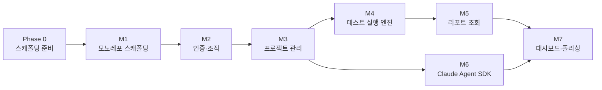

# 01. Phase 로드맵 및 크리티컬 패스

- 최종 수정일: 2026-04-17
- 관련 스펙: `../specs/02_요구사항명세서.md`, `../specs/05_인프라_배포명세서.md`, `../specs/07_기술스택_프로젝트구조.md`

## 1. Phase 개요 매트릭스

| Phase | 기간 | 완성 상태 | 주요 포함 범위 | 제외되는 것 |
|-------|------|----------|---------------|------------|
| **Phase 0** | 1~2일 | 설계 검증 및 도구 준비 | 레포, 도구체인, CI 파이프라인 틀 | 기능 구현 전체 |
| **Phase 1 (MVP)** | 6~10주 | 단일 팀 사내 사용 가능 | FR-01~06 전 기능, Docker Compose 단일 서버 배포 | 다중 워커, NFS, S3, OAuth, 리포트 비교 |
| **Phase 2** | 2~3주 | 중규모 팀(15~30명) 대응 | 다중 워커 서버 + NFS 공유 스토리지 + 장애 복구 | 다중 Redis, S3 |
| **Phase 3** | 4~6주 | 대규모 팀(30명+) 대응 | 다중 Redis + Queue Router 고도화 + S3 + 로드밸런싱 | - |
| **Phase 4 (포스트-MVP)** | 지속 | 기능 확장 | OAuth, 리포트 비교(FR-04-07), 알림, RBAC 세분화, rootless docker | - |

## 2. Phase 1 마일스톤 체계

| 마일스톤 | 제목 | 담당 FR | 예상 기간 |
|----------|------|---------|----------|
| M1 | 모노레포 스캐폴딩 + 공통 기반 | - | 3~5일 |
| M2 | 인증 및 조직 관리 | FR-01 | 4~6일 |
| M3 | 프로젝트 관리 | FR-02 | 5~7일 |
| **M4** | **테스트 실행 엔진** | FR-03 | **8~12일** |
| M5 | 리포트 조회 | FR-04 | 4~6일 |
| **M6** | **Claude Agent SDK 통합** | FR-05 | **10~14일** |
| M7 | 대시보드 및 폴리싱 | FR-06 + 비기능 | 4~6일 |

**총 기간(1인 fullstack 기준)**: 6~10주, 병렬 가능 구간을 활용하면 2~3인 팀으로 **4~6주** 단축 가능.

## 3. 상위 의존성 그래프



- **M1 → M2 → M3**는 엄격한 선행. DB 스키마 → 인증 → 프로젝트 CRUD.
- **M4와 M6는 M3 이후 병렬 가능**. 둘 다 Project 엔티티에 의존하지만 Run과 Edit은 데이터 흐름이 분리됨.
- **M5는 M4의 산출물(리포트 파일) 이후에야 테스트 가능**.
- **M7은 Run·Edit 데이터가 쌓인 뒤 의미 있는 대시보드가 가능하므로 마지막**.

## 4. 크리티컬 패스 (최장 경로)

```
P0 → M1(Prisma) → M2(auth 라우트) → M3(projects 라우트)
   → M4(Worker + WS) → M5(Report 파싱·뷰어)
   → M7(대시보드 → 배포 스크립트 → E2E)
```

이 경로 상 약 6~10주(1인). **M6(Claude SDK)은 크리티컬 패스 외부**에 있어 병렬 개발 시 전체 리드타임 감소에 핵심.

## 5. 병렬화 기회

| 병렬 조합 | 선행 조건 | 권장 인력 |
|----------|----------|----------|
| M4 ⊕ M6 | M3 완료 | 2명 (백엔드 분업) |
| M3-T6 (프론트) ⊕ M4-S1~S4 (백엔드 실행) | M3-T4 완료 | 프론트 1 / 백 1 |
| M5 ⊕ M6 후반 | M4 완료 | 2명 |
| M7-T2 (프론트 대시보드) ⊕ M7-T5 (배포 문서) | M7-T1 완료 | 1명 | 
| E2E 테스트(M7-T6) ⊕ Phase 2 준비 | M7-T5 완료 | 2명 |

## 6. 주차별 권장 개발 순서 (1인 기준)

| 주차 | 주 작업 | 마일스톤 |
|------|---------|---------|
| 1 | Phase 0 + M1 완료 | 스캐폴딩 + Compose 기동 |
| 2 | M2 + M3 시작 | 인증 완료, 프로젝트 서비스 착수 |
| 3 | M3 완료 + M4.S1, S2 | BullMQ + Docker 서비스 |
| 4 | M4.S3~S5 | Worker + SSE + 라우트 |
| 5 | M4.S6, S7 + **M6.S1 SDK 스파이크** | 실행 UI + SDK 실동작 검증 |
| 6 | M5 완료 + M6.S2~S5 | 리포트, edit 서비스·라우트 |
| 7 | M6.S6, S7, S8(전반) | WS + 프론트 채팅 초기 |
| 8 | M6.S8(후반), S9 + M7.T1 | 프론트 채팅 완성 + 대시보드 API |
| 9 | M7.T2~T7 | 폴리싱 + E2E + 배포 문서 |
| 10 | 베타 배포 + 사용 피드백 | Phase 2 계획 |

## 7. 2~3인 팀 권장 배치

- **팀원 A (백엔드 리드)**: M1(Prisma) → M3(서비스) → M4(Worker·Docker)
- **팀원 B (풀스택)**: M1(web 스캐폴딩) → M2(인증 전 구간) → M5(리포트) → M7(대시보드)
- **팀원 C (AI 전담, 선택)**: M6(Claude SDK) — M3 완료 후 투입

병렬 시 전체 기간: **4~6주**.

## 8. Phase별 배포 전환 지점

| 시점 | 배포 단위 | 주요 전환 |
|------|----------|----------|
| Phase 1 완료 | 단일 서버 (`docker compose up`) | 사내 베타 |
| Phase 2 진입 | 메인 서버 + 워커 서버 N대 + NFS | 코드 최소 수정. 환경변수·compose만 변경 |
| Phase 3 진입 | 다중 Redis + Queue Router `project-based` + S3 | Queue Router 전략 전환, storage adapter 도입 |

Queue Router를 **Phase 1부터 추상화 인터페이스로 구현**해 두어야 Phase 3 전환이 수월하다. (M4 리스크 R4.2 참조)

## 9. 마일스톤 완료 판정 기준 요약

자세한 검증 시나리오는 `10_검증_시나리오.md` 참조.

| 마일스톤 | 1줄 판정 기준 |
|----------|--------------|
| Phase 0 | `pnpm install` + `pnpm -r typecheck` 에러 0 |
| M1 | `docker compose up -d` 후 `/health` 200 응답 + Prisma 마이그레이션 완료 |
| M2 | `curl /auth/register → /auth/login` 로 JWT 발급 + 권한 거부(403) 정상 동작 |
| M3 | `POST /projects`(실제 git repo) → `stable`, `working` 디렉토리 생성 + `GET /tests` |
| M4 | `POST /runs` → WS 이벤트 4종(status/progress/log/done) 수신 + 리포트 파일 생성 |
| M5 | `GET /runs/:id/report` JSON 파싱 + 첨부 파일 서빙 + path traversal 차단 |
| M6 | `POST /edits` → WS 스트리밍 10+ 이벤트 + approve 시 `git log`에 새 commit 확인 |
| M7 | 대시보드에 통과율/트렌드 표시 + E2E 스위트 전체 녹색 + 배포 문서 재현 성공 |

## 10. 다음 단계

각 마일스톤의 상세는 `02_마일스톤_M1_스캐폴딩.md`부터 차례로 참조한다.
