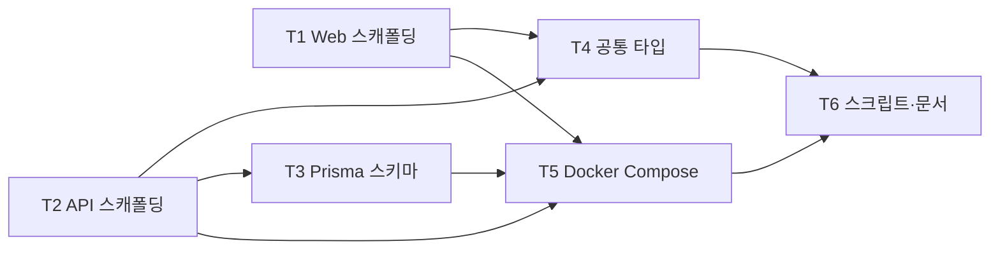

# 02. 마일스톤 M1 — 모노레포 스캐폴딩 및 공통 기반

- 최종 수정일: 2026-04-17
- 관련 스펙: `../specs/03_ERD_DB스키마.md`, `../specs/05_인프라_배포명세서.md`, `../specs/07_기술스택_프로젝트구조.md`
- 예상 기간: 3~5일

## 1. 목표

- `apps/web` (Next.js 14 App Router)와 `apps/api` (Fastify 5) 이원 구조의 pnpm 모노레포 스캐폴딩
- Prisma 스키마 정의 + 초기 마이그레이션
- Docker Compose Phase 1 최소 스택 기동(PostgreSQL, Redis)
- `/health` 엔드포인트 작동 + Next.js `/dashboard` placeholder
- Playwright Runner 이미지 정의 (빌드는 선택, M4에서 사용)

## 2. 선행 조건

- Phase 0 완료 (Node 20, pnpm 8+, Docker 24+ 설치)
- 빈 레포에 `README.md`와 `docs/` 만 있는 상태 (현재)

## 3. 태스크 흐름 (상위)

| 태스크 | 이름 | 내용 | 의존 |
|--------|------|------|------|
| M1-T1 | Web 스캐폴딩 | `apps/web` Next.js 14 App Router + Tailwind + shadcn/ui | - |
| M1-T2 | API 스캐폴딩 | `apps/api` Fastify 5 + TS + 공통 라이브러리 (config/prisma/redis/logger) | - |
| M1-T3 | Prisma 스키마 | `prisma/schema.prisma` + init 마이그레이션 + seed | M1-T2 |
| M1-T4 | 공통 타입 | `packages/shared-types` API/WS 이벤트 타입 공유 | M1-T1, M1-T2 |
| M1-T5 | Docker Compose | Phase 1 compose(postgres, redis, api, worker, web) + runner Dockerfile | M1-T1~T3 |
| M1-T6 | 개발 스크립트 | 루트 scripts + 개발 문서 | M1-T1~T5 |

## 4. 파일 단위 체크리스트

### M1-T1. Web 스캐폴딩

- [ ] `apps/web/package.json` — Next.js 14, React 18, Tailwind 3, shadcn/ui 의존성
- [ ] `apps/web/tsconfig.json` — `extends: ../../tsconfig.base.json`, paths 매핑
- [ ] `apps/web/next.config.js` — API 프록시 `/api/v1/*` → `http://localhost:3001`
- [ ] `apps/web/tailwind.config.ts` — Supabase 벤치마크 팔레트 (primary green `#3ECF8E`)
- [ ] `apps/web/postcss.config.js` — tailwindcss, autoprefixer
- [ ] `apps/web/app/globals.css` — Tailwind directives + CSS 변수(light/dark)
- [ ] `apps/web/app/layout.tsx` — 루트 레이아웃, QueryProvider, Toaster
- [ ] `apps/web/app/page.tsx` — `/dashboard` 또는 `/login` 리다이렉트 (서버 컴포넌트)
- [ ] `apps/web/components/providers/QueryProvider.tsx` — TanStack Query 클라이언트
- [ ] `apps/web/components/ui/` — shadcn CLI로 button/card/input/label/toast 설치
- [ ] `apps/web/Dockerfile` — multi-stage, `next build` standalone 출력

### M1-T2. API 스캐폴딩

- [ ] `apps/api/package.json` — fastify@5, `@fastify/cors`, `@fastify/helmet`, `@fastify/compress`, `@fastify/jwt`, `@fastify/sensible`, `@fastify/rate-limit`, `@fastify/static`, `@fastify/type-provider-zod`, `fastify-sse-v2`, bullmq, ioredis, @prisma/client, bcryptjs, zod, dockerode, simple-git, @anthropic-ai/claude-agent-sdk (Fastify는 pino 로거 내장)
- [ ] `apps/api/tsconfig.json` — `extends: ../../tsconfig.base.json`, `outDir: dist`
- [ ] `apps/api/src/index.ts` — Fastify 앱(`fastify({ logger: ... })`), `@fastify/cors`/`@fastify/helmet`/`@fastify/compress` 플러그인 등록, `/api/v1/health` 라우트, `fastify-sse-v2` 플러그인, `listen({ port: config.PORT, host: '0.0.0.0' })`
- [ ] `apps/api/src/lib/config.ts` — Zod 기반 env 스키마 (DATABASE_URL, REDIS_URL, JWT_SECRET≥32, CLAUDE_API_KEY, WORKER_CONCURRENCY, PROJECTS_STABLE_PATH, PROJECTS_WORKING_PATH, REPORTS_PATH, DOCKER_NETWORK, LOG_LEVEL, QUEUE_ROUTING_STRATEGY, STORAGE_TYPE, PORT, NODE_ENV, CLAUDE_AGENT_*)
- [ ] `apps/api/src/lib/prisma.ts` — PrismaClient 싱글톤 (HMR 대응 global 캐시)
- [ ] `apps/api/src/lib/redis.ts` — ioredis 팩토리, BullMQ용 `maxRetriesPerRequest: null`, pub/sub 분리 클라이언트
- [ ] `apps/api/src/lib/logger.ts` — pino + pinoHttp
- [ ] `apps/api/src/lib/errors.ts` — AppError 계열 (Validation/Unauthorized/Forbidden/NotFound/Conflict/RateLimit/Internal)
- [ ] `apps/api/src/middleware/errorHandler.ts` — 최종 에러 응답 `{ success, error: { code, message } }`
- [ ] `apps/api/src/middleware/requestLogger.ts` — 요청 로깅
- [ ] `apps/api/Dockerfile` — multi-stage, pnpm 캐시, `CMD ["node","dist/index.js"]`
- [ ] `apps/api/nodemon.json` 또는 `tsx watch` 개발 실행 설정

### M1-T3. Prisma 스키마 + 마이그레이션

- [ ] `prisma/schema.prisma` — 스펙 03 기반 모델 정의
  - Org, User, Project, Run, Edit
  - enum: Role(ADMIN/MEMBER), RunStatus(QUEUED/RUNNING/PASSED/FAILED/CANCELLED), EditStatus(STREAMING/WAITING_INPUT/PENDING/APPROVED/REJECTED)
  - 인덱스: User `[orgId]`, Project `@@unique([orgId, name])`, Run `[projectId, createdAt DESC]`/`[status]`/`[userId]`, Edit `[projectId, createdAt DESC]`/`[userId]`
  - Cascade: Project→Org, Run→Project, Edit→Project
  - Edit 필드 확장(스펙 08): `sessionId`, `messages Json @default("[]")`, `costUsd`, `durationMs`
  - Project 확장: `workerGroup String?` (Phase 3 project-based 라우팅 대비)
- [ ] `prisma/seed.ts` — Demo Org + Admin 계정(`admin@labiter.com`, bcrypt 해시) upsert
- [ ] `prisma/migrations/<timestamp>_init/` — `prisma migrate dev --name init` 자동 생성
- [ ] 루트 `package.json` scripts — `db:migrate`, `db:deploy`, `db:studio`, `db:seed`

### M1-T4. 공통 타입 패키지

- [ ] `packages/shared-types/package.json`
- [ ] `packages/shared-types/tsconfig.json`
- [ ] `packages/shared-types/src/run-events.ts` — `RunEvent` union (`log|status|progress|test_result|done|error`) + 페이로드
- [ ] `packages/shared-types/src/edit-events.ts` — `EditEvent` union (`edit:connected|text_delta|text_done|thinking|tool_start|tool_result|file_change|turn_complete|result|error`) + 페이로드
- [ ] `packages/shared-types/src/api-contracts.ts` — Zod 스키마 + `z.infer<>` 타입 export
- [ ] `packages/shared-types/src/index.ts` — barrel export
- [ ] `apps/web/package.json`, `apps/api/package.json` — workspace 의존성 추가 (`"@playwright-hub/shared-types": "workspace:*"`)

### M1-T5. Docker Compose 최소 스택

- [ ] `deploy/docker-compose.yml`
  - `postgres:16-alpine` (pgdata 볼륨, healthcheck `pg_isready`)
  - `redis:7-alpine` (redisdata 볼륨, healthcheck `redis-cli ping`)
  - `api` (apps/api Dockerfile, depends_on postgres/redis, volumes: projects-stable, projects-working, reports, `/var/run/docker.sock`)
  - `worker` (동일 이미지, `CMD ["node","dist/workers/playwright.worker.js"]`, projects-stable:ro)
  - `web` (apps/web Dockerfile, NEXT_PUBLIC_API_URL, depends_on api)
  - networks: `playwright-hub-net`
  - volumes: pgdata, redisdata, projects-stable, projects-working, reports
- [ ] `deploy/.env.example` — compose 참조용 env 전체
- [ ] `docker/playwright-runner/Dockerfile` — `mcr.microsoft.com/playwright:v1.50.0-noble` 기반, ENTRYPOINT `["npx","playwright","test"]`, PLAYWRIGHT_BROWSERS_PATH=/ms-playwright
- [ ] `docker/playwright-runner/.dockerignore`

### M1-T6. 개발 스크립트 및 문서

- [ ] 루트 `package.json` scripts: `dev:api`, `dev:web`, `dev:all` (concurrently), `dev:db:up/down`, `docker:build-runner`, `prisma:*`
- [ ] 루트 `pnpm-workspace.yaml` — `packages: ['apps/*', 'packages/*']`
- [ ] 루트 `tsconfig.base.json` — target ES2022, strict, paths
- [ ] 루트 `.eslintrc.cjs` — `@typescript-eslint/recommended`, `next/core-web-vitals`
- [ ] 루트 `.prettierrc` — singleQuote, semi, trailingComma:all, printWidth:100
- [ ] 루트 `.husky/pre-commit` + `lint-staged` — eslint --fix && prettier --write
- [ ] 루트 `.gitignore` — node_modules, .next, dist, .env, projects/, reports/, .turbo, coverage
- [ ] 루트 `.env.example` — 모든 필수 env 문서화
- [ ] `docs/development.md` — 로컬 개발 세팅 가이드 (pnpm i → compose up → migrate → dev)

## 5. 내부 의존성 그래프



## 6. 검증 기준

```bash
# 1) 의존성 설치
pnpm install

# 2) 타입체크
pnpm -r typecheck   # 에러 0

# 3) DB 기동
cd /home/superstart/projects/playwright-hub/deploy
docker compose up -d postgres redis

# 4) 마이그레이션
cd .. && pnpm --filter @playwright-hub/api exec prisma migrate deploy

# 5) API 실행
pnpm dev:api
curl http://localhost:3001/api/v1/health
# → { "success": true, "data": { "status": "ok" } }

# 6) Web 실행
pnpm dev:web
# 브라우저 http://localhost:3000 → /dashboard 또는 /login placeholder

# 7) Prisma Studio 로 테이블 5개 확인
pnpm db:studio
# Org, User, Project, Run, Edit 테이블 존재

# 8) Runner 이미지 빌드 (선택)
docker build -t playwright-hub-runner:latest docker/playwright-runner/
docker image ls | grep playwright-hub-runner
```

## 7. 리스크

| # | 리스크 | 완화 |
|---|-------|------|
| R1.1 | pnpm + Prisma 심링크 호환 | `prisma.generator.output`을 `../../node_modules/.prisma/client`로 명시, 또는 `package.json`에 `pnpm.overrides`로 prisma 고정 |
| R1.2 | WSL2에서 `/var/run/docker.sock` 마운트 실패 | 초기에 `docker ps` 호출 스크립트로 검증, Docker Desktop WSL 통합 활성화 |
| R1.3 | Next.js 14 App Router 학습 곡선 | Server/Client 경계 문서화, shadcn `use client` 주석 습관화 |
| R1.4 | JWT 시크릿 약한 값 배포 | Zod `.min(32)` + `.env.example`에 강한 값 생성 명령 주석 |
| R1.5 | 여러 앱의 tsconfig 경로 매핑 불일치 | `tsconfig.base.json` 한 곳에서 paths 관리, app별은 `extends`만 |

## 8. 산출물

- 실행 가능한 `docker compose up` 스택
- Prisma Studio에서 확인 가능한 5개 테이블
- `apps/web`의 `/login` placeholder 페이지
- `apps/api`의 `/api/v1/health` 정상 응답
- `packages/shared-types`에서 export된 WS 이벤트 타입

## 9. 다음 단계

`03_마일스톤_M2_인증_조직.md`로 이동하여 FR-01(조직/사용자 관리) 구현에 착수한다.
