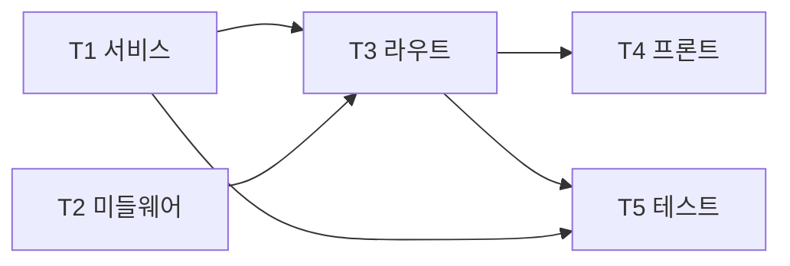

# 03. 마일스톤 M2 — 인증 및 조직 관리

- 최종 수정일: 2026-04-17
- 관련 스펙: `../specs/01_기능명세서.md` F-01, `../specs/04_API명세서.md` §2.3, `../specs/02_요구사항명세서.md` FR-01
- 예상 기간: 4~6일

## 1. 목표

- FR-01 전체를 HTTP + UI 수준으로 완성
- JWT 기반 인증, bcrypt 비밀번호 해시
- 조직(Org) 단위 격리 + Admin/Member RBAC
- 이메일 초대 → 가입 플로우(Phase 1은 invite token 발급까지)
- 프론트엔드 로그인/회원가입/조직 설정 페이지

## 2. 선행 조건

- M1 완료 (Prisma 스키마에 Org/User/Role, API/Web 스캐폴딩, 공통 타입)

## 3. 태스크 흐름

| 태스크 | 이름 | 내용 |
|--------|------|------|
| M2-T1 | 인증 서비스 | `auth.service`, `org.service`, `invite.service` |
| M2-T2 | 미들웨어 | JWT 검증, orgScope, validation, requireRole |
| M2-T3 | 라우트 | `/auth/*`, `/org`, `/org/members/*` |
| M2-T4 | 프론트 인증 | 로그인/회원가입/조직 설정 페이지 + AuthGuard |
| M2-T5 | 테스트 | 서비스 단위 테스트 + Fastify `app.inject()` 통합 테스트 |

## 4. 파일 단위 체크리스트

### M2-T1. 인증 서비스 레이어

- [ ] `apps/api/src/services/auth.service.ts`
  - `register({ email, password, orgName }): Promise<{ user, org, token }>` — `prisma.$transaction` 안에서 Org 생성 + User(ADMIN) 생성 + 비밀번호 bcrypt 해시(cost 11) + JWT 발급
  - `login({ email, password }): Promise<{ user, token }>` — 사용자 조회, bcrypt 검증, JWT 발급
  - `signToken(payload: { userId, orgId, role }): string` — `jwt.sign(payload, JWT_SECRET, { expiresIn: '1d' })`
  - `verifyToken(token): JwtPayload` — `jwt.verify`, 실패 시 `UnauthorizedError` 발생
- [ ] `apps/api/src/services/org.service.ts`
  - `getOrgById(orgId)`, `updateOrg(orgId, patch)`, `listMembers(orgId)`, `updateMemberRole(orgId, userId, role)`, `removeMember(orgId, userId, actingUserId)` (본인 제외 검증)
- [ ] `apps/api/src/services/invite.service.ts`
  - `createInvite(orgId, email, role): Promise<{ inviteId: string }>` — 단순 랜덤 토큰 32바이트(Phase 1). 별도 `Invite` 테이블 또는 User의 pending 상태 (Phase 1은 별도 테이블 없이 `prisma.user.create`로 pending 필드 추가 없이 직접 생성하되 비밀번호 해시 공란 + 초대 토큰 저장 — 단순화).
  - Phase 4에서 이메일 전송 연동

### M2-T2. 미들웨어

- [ ] `apps/api/src/plugins/auth.ts`
  - Fastify 플러그인. `@fastify/jwt` 등록(secret: config.JWT_SECRET) + `authHook` preHandler 등록.
  - `authHook(request, reply)` — `request.jwtVerify()` → `request.user = { id, orgId, role }`
  - 실패 시 `UnauthorizedError` 던져 errorHandler가 401 응답
- [ ] `apps/api/src/hooks/orgScope.ts`
  - `requireAdmin(request, reply)` preHandler — role !== 'ADMIN' 이면 `ForbiddenError`
  - `scopedPrisma(orgId)` 헬퍼 — 자주 쓰는 where 조건 래퍼 (선택)
- [ ] `apps/api/src/plugins/validation.ts`
  - `@fastify/type-provider-zod` 등록 → 라우트의 `schema.body/querystring/params`에 Zod 스키마 지정 시 자동 검증
  - 또는 `validateRequest(schemas)` 커스텀 preHandler 헬퍼(옵션)
  - Zod 실패 시 `ValidationError(issues)`
- [ ] `apps/api/src/hooks/requireRole.ts`
  - `requireRole(role: Role)` preHandler 팩토리

### M2-T3. 라우트

- [ ] `apps/api/src/routes/auth.ts`
  - `POST /auth/register` — Zod body `{ email, password(min 8), orgName }`, `auth.service.register` → 201 `{ token, user, org }`
  - `POST /auth/login` — Zod body `{ email, password }`, `auth.service.login` → 200
  - `POST /auth/invite` — requireAdmin + Zod body `{ email, role }`, `invite.service.createInvite` → 201 `{ inviteId }`
- [ ] `apps/api/src/routes/org.ts`
  - `GET /org` — authed, `org.service.getOrgById(req.user.orgId)`
  - `PATCH /org` — requireAdmin + Zod body `{ name }` → 200
  - `GET /org/members` — authed → `[{ id, email, role, createdAt }]`
  - `PATCH /org/members/:userId` — requireAdmin + Zod `{ role }` → 200
  - `DELETE /org/members/:userId` — requireAdmin, 본인(orgId 내 자기 자신) 제거 금지, Cascade 주의
- [ ] `apps/api/src/index.ts` — `/api/v1/auth` 라우터(미들웨어 없음), `/api/v1` + authMiddleware 하위에 org 라우터 mount

### M2-T4. 프론트엔드 인증

- [ ] `apps/web/lib/api.ts`
  - `apiFetch<T>(path, init?): Promise<T>` — JWT 자동 주입(`Authorization: Bearer`), 401 응답 시 토큰 제거 후 `/login` 리다이렉트
  - 도메인 헬퍼: `api.auth.register`, `api.auth.login`, `api.org.getOrg`, `api.org.listMembers`, `api.org.updateMemberRole`
- [ ] `apps/web/lib/auth.ts`
  - `setToken(token)`, `getToken()`, `clearToken()`, `getUserFromToken(): { id, orgId, role } | null`
  - Phase 1: localStorage. Phase 4: httpOnly 쿠키 전환
- [ ] `apps/web/stores/auth.store.ts`
  - zustand: `user`, `org`, `token`, `login(user, org, token)`, `logout()`
- [ ] `apps/web/components/layout/AuthGuard.tsx`
  - Client Component. useAuth() → 토큰 없으면 `router.replace('/login')`
- [ ] `apps/web/app/(auth)/login/page.tsx`
  - `react-hook-form` + Zod resolver. 입력: email, password. TanStack Query mutation.
  - 성공 시 토큰 저장, zustand 갱신, `/dashboard` 이동
- [ ] `apps/web/app/(auth)/register/page.tsx`
  - 입력: email, password, orgName. 가입 성공 시 자동 로그인 처리
- [ ] `apps/web/app/(main)/layout.tsx` — AuthGuard로 하위 보호 + Sidebar/Header 공통
- [ ] `apps/web/app/(main)/settings/org/page.tsx`
  - 조직 정보 카드(이름 편집), 멤버 테이블(역할 드롭다운, 삭제 버튼 Admin 전용)
- [ ] `apps/web/components/layout/Sidebar.tsx` — Supabase 풍 사이드바. items: Dashboard / Projects / Settings
- [ ] `apps/web/components/layout/Header.tsx` — 유저 드롭다운(로그아웃), 테마 토글

### M2-T5. 테스트

- [ ] `apps/api/src/services/auth.service.test.ts`
  - bcrypt 해시/비교 왕복
  - JWT 발급/검증 왕복, 만료 토큰 거부
  - `register` 동일 이메일 재시도 시 `ConflictError`
- [ ] `apps/api/src/routes/auth.test.ts`
  - Fastify `app.inject()` + 테스트용 PostgreSQL (docker compose -f deploy/test-compose.yml 또는 testcontainers)
  - `POST /auth/register` → 201
  - `POST /auth/login` (잘못된 비밀번호) → 401
  - `POST /auth/invite` (MEMBER 토큰) → 403
- [ ] `apps/api/src/routes/org.test.ts`
  - 타 조직 member 조회 → 빈 배열
  - MEMBER가 PATCH /org → 403

## 5. 내부 의존성 그래프



## 6. 검증 기준

```bash
# 1) 단위·통합 테스트
pnpm --filter @playwright-hub/api test

# 2) 회원가입
curl -X POST http://localhost:3001/api/v1/auth/register \
  -H "Content-Type: application/json" \
  -d '{"email":"admin@labiter.com","password":"pass1234","orgName":"Labiter"}'
# → 201 + { success: true, data: { token, user, org } }

# 3) 로그인
curl -X POST http://localhost:3001/api/v1/auth/login \
  -H "Content-Type: application/json" \
  -d '{"email":"admin@labiter.com","password":"pass1234"}'
# → 200 + token
TOKEN=$(위 응답의 token)

# 4) 조직 조회
curl http://localhost:3001/api/v1/org -H "Authorization: Bearer $TOKEN"
# → 200 + { id, name, createdAt }

# 5) 타 조직 격리
# 다른 사용자로 가입 후 해당 토큰으로 첫 Org 조회 시도 → 본인 Org만 반환

# 6) RBAC
# MEMBER 계정 토큰으로 PATCH /org 시도 → 403 FORBIDDEN

# 7) 프론트
# /register → 가입 → /dashboard 리다이렉트
# /login → 로그인
# /settings/org → 멤버 목록, 역할 변경 dropdown
# 잘못된 토큰 상태로 /dashboard 접근 → /login 리다이렉트
```

## 7. 리스크

| # | 리스크 | 완화 |
|---|-------|------|
| R2.1 | 조직 격리 누락으로 정보 유출 | `scopedPrisma(orgId)` 헬퍼 + 코드 리뷰 체크리스트 |
| R2.2 | JWT 시크릿 운영 노출 | 배포 시 환경별 시크릿 분리, Phase 4 Vault |
| R2.3 | 로그인 brute-force | Phase 4 `@fastify/rate-limit`로 `/auth/login` 전용 rate limit 도입 예정 |
| R2.4 | bcrypt 성능 영향 | cost 11 기준 ~100ms. 회원가입/로그인 엔드포인트에만 적용되므로 수용 |
| R2.5 | 초대 이메일 미발송 | Phase 1은 inviteId를 응답으로 반환해 Admin이 수동 공유. Phase 4에서 SMTP/Resend 연동 |
| R2.6 | shadcn Form 템플릿 복잡도 | 첫 Form에서 pattern 확립 후 재사용 |

## 8. 산출물

- `/api/v1/auth/register`, `/api/v1/auth/login` 정상 작동
- `/api/v1/org`, `/api/v1/org/members*` 정상 작동 + RBAC 적용
- 프론트 `/login`, `/register`, `/settings/org` 페이지
- 테스트 커버리지: auth.service 90%+, 라우트 통합 주요 시나리오

## 9. 다음 단계

`04_마일스톤_M3_프로젝트_관리.md`로 이동하여 Git 연동 및 프로젝트 CRUD를 구현한다.
