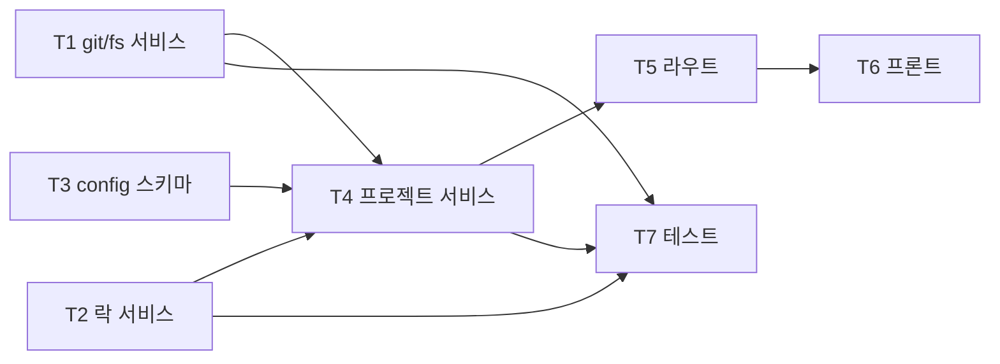

# 04. 마일스톤 M3 — 프로젝트 관리

- 최종 수정일: 2026-04-17
- 관련 스펙: `../specs/01_기능명세서.md` F-02, `../specs/04_API명세서.md` §2.4, `../specs/06_워크플로우명세서.md`
- 예상 기간: 5~7일

## 1. 목표

- FR-02 전체 + stable/working 디렉토리 구조 확립
- Git clone/pull 연동 (simple-git)
- 테스트 파일·케이스 탐지(`GET /projects/:id/tests`)
- 프로젝트 설정(`Project.config`) Zod 스키마
- Redis 분산 락(프로젝트 단위) 기본 구현 (M4·M6에서 재사용)

## 2. 선행 조건

- M2 완료 (JWT 인증, 조직 격리 미들웨어)
- Prisma의 Project/Run/Edit 모델이 생성되어 있음

## 3. 태스크 흐름

| 태스크 | 이름 | 내용 |
|--------|------|------|
| M3-T1 | Git/FS 서비스 | simple-git 래퍼, 디렉토리 생성·복사·탐지 |
| M3-T2 | 락 서비스 | Redis SET NX + Lua 해제 |
| M3-T3 | Config 스키마 | Zod `ProjectConfigSchema` |
| M3-T4 | 프로젝트 서비스 | CRUD + sync + 디렉토리 라이프사이클 |
| M3-T5 | 라우트 | `/projects/*` 엔드포인트 |
| M3-T6 | 프론트 | 프로젝트 목록/상세/생성 모달/테스트 트리 |
| M3-T7 | 테스트 | 단위 + 통합 |

## 4. 파일 단위 체크리스트

### M3-T1. Git/FS 서비스

- [ ] `apps/api/src/services/git.service.ts`
  - `cloneRepo(gitUrl, targetPath, branch?, options?: { shallow?: boolean })` — simple-git `clone`, 기본 `--depth=1`
  - `pull(projectPath): Promise<{ commitHash, filesChanged }>`
  - `getCommitHash(projectPath): Promise<string>`
  - `commitChanges(projectPath, { message, authorName, authorEmail, files }): Promise<string>` — `-c user.name -c user.email` 로 author 설정
  - `diff(projectPath, fromRef?, toRef?): Promise<string>` — unified diff
  - `checkStatus(projectPath): Promise<{ isClean, modified, untracked }>`
  - `reset(projectPath, mode: 'hard'|'soft', ref?): Promise<void>`
- [ ] `apps/api/src/services/fs.service.ts`
  - `ensureProjectDirs(projectPath: string): Promise<{ stableDir, workingDir }>`
  - `copyStableToWorking(projectPath): Promise<void>` — `.git` 포함 복사 (`fs.cp` with `recursive: true`)
  - `removeProjectDirs(projectPath): Promise<void>` — DELETE 시 cleanup
  - `listTestFiles(dir: string, testDir?: string): Promise<string[]>` — glob `**/*.spec.{ts,js,tsx,mjs}` + `**/*.test.*`
  - `parseTestTitles(filePath: string): Promise<Array<{ title, line }>>` — Phase 1 정규식, Phase 4 AST 전환
  - `resolveSafePath(base: string, sub: string): string` — path traversal 방어

### M3-T2. 락 서비스 (M4·M6 선행)

- [ ] `apps/api/src/services/lock.service.ts`
  - `acquire(key, ttlMs=60000, retryMs=500, maxRetries=60): Promise<{ token, release }>` — SET NX PX with random token
  - `release(key, token)` — Lua 스크립트로 자기 토큰일 때만 DEL
  - `withLock<T>(key, ttlMs, fn): Promise<T>`
  - 락 키 규칙:
    - `lock:project:${projectId}` — 공유 자원(working/stable) 접근
    - `lock:project:sync:${projectId}` — sync 전용 배타 락 (Phase 1은 단일 락으로 시작)

### M3-T3. Project.config Zod 스키마

- [ ] `apps/api/src/schemas/project.schema.ts`
  - `ProjectConfigSchema`:
    ```ts
    z.object({
      baseURL: z.string().url().optional(),
      env: z.record(z.string()).default({}),
      browser: z.enum(['chromium','firefox','webkit']).default('chromium'),
      timeout: z.number().int().positive().default(30000),
      retries: z.number().int().min(0).max(5).default(0),
      workers: z.number().int().min(1).max(16).default(1),
      reportOptions: z.object({
        screenshots: z.enum(['on','only-on-failure','off']).default('only-on-failure'),
        video: z.enum(['on','on-first-retry','retain-on-failure','off']).default('off'),
        trace: z.enum(['on','on-first-retry','retain-on-failure','off']).default('retain-on-failure'),
      }).default({}),
    })
    ```
  - `CreateProjectSchema`, `UpdateProjectSchema` 래핑

### M3-T4. 프로젝트 서비스

- [ ] `apps/api/src/services/project.service.ts`
  - `createProject({ orgId, name, gitUrl, config })`
    - 흐름: `fs.ensureProjectDirs` → `prisma.project.create({ data: { orgId, name, path: slug, gitUrl, config } })` → `git.cloneRepo(gitUrl, stableDir)` → `fs.copyStableToWorking(projectPath)` → 실패 시 DB row 삭제 + 디렉토리 rm (롤백)
    - `path` slug 규칙: `<orgId>/<slugify(name)>` (조직 격리 강제)
  - `getProject(id, orgId)` — orgId 필터
  - `listProjects(orgId)` — lastRun 조인 include
  - `updateProject(id, orgId, patch)` — config 병합 (deep merge)
  - `deleteProject(id, orgId)` — DB cascade + `fs.removeProjectDirs` (비동기 큐로 분리 가능)
  - `syncProject(id, orgId)` — `withLock(project:sync:${id})` 내부에서 `git.pull(stable)` → `fs.copyStableToWorking` → 결과 반환
  - `listProjectTests(id, orgId)` — `fs.listTestFiles` + `fs.parseTestTitles`

### M3-T5. 라우트

- [ ] `apps/api/src/routes/projects.ts`
  - `GET /projects` — authed → `listProjects(req.user.orgId)`
  - `POST /projects` — requireAdmin + validate(CreateProjectSchema) → 201
  - `GET /projects/:id` — authed + orgScope(자동: service 내 orgId 필터)
  - `PATCH /projects/:id` — requireAdmin + validate(UpdateProjectSchema) → 200
  - `DELETE /projects/:id` — requireAdmin → 204
  - `POST /projects/:id/sync` — authed → 200 `{ commitHash, filesChanged }`
  - `GET /projects/:id/tests` — authed → `[{ file, tests: [{ title, line }] }]`

### M3-T6. 프론트엔드

- [ ] `apps/web/app/(main)/projects/page.tsx` — 프로젝트 카드 그리드, 신규 버튼
- [ ] `apps/web/app/(main)/projects/[id]/page.tsx` — 탭(Overview/Tests/Config), 최근 Run 요약, Run/Edit 버튼
- [ ] `apps/web/components/projects/ProjectCard.tsx` — props `{ project }`, 통과율 배지
- [ ] `apps/web/components/projects/NewProjectDialog.tsx` — react-hook-form, Zod resolver, gitUrl/baseURL/browser 선택
- [ ] `apps/web/components/projects/TestFileTree.tsx` — 파일/케이스 트리, 체크박스 선택 → 선택 상태 zustand 보관
- [ ] `apps/web/components/projects/ProjectConfigCard.tsx` — config 조회·편집
- [ ] `apps/web/hooks/useProjects.ts` — TanStack Query keys
- [ ] `apps/web/hooks/useCreateProject.ts`, `useSyncProject.ts`, `useDeleteProject.ts`, `useProjectTests.ts`

### M3-T7. 테스트

- [ ] `apps/api/src/services/git.service.test.ts` — tmp bare repo 생성 후 clone/pull/commit 시뮬
- [ ] `apps/api/src/services/fs.service.test.ts` — 샘플 디렉토리 fixture → listTestFiles/parseTestTitles
- [ ] `apps/api/src/services/project.service.test.ts` — 등록/삭제 라이프사이클 + 롤백 (clone 실패 시 디렉토리 정리)
- [ ] `apps/api/src/services/lock.service.test.ts` — 2개 동시 acquire 중 하나만 성공, release Lua 검증

## 5. 내부 의존성 그래프



## 6. 검증 기준

```bash
# 1) 단위·통합 테스트
pnpm --filter @playwright-hub/api test -- project lock git fs

# 2) E2E: 공개 Playwright 예제 repo 등록
TOKEN=<M2에서 발급받은 Admin 토큰>
curl -X POST http://localhost:3001/api/v1/projects \
  -H "Authorization: Bearer $TOKEN" \
  -H "Content-Type: application/json" \
  -d '{
    "name":"sample",
    "gitUrl":"https://github.com/microsoft/playwright-examples.git",
    "config":{
      "baseURL":"https://example.com",
      "browser":"chromium",
      "timeout":30000,
      "retries":0,
      "workers":1,
      "reportOptions":{"screenshots":"only-on-failure","video":"off","trace":"retain-on-failure"}
    }
  }'
PID=<응답 id>

# 3) 디렉토리 확인
ls /data/projects/stable/*/sample   # .git, tests/ 존재
ls /data/projects/working/*/sample  # stable 복사본

# 4) 테스트 목록
curl http://localhost:3001/api/v1/projects/$PID/tests -H "Authorization: Bearer $TOKEN"
# → [{ file, tests: [{ title, line }] }]

# 5) Sync
curl -X POST http://localhost:3001/api/v1/projects/$PID/sync -H "Authorization: Bearer $TOKEN"
# → { commitHash, filesChanged }

# 6) 삭제 롤백 검증
# 잘못된 gitUrl 제공 후 POST → DB에 project row 없음 + 디렉토리 정리

# 7) 프론트
# /projects → 카드 표시 / NewProjectDialog로 등록
# /projects/:id → 테스트 트리, Run 버튼(비활성은 M4에서 활성화)
```

## 7. 리스크

| # | 리스크 | 완화 |
|---|-------|------|
| R3.1 | 큰 repo clone 타임아웃 | `--depth=1` 기본값, 필요 시 Phase 2에서 비동기 큐 도입(`projects-setup`) |
| R3.2 | 사설 repo 인증 | Phase 1은 공개 repo 한정. Phase 2에 deploy key/PAT 등록 UI |
| R3.3 | 테스트 파일 파싱 엣지 케이스 | Phase 1은 `test('…')`, `test.only/skip('…')` 정규식. Phase 4에서 `@babel/parser` AST 전환 |
| R3.4 | 디렉토리 slug 충돌 | `path`는 `<orgId>/<slug(name)>`, Prisma `@@unique([orgId, name])` 이중 방어 |
| R3.5 | 삭제 시 큰 디렉토리 I/O | 비동기 cleanup (Phase 2). Phase 1에서는 동기 `fs.rm` 허용(소규모 가정) |
| R3.6 | sync 중 실행 동시성 충돌 | `project:sync` 락 + M4 Worker도 동일 락 확인 |
| R3.7 | path traversal | `resolveSafePath` + `path.resolve` + `startsWith(base)` 검증 |

## 8. 산출물

- `POST /projects`로 git repo 등록 시 stable/working 디렉토리 생성
- `GET /projects/:id/tests`에서 파일·케이스 목록 제공
- 분산 락 서비스(`lock.service`) — M4·M6에서 재사용 준비
- 프론트 프로젝트 목록/상세 페이지

## 9. 다음 단계

`05_마일스톤_M4_테스트_실행_엔진.md`로 이동하여 BullMQ·Docker·SSE 기반 실행 엔진을 구현한다. M6(Claude Agent SDK)는 M4와 병렬 착수 가능.
