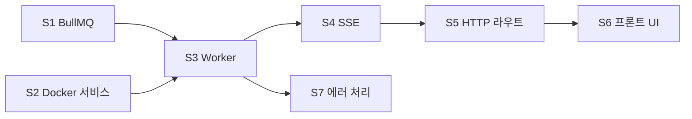
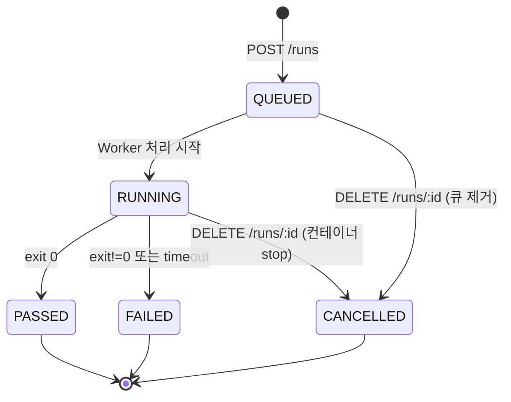

# 05. 마일스톤 M4 — 테스트 실행 엔진 (BullMQ + Docker + SSE)

- 최종 수정일: 2026-04-17
- 관련 스펙: `../specs/01_기능명세서.md` F-03, `../specs/04_API명세서.md` §2.5·§2.8, `../specs/05_인프라_배포명세서.md` §4, `../specs/06_워크플로우명세서.md` §3.1·§3.2·§3.4
- 예상 기간: 8~12일 (가장 크고 어려운 마일스톤)

## 1. 목표

- FR-03 전체 — 테스트 선택/실행/실시간 스트리밍/중단/이력
- BullMQ 기반 큐 인프라 + **Queue Router 추상화** (Phase 3 대비)
- Docker 컨테이너 격리 실행 (dockerode)
- **SSE(Server-Sent Events) 단방향 실시간 로그·진행도 스트리밍** (fastify-sse-v2)
- 클라이언트→서버 조작은 REST 엔드포인트(`DELETE /runs/:runId` 등)로 분리
- **Worker와 API 서버는 Redis pub/sub을 경유**해 상호 통신 (Phase 2 다중 워커 대비)
- Run 상태 전이 원자성 + 동시성 제어(프로젝트 락)

## 2. 선행 조건

- M3 완료 (Project 엔티티, stable/working 디렉토리, 락 서비스)
- `docker/playwright-runner` 이미지 빌드 완료
- `/var/run/docker.sock` 접근 가능

## 3. 태스크 흐름 (하위 7개 단계)

| 태스크 | 이름 | 기간 | 내용 |
|--------|------|------|------|
| M4-S1 | BullMQ 인프라 | 1~2일 | Queue/Worker 팩토리, Queue Router 스켈레톤 |
| M4-S2 | Docker 서비스 | 2~3일 | dockerode 래퍼, 로그 스트림, 취소 |
| M4-S3 | Worker 프로세스 | 3일 | BullMQ Worker + Pub/Sub + 상태 전이 |
| M4-S4 | SSE 엔드포인트 | 2일 | `GET /runs/:runId/events` (fastify-sse-v2) + pub/sub 구독 |
| M4-S5 | HTTP 라우트 | 1일 | `/runs/*` 엔드포인트 |
| M4-S6 | 프론트 실행 UI | 3~4일 | TestSelector, LogViewer, Progress, QueuePosition |
| M4-S7 | 에러·엣지 케이스 | 1일 | 타임아웃, 중복 job, 재연결 |

## 4. 파일 단위 체크리스트

### M4-S1. BullMQ 인프라

- [ ] `apps/api/src/types/jobs.ts`
  - `RunJobData` 인터페이스: `{ runId, projectId, orgId, userId, projectPath, testFilter?, envOverride?, baseURL?, browser, timeout, retries, workers, reportOptions }`
- [ ] `apps/api/src/lib/queue.ts`
  - `createRunsQueue(connection: IORedis): Queue<RunJobData>` — 이름 `runs`, defaultJobOptions `{ attempts: 1, removeOnComplete: 100, removeOnFail: 500 }` (재시도 1로 제한해 중복 실행 방지)
  - `createRunsQueueEvents(connection): QueueEvents` — API가 completion 이벤트 구독
- [ ] `apps/api/src/services/queue-router.service.ts` — **Phase 3 대비 추상화**
  - `class QueueRouter`
  - `constructor({ redisUrls: string[], strategy: 'least-busy'|'round-robin'|'project-based', prisma })`
  - `getQueue(projectId?: string): Promise<Queue<RunJobData>>`
    - Phase 1: redisUrls 1개만 있을 때 즉시 반환
    - `least-busy`: `Queue.getJobCounts('waiting','active')` 합산 비교
    - `round-robin`: 메모리 counter 증가
    - `project-based`: `prisma.project.findUnique` → `workerGroup` → 매핑 테이블, 없으면 least-busy 폴백
  - `getAllQueues(): Queue[]` — 대시보드·관찰성용
  - `close(): Promise<void>`

### M4-S2. Docker 서비스

- [ ] `apps/api/src/services/docker.service.ts`
  - `class DockerService`
  - `constructor(docker: Docker = new Docker())` — 기본 unix:///var/run/docker.sock
  - `runPlaywright(params: { runId, projectPath, reportDir, testFilter?, env?, onStdout, onStderr, onExit, abortSignal? }): Promise<{ containerId, exitCode }>`
    - `docker.createContainer({ Image: 'playwright-hub-runner:latest', Cmd: ['npx','playwright','test', '--reporter=list,html,json', ...(testFilter ? ['--grep', testFilter] : [])], HostConfig: { Binds: [ '${projectPath}:/app:ro', '${reportDir}:/app/playwright-report' ], AutoRemove: true, NetworkMode: config.DOCKER_NETWORK, Memory: 2*1024**3, NanoCpus: 2e9, PidsLimit: 200 }, Env: [ `BASE_URL=${env.baseURL}`, `PLAYWRIGHT_JSON_OUTPUT_NAME=/app/playwright-report/results.json`, ...env.env ], WorkingDir: '/app' })`
    - `container.start()` → `container.attach({ stream: true, stdout: true, stderr: true })` → **demultiplex**: 8바이트 헤더(stream type)로 stdout/stderr 분리 (`dockerode`의 `modem.demuxStream` 활용)
    - 라인 버퍼링: 개행 기준으로 onStdout/onStderr 콜백 호출
    - `container.wait()` → `{ StatusCode }` 반환
    - `abortSignal` 발화 시 `container.stop({ t: 5 })` → SIGKILL
    - `AutoRemove: true`로 stop 후 자동 삭제
  - `stop(containerId): Promise<void>` — 외부 취소 신호용
- [ ] `apps/api/src/services/docker.service.test.ts`
  - alpine 이미지로 간단 echo 테스트
  - abortSignal 후 10s 내 종료 보장
  - stdout/stderr demux 정확성

### M4-S3. Worker 프로세스

- [ ] `apps/api/src/workers/playwright.worker.ts`
  - 파일 최상단: `import 'dotenv/config'` → `config` 검증
  - `const worker = new Worker<RunJobData>('runs', processor, { connection: createRedisConnection(), concurrency: config.WORKER_CONCURRENCY })`
  - **processor 로직**:
    1. `await prisma.run.update({ where: { id: runId }, data: { status: 'RUNNING' } })`
    2. `publish('run:'+runId+':events', { type: 'status', data: 'RUNNING' })`
    3. 프로젝트 락 관찰: sync 락(`lock:project:sync:${projectId}`)이 있으면 대기 — `BLPOP`-like polling 또는 lock.service의 `waitForRelease` 추가
    4. `reportDir = path.join(config.REPORTS_PATH, runId)` 생성
    5. 취소 신호 구독: subscribeOnce `run:{runId}:cancel` → AbortController.abort()
    6. `dockerService.runPlaywright({ ..., onStdout: (line) => { publishLog(line); extractProgress(line) }, onStderr, abortSignal })`
    7. 종료 시:
       - exit 0 → PASSED
       - exit 1 → FAILED
       - cancelled → CANCELLED
       - timeout → FAILED + errorMessage
    8. `reportService.parseReport(runId)` 호출로 집계 업데이트
    9. `prisma.run.update({ data: { status, durationMs, totalTests, passedTests, failedTests, skippedTests, reportPath, finishedAt, errorMessage } })`
    10. `publish('run:'+runId+':events', { type: 'done', data: { status, reportPath } })`
  - `worker.on('failed', async (job, err) => {...})` — 에러 시 FAILED + errorMessage + publish
  - Graceful shutdown: SIGTERM → `worker.close(false)` → 현재 작업 완료 대기 (최대 5분)
- [ ] `apps/api/src/workers/progress-parser.ts`
  - **전략**: `--reporter=json` 출력 파일(`playwright-report/results.json`)을 주기적으로 tail하거나, `--reporter=line` stdout 라인 패턴을 파싱
  - 권장: **json reporter 활용** — Playwright가 최종 results.json을 쓰고, list reporter가 stdout으로 진행 상태를 출력
  - `extractProgress(line: string): { totalTests?, completedTests?, status? } | null` — `Running N tests using M workers`, `N passed`, `N failed`, `N skipped` 패턴 파싱
  - `publishProgress(runId, snapshot)` — throttle 500ms(백프레셔 방지)
- [ ] `apps/api/src/workers/run-publisher.ts`
  - Redis pub/sub 래퍼: `publishLog`, `publishStatus`, `publishProgress`, `publishTestResult`, `publishDone`, `publishError`
  - 로그 배치: 100ms 동안 쌓인 라인을 한 번에 발행(SSE 프레임 과부하 방지)
- [ ] `apps/api/package.json` scripts: `"worker:dev": "tsx watch src/workers/playwright.worker.ts"`, `"worker:start": "node dist/workers/playwright.worker.js"`

### M4-S4. SSE 엔드포인트

- [ ] `apps/api/src/plugins/sse.ts`
  - Fastify 플러그인. `fastify.register(fastifySse)` (from `fastify-sse-v2`).
  - CORS 설정은 `@fastify/cors`에서 이미 처리됨.
- [ ] `apps/api/src/sse/runSse.ts`
  - `registerRunSse(fastify, { prisma, subRedis })` Fastify 플러그인
  - 라우트 `GET /runs/:runId/events`
  - `preHandler`: JWT 검증(쿼리 `?token=` 또는 `Authorization` 헤더) → `request.user = { id, orgId, role }`
  - 핸들러 시작 시: Run + Project → orgScope 검증. 완료된 Run이면 최종 상태 단발 전송 후 스트림 종료
  - `Last-Event-ID` 헤더 지원 (Phase 2 Redis Stream). Phase 1은 무시
  - `subRedis.subscribe('run:'+runId+':events')` → 메시지 파싱 → `reply.sse({ id, event: msg.type, data: JSON.stringify(msg.data) })` 발행
  - 클라이언트 disconnect 감지: `request.raw.on('close', () => subRedis.unsubscribe(...))`
  - **핵심 설계**: Worker가 Fastify/SSE 객체에 직접 접근하지 않고 Redis pub/sub만 사용 → Phase 2에서 워커가 다수여도 동일하게 작동
- [ ] `apps/web/lib/sse.ts`
  - `createRunEventSource(runId, token): EventSource` — 브라우저 native `new EventSource('/api/v1/runs/'+runId+'/events?token='+token)`
  - `useRunEvents(runId)` 훅 — useReducer 기반 상태 `{ status, progress, logs, result, error, isConnected, lastEventId }`
  - 이벤트 등록: `es.addEventListener('log', handler)`, `'status'`, `'progress'`, `'test_result'`, `'done'`, `'error'`
  - 완료/실패 시 `es.close()`로 재연결 방지
  - **취소**는 별도 REST 호출: `cancel()` → `fetch(DELETE /runs/:runId)`

### M4-S5. HTTP 라우트

- [ ] `apps/api/src/routes/runs.ts`
  - `POST /projects/:id/runs` — authed + orgScope + validate body `{ testFilter?, envOverride? }`
    - 흐름: Prisma `run.create({ status: 'QUEUED', testFilter, userId, projectId })` → `queueRouter.getQueue(projectId).add('run', jobData, { jobId: run.id })` → 202 `{ runId, status, eventsUrl: '/api/v1/runs/'+runId+'/events' }` (클라이언트가 EventSource로 구독)
  - `GET /projects/:id/runs` — 페이지네이션 (`page, limit, status`)
  - `GET /runs/:runId` — 상세
  - `DELETE /runs/:runId` — QUEUED/RUNNING만 허용
    - QUEUED: `queue.remove(runId)` + `run.update({ status: 'CANCELLED' })`
    - RUNNING: `publish('run:'+runId+':cancel', {})` → 워커가 container.stop → 최종 상태 전이는 워커가 처리 (race 방지)
    - 그 외 상태: 409 Conflict

### M4-S6. 프론트엔드 실행 화면

- [ ] `apps/web/app/(main)/projects/[id]/run/page.tsx`
  - 좌측: `TestSelector` (M3에서 준비한 트리 재활용, 선택 상태 zustand)
  - 우측 탭: `LogViewer`, `RunProgress`, `QueuePosition`
  - "실행" 버튼 → `POST /projects/:id/runs` → runId 획득 → `useRunEvents(runId)` EventSource 구독
  - QUEUED 상태: QueuePosition 표시. RUNNING 전환 시 Progress로 전환
- [ ] `apps/web/components/runner/TestSelector.tsx`
  - props: `{ projectId, onSelectionChange: (filter: string | null) => void }`
  - glob/grep 문자열 생성(선택된 테스트 제목들을 `|` regex로 결합)
- [ ] `apps/web/components/runner/LogViewer.tsx`
  - props: `{ logs: LogLine[] }`
  - 가상 스크롤(`react-virtuoso`), ANSI 컬러 파싱(`ansi-to-react`), 자동 스크롤(사용자가 스크롤 올리면 일시 중지)
- [ ] `apps/web/components/runner/RunProgress.tsx`
  - props: `{ progress: ProgressSnapshot, status: RunStatus }`
  - Progress bar, passed/failed/skipped 카운터, 현재 실행 파일명
- [ ] `apps/web/components/runner/QueuePosition.tsx`
  - props: `{ runId }` — `GET /runs/:runId`로 폴링하여 큐 위치·예상 대기 시간 표시
- [ ] `apps/web/app/(main)/projects/[id]/runs/page.tsx` — 실행 이력 테이블
- [ ] `apps/web/hooks/useRunEvents.ts` — `lib/sse.ts`에서 re-export
- [ ] `apps/web/hooks/useCreateRun.ts`, `useCancelRun.ts`

### M4-S7. 에러 및 엣지 케이스

- [ ] Docker 이미지 없음 → `dockerService.runPlaywright` 초기에 체크 후 `Error('Image not found: ...')` 발생 → Worker가 FAILED로 전환 + 관리자 로그
- [ ] 컨테이너 타임아웃: `Math.min(config.RUN_HARD_TIMEOUT_MS, testTimeout * totalTestsHint + 60s)` 안전 상한
- [ ] 워커 크래시 시 duplicate job 방지: `jobId: runId` + Run.status 기반 idempotency 체크 — 워커 시작 시 `prisma.run.findUnique` → 이미 `PASSED/FAILED/CANCELLED` 이면 skip
- [ ] SSE 재연결: EventSource 자동 재연결 + `Last-Event-ID` 헤더 활용. 서버는 Redis Stream(`run:{runId}:events`)에서 해당 id 이후 이벤트 리플레이 (Phase 1은 DB 최종 상태만 재전송)
- [ ] 로그 백프레셔: Worker 쪽에서 100ms 배치 발행. SSE 클라이언트는 큐 최대 길이 제한(5000 라인) 후 오래된 것 truncate

## 5. 내부 의존성 그래프



## 6. 상태 전이 다이어그램



## 7. 검증 기준

```bash
# 1) 이미지 빌드
docker build -t playwright-hub-runner:latest /home/superstart/projects/playwright-hub/docker/playwright-runner/

# 2) 워커 실행
pnpm --filter @playwright-hub/api worker:dev

# 3) 실행 요청
curl -X POST http://localhost:3001/api/v1/projects/$PID/runs \
  -H "Authorization: Bearer $TOKEN" \
  -H "Content-Type: application/json" \
  -d '{"testFilter": null, "envOverride": {}}'
# → 202 { runId, status: "QUEUED", eventsUrl: "/api/v1/runs/{runId}/events" }

# 4) SSE 연결
curl -N -H "Authorization: Bearer $TOKEN" \
  http://localhost:3001/api/v1/runs/$RUN_ID/events
# 또는 브라우저에서 EventSource로 구독하여 실시간 이벤트 확인
# 이벤트 순서: status(QUEUED→RUNNING) → log(여러번) → progress(여러번) → test_result → done

# 5) DB 확인
# Run.status=PASSED/FAILED, totalTests/passed/failed/skipped/durationMs/reportPath/finishedAt 채워짐

# 6) 취소 테스트
curl -X DELETE http://localhost:3001/api/v1/runs/$RUN_ID -H "Authorization: Bearer $TOKEN"
# RUNNING 도중 → 컨테이너 SIGKILL → status=CANCELLED

# 7) 동시성 테스트
# 4개 동시 POST /runs → 모두 RUNNING → reports/{runId} 4개 디렉토리 격리
# 5번째 → QUEUED 유지 → 슬롯 확보 후 RUNNING 전환

# 8) sync 중 실행
# POST /projects/:id/sync 중에 POST /runs → Worker가 sync 락 대기 → 해제 후 실행

# 9) 프론트
# /projects/:id/run → 테스트 선택 → 실행 → 실시간 진행도 바 + 로그 스트림 + 통계
# /projects/:id/runs → 과거 실행 이력 테이블 (페이지네이션)
```

## 8. 리스크 (가장 높음)

| # | 리스크 | 영향 | 완화 |
|---|-------|------|------|
| R4.1 | 진행도 파싱 정확성 (Playwright 리포터 포맷 변경) | 대시보드 잘못된 값 | `--reporter=json` 파일 기반 파싱 우선, list 스트림은 보조. 리포터 버전 핀 고정. 픽스처 기반 contract test |
| R4.2 | Queue Router 추상화 미흡 → Phase 3에서 대규모 리팩터링 | Phase 3 일정 지연 | Phase 1부터 인터페이스 완성(redisUrls 배열, strategy 분기) |
| R4.3 | `/var/run/docker.sock` 루트 권한 | 호스트 탈취 가능 | 워커 전용 컨테이너로 분리. Phase 4 rootless docker |
| R4.4 | BullMQ duplicate job (워커 크래시 후 재할당) | 같은 Run 2번 실행 | `jobId: runId` + Run.status 기반 idempotency 체크 |
| R4.5 | SSE 재연결 시 이벤트 유실 | 화면 미완성 | Redis Stream + `Last-Event-ID` 헤더 기반 replay. Phase 1은 DB 최종 상태만 재전송 |
| R4.6 | 로그 폭주 → SSE 백프레셔 | 클라이언트 느려짐 | 100ms 배치 + 최대 라인 5000 truncate |
| R4.7 | 컨테이너 리소스 누수 | 호스트 OOM/디스크 | `AutoRemove: true`, 정기 `docker ps -a --filter label=playwright-hub=true` cleanup |
| R4.8 | 대용량 리포트 메모리 | API OOM | stream-json, suite 단위 lazy fetch (M5에서 구현) |

## 9. 설계 결정 메모

- **진행도 파싱**: `PLAYWRIGHT_JSON_OUTPUT_NAME` env로 리포트 디렉토리 내 `results.json` 생성 지정. 워커가 종료 후 파싱. 실시간 진행도는 stdout list reporter로만.
- **동시성 제어**: M3의 `lock:project:sync`만 Worker에서 존중. 같은 프로젝트 여러 Run 동시 실행은 `reports/{runId}` 격리로 안전.
- **Queue Router Phase 1 동작**: `REDIS_URLS` 미지정 시 `REDIS_URL` 단일 사용 → queue 1개 반환.
- **Worker ↔ API 통신**: Redis pub/sub (`run:{runId}:events`, `run:{runId}:cancel`). Worker는 Fastify/SSE 객체 미참조.

## 10. 산출물

- 실행 가능한 `pnpm worker:dev`
- `POST /runs` + SSE 실시간 스트리밍 완전 동작
- 4개 동시 실행 성공
- `/projects/:id/run`, `/projects/:id/runs` 프론트 완성
- 리포트 파일(`reports/{runId}/`) 생성

## 11. 다음 단계

`06_마일스톤_M5_리포트_조회.md`로 이동하여 생성된 리포트 파일을 파싱·서빙한다. 동시에 **M6(Claude Agent SDK)는 M3 완료 시점부터 병렬 착수 가능** — `07_마일스톤_M6_Claude_Agent_SDK.md` 참조.
