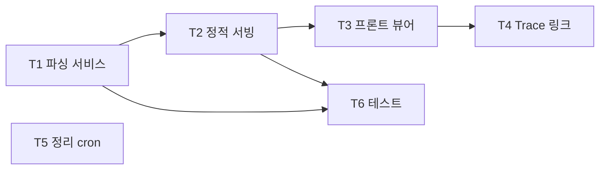

# 06. 마일스톤 M5 — 리포트 조회

- 최종 수정일: 2026-04-17
- 관련 스펙: `../specs/01_기능명세서.md` F-04, `../specs/04_API명세서.md` §2.6, `../specs/05_인프라_배포명세서.md` §10(정리)
- 예상 기간: 4~6일

## 1. 목표

- FR-04 (리포트 비교 제외) — HTML 리포트 JSON 파싱 + 자체 React 렌더러
- 스크린샷/Trace/비디오 등 첨부 파일 정적 서빙 (path traversal 방어)
- Trace 외부 뷰어 연동(`https://trace.playwright.dev`)
- 리포트 보존 기간 관리(cron cleanup)

## 2. 선행 조건

- M4 완료 (Run 생성 + 리포트 파일 실제 생성 확인)
- `PLAYWRIGHT_JSON_OUTPUT_NAME` 설정으로 워커가 `results.json` 생성하도록 M4에서 합의

## 3. 태스크 흐름

| 태스크 | 이름 | 내용 |
|--------|------|------|
| M5-T1 | 리포트 서비스 | `results.json` 파싱, ReportData 구조화 |
| M5-T2 | 정적 파일 서빙 | `/runs/:runId/report/files/*` + traversal 방어 |
| M5-T3 | 프론트 리포트 뷰어 | ReportSummary, SuiteList, CaseRow, Screenshot/Trace/Video |
| M5-T4 | Trace 뷰어 통합 | 외부 Playwright Trace Viewer URL 생성 |
| M5-T5 | 리포트 정리 | cron 기반 보존 기간 관리 |
| M5-T6 | 테스트 | 픽스처 기반 파싱 contract test |

## 4. 파일 단위 체크리스트

### M5-T1. 리포트 파싱 서비스

- [ ] `apps/api/src/services/report.service.ts`
  - `parseReport(runId: string): Promise<ReportData>`
    - 입력: `reports/{runId}/results.json` (Playwright json reporter 출력)
    - 출력 구조:
      ```ts
      {
        summary: { total, passed, failed, skipped, duration },
        suites: [{
          title, file,
          tests: [{
            title, status, duration, retries,
            error: { message, stack, snippet? } | null,
            attachments: [{ name, path, contentType }]
          }]
        }]
      }
      ```
    - 중첩 suites 처리 (Playwright는 describe 중첩 가능)
    - 첨부 파일 경로 변환: 원본 `test-results/<hash>/trace.zip` → API 경로 `/api/v1/runs/{runId}/report/files/test-results/<hash>/trace.zip`
  - `resolveAttachmentPath(runId: string, relativePath: string): string` — path traversal 방어 (`path.resolve(base)` + `startsWith(base)`)
  - `extractProgress(stdoutLine: string): ProgressSnapshot | null` — M4의 progress-parser와 동일 로직(재사용 혹은 동일 모듈)
- [ ] `apps/api/src/types/report.ts` — TypeScript 타입(프론트 공용 → `packages/shared-types`로 이동 가능)

### M5-T2. 정적 파일 서빙 라우트

- [ ] `apps/api/src/routes/reports.ts`
  - `GET /runs/:runId/report` — authed + orgScope → `reportService.parseReport(runId)` JSON 반환
  - `GET /runs/:runId/report/files/*` — authed + orgScope
    - `path.resolve(reportRoot, matchedPath)` 후 `startsWith(reportRoot)` 검증
    - `res.sendFile(absPath, { headers: { 'Content-Type': contentTypeMap[ext] } })`
    - `.png` → `image/png`, `.jpeg` → `image/jpeg`, `.webm` → `video/webm`, `.zip` → `application/zip`, 기본 `application/octet-stream`
    - 큰 파일은 HTTP Range 자동 지원 (`sendFile`이 처리)
- [ ] `apps/api/src/index.ts`에서 `/api/v1/runs/:runId/report/*` 라우터 mount
- [ ] Alternatively(선택): `GET /runs/:runId/report/html` — iframe embed용 원본 HTML 리포트(Phase 1 대안, 자체 UI 완성 전)

### M5-T3. 프론트엔드 리포트 뷰어

- [ ] `apps/web/app/(main)/runs/[runId]/report/page.tsx`
  - Server Component로 초기 fetch(SSR) → 클라이언트 컴포넌트로 상세 인터랙션
- [ ] `apps/web/components/report/ReportSummary.tsx`
  - props: `{ summary }`
  - 카운터 카드(Total/Passed/Failed/Skipped/Duration) + 도넛 차트(recharts)
- [ ] `apps/web/components/report/TestSuiteList.tsx`
  - props: `{ suites }`
  - 파일별 그룹 accordion
- [ ] `apps/web/components/report/TestCaseRow.tsx`
  - props: `{ test }`
  - 상태 아이콘, 제목, 소요, 재시도 횟수
  - 확장 시 에러 메시지/스택 + 첨부 파일 프리뷰
- [ ] `apps/web/components/report/ScreenshotViewer.tsx`
  - props: `{ src, alt }`
  - lightbox 모달(`dialog` 기반), zoom/pan
- [ ] `apps/web/components/report/TraceDownload.tsx`
  - 다운로드 버튼 + "Open in Playwright Trace Viewer" 링크 (외부)
- [ ] `apps/web/components/report/VideoPlayer.tsx`
  - `<video controls>` + Content-Type `video/webm` 가정
- [ ] `apps/web/hooks/useReport.ts` — `useQuery(['report', runId], () => api.reports.get(runId))`

### M5-T4. Trace 뷰어 URL 전략

- [ ] **방안 A (권장, Phase 1)**: 외부 Playwright Trace Viewer 링크
  - URL: `https://trace.playwright.dev/?trace=${encodeURIComponent(absoluteTraceUrl)}`
  - 문제: 외부 서비스가 trace 파일을 public URL로 접근 가능해야 함
  - Phase 1 단순화: "사용자가 trace.zip 다운로드 → 수동으로 trace.playwright.dev에 드롭" 안내. 또는 로컬 서명 URL(JWT 쿼리) 발급
- [ ] **방안 B (Phase 4)**: `@playwright/test` 내장 trace-viewer 번들 embed

### M5-T5. 리포트 정리 (cron)

- [ ] `apps/api/src/jobs/cleanup-reports.job.ts`
  - BullMQ `repeat: { pattern: '0 3 * * *' }` 또는 `node-cron`
  - 동작: `fs.readdir(REPORTS_PATH)` → 각 run-id 디렉토리의 mtime 확인 → `REPORT_RETENTION_DAYS` 초과 시 `fs.rm(dir, { recursive })` + `prisma.run.update({ reportPath: null })`
- [ ] 대안: 호스트 cron + `deploy/scripts/report-cleanup.sh`
  - `find ${REPORTS_PATH} -mindepth 1 -maxdepth 1 -type d -mtime +$REPORT_RETENTION_DAYS -exec rm -rf {} \;`
- [ ] Phase 1 권장: **호스트 cron**이 단순. BullMQ repeat은 Phase 2+에서 적용

### M5-T6. 테스트

- [ ] `apps/api/src/services/report.service.test.ts`
  - 실제 Playwright가 생성한 샘플 `results.json` 픽스처 저장(`__fixtures__/results.json`)
  - parseReport → 기대 구조 일치
  - 중첩 suites 처리
  - 첨부 파일 경로 변환
- [ ] `apps/api/src/routes/reports.test.ts`
  - path traversal(`../../../etc/passwd`) → 400 또는 403
  - 존재하지 않는 파일 → 404
  - 타 조직 runId 접근 → 404 (정보 유출 방지)
  - 큰 영상 Range 요청 → 206 Partial Content

## 5. 내부 의존성 그래프



## 6. 검증 기준

```bash
# 1) 파싱 단위 테스트
pnpm --filter @playwright-hub/api test -- report

# 2) E2E: M4에서 완료된 Run 사용
curl http://localhost:3001/api/v1/runs/$RUN_ID/report -H "Authorization: Bearer $TOKEN"
# → { summary, suites: [...] }

# 3) 첨부 스크린샷 조회
curl http://localhost:3001/api/v1/runs/$RUN_ID/report/files/test-results/login-chromium/test-failed-1.png \
  -H "Authorization: Bearer $TOKEN" -o /tmp/out.png
file /tmp/out.png  # PNG image data

# 4) path traversal 차단
curl -w "%{http_code}\n" -o /dev/null -s \
  "http://localhost:3001/api/v1/runs/$RUN_ID/report/files/../../../../etc/passwd" \
  -H "Authorization: Bearer $TOKEN"
# → 403 또는 400

# 5) 비디오 Range 요청
curl -H "Range: bytes=0-1023" -H "Authorization: Bearer $TOKEN" \
  http://localhost:3001/api/v1/runs/$RUN_ID/report/files/test-results/xxx/video.webm -o /dev/null -w "%{http_code}\n"
# → 206

# 6) 프론트 리포트 페이지
# /runs/$RUN_ID/report → 요약 + 파일 트리 + 실패 케이스 확장 시 에러 스택/스크린샷/trace/video

# 7) cron cleanup(수동)
node -e "require('./apps/api/dist/jobs/cleanup-reports.job.js').run()"
# 30일 지난 디렉토리 rm + Run.reportPath = null
```

## 7. 리스크

| # | 리스크 | 완화 |
|---|-------|------|
| R5.1 | Playwright 리포터 포맷 변경 | 픽스처 contract test + 버전 핀 고정 |
| R5.2 | 대용량 리포트 JSON 파싱 OOM | Phase 2에서 `stream-json` 도입. Phase 1은 최대 1000 테스트 가정 |
| R5.3 | Trace 파일 public 노출 | Phase 1은 수동 다운로드 안내. Phase 2에서 서명된 임시 URL 발급 |
| R5.4 | 비디오 `.webm` 호환성 | 권장 브라우저(Chrome/Firefox/Edge) 안내. Phase 4에서 `.mp4` 변환 옵션 |
| R5.5 | 첨부 경로 traversal | `path.resolve` + `startsWith(base)` 이중 검증 |
| R5.6 | cron과 BullMQ repeat 중복 | Phase 1은 호스트 cron 단일 채택 |

## 8. 산출물

- `GET /runs/:runId/report` JSON 응답
- `GET /runs/:runId/report/files/*` 파일 서빙
- `/runs/:runId/report` 프론트 페이지 (요약·목록·스크린샷·비디오)
- 자동 정리 cron(스크립트 + 실행 매뉴얼)

## 9. 다음 단계

`07_마일스톤_M6_Claude_Agent_SDK.md`로 이동하여 AI 기반 코드 수정을 구현한다. M6는 M3 완료 이후 M4와 병렬로 진행 가능했으므로, 실제 일정상 M4·M5·M6를 오버랩시킬 수 있다.
