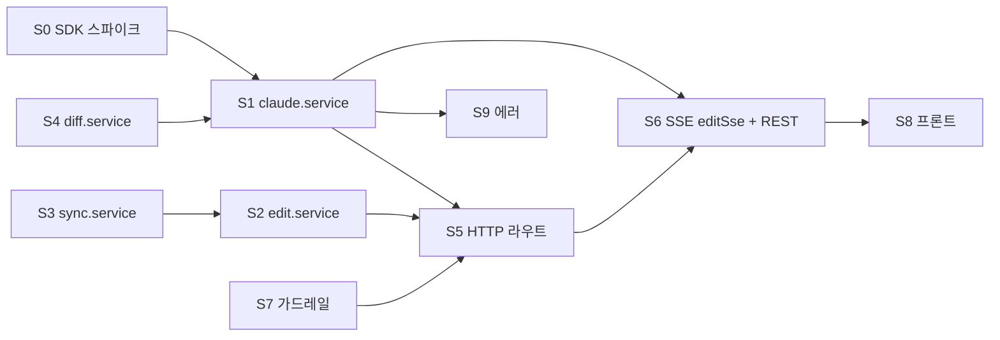
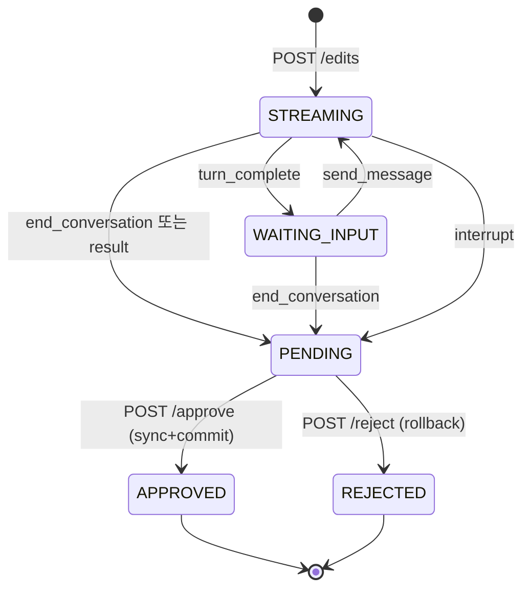

# 07. 마일스톤 M6 — Claude Agent SDK 통합 (멀티턴 AI 코드 수정)

- 최종 수정일: 2026-04-17
- 관련 스펙: `../specs/01_기능명세서.md` F-05, `../specs/04_API명세서.md` §2.7·§2.8 ws/edits, `../specs/06_워크플로우명세서.md` §3.3, `../specs/08_Claude_Agent_SDK_연동명세서.md` 전체
- 예상 기간: 10~14일 (두 번째로 큰 마일스톤)

## 1. 목표

- FR-05 전체 + 스펙 08 전체 — 멀티턴 대화형 수정, 실시간 스트리밍, 도구 사용 추적, 파일 변경 감지, diff 미리보기, 승인/거부, Git 자동 커밋, 세션 재개
- `@anthropic-ai/claude-agent-sdk`의 AsyncGenerator 스트리밍 풀 활용
- 동시성 한도·비용 한도·유휴 타임아웃 가드레일
- 샌드박싱(projects/working/ 외부 접근 차단)

## 2. 선행 조건

- M3 완료 (Project + working/ 디렉토리 + lock.service)
- M4 완료는 불필요 (병렬 진행 가능) — 단, approve 시 Git commit이 stable/에 이뤄지므로 M3의 git.service 완성 필수
- **SDK 스파이크(M6-S0)**: 본격 착수 전 1~2일간 최소 예제 구축 (riskmitigation `11_리스크_불확실성.md` 참조)

## 3. 태스크 흐름 (하위 9개 단계)

| 태스크 | 이름 | 기간 | 내용 |
|--------|------|------|------|
| M6-S0 | SDK 스파이크(선행) | 1~2일 | query() / interrupt / rewindFiles / resume 실동작 검증 |
| M6-S1 | Claude 서비스 골격 | 2일 | `claude.service` 핵심 구조 + ActiveSession 레지스트리 |
| M6-S2 | Edit DB 서비스 | 1일 | createEdit/appendMessage/updateResult/approve/reject |
| M6-S3 | Sync 서비스 완성 | 1일 | working→stable 동기화 + Git commit + 롤백 |
| M6-S4 | Diff 서비스 | 1일 | git diff 기반 unified diff 생성 |
| M6-S5 | HTTP 라우트 | 1일 | `/edits/*` 엔드포인트 |
| M6-S6 | SSE editSse + REST 제어 | 2일 | `GET /edits/:editId/events` (fastify-sse-v2) + 제어 REST 엔드포인트 |
| M6-S7 | 가드레일 | 1일 | 동시성·비용·타임아웃 |
| M6-S8 | 프론트 채팅 UI | 4~5일 | EditChatView + 9개 컴포넌트 + useEditEvents(EventSource) |
| M6-S9 | 에러 강화 | 1일 | 08 §9.6 에러 매트릭스 |

## 4. 파일 단위 체크리스트

### M6-S0. SDK 스파이크 (실장 착수 전)

- [ ] `scripts/sdk-spike/basic-query.ts` — 최소 `query()` 호출 예제. 간단한 프롬프트 → 텍스트 응답
- [ ] `scripts/sdk-spike/multi-turn.ts` — AsyncIterable input으로 멀티턴
- [ ] `scripts/sdk-spike/file-edit.ts` — cwd 지정, allowedTools=[Read,Edit] 로 파일 수정
- [ ] `scripts/sdk-spike/interrupt.ts` — interrupt() 호출 후 cleanup 타이밍 확인
- [ ] `scripts/sdk-spike/rewind.ts` — rewindFiles(messageId, dryRun:true) 결과 구조
- [ ] `scripts/sdk-spike/sessions.ts` — listSessions/getSessionMessages 저장 위치 확인
- [ ] 결과를 `11_리스크_불확실성.md`의 "Claude SDK 스파이크 체크리스트"로 업데이트

### M6-S1. Claude 서비스 골격

- [ ] `apps/api/src/services/claude.service.ts`
  - **상수**
    - `PLAYWRIGHT_SYSTEM_PROMPT` — 스펙 08 §4.9 기반 (한국어, 프로젝트 구조·도구 사용 규칙·변경 범위 제한)
  - **타입**
    ```ts
    interface ActiveSession {
      queryInstance: Query;
      abortController: AbortController;
      editId: string;
      projectId: string;
      projectPath: string;
      sessionId?: string;
      inputEmitter: (message: string) => void;
      filesChanged: Set<string>;
      lastActivityAt: number;
      createdAt: number;
      orgId: string;
    }
    ```
  - **상태**
    - `const activeSessions = new Map<editId, ActiveSession>()`
  - **함수**
    - `startSession({ editId, projectId, orgId, projectPath, prompt, emitToClient }): Promise<void>`
      - messageStream AsyncIterable 구성: 첫 prompt yield → Promise queue 대기
      - `inputEmitter(message)` 호출 시 큐에 push하여 다음 yield
      - `query({ prompt: messageStream, options: { cwd: ${workingBase}/${projectPath}, systemPrompt: PLAYWRIGHT_SYSTEM_PROMPT, allowedTools: config.CLAUDE_AGENT_ALLOWED_TOOLS.split(','), disallowedTools: ['Agent','WebSearch','WebFetch'], permissionMode: 'acceptEdits', maxTurns: config.CLAUDE_AGENT_MAX_TURNS, maxBudgetUsd: config.CLAUDE_AGENT_MAX_COST_PER_EDIT, abortController, includePartialMessages: true, enableFileCheckpointing: true, persistSession: true } })`
      - activeSessions.set → `processStream(q, editId, emitToClient).catch(handleStreamError)`
    - `processStream(q, editId, emitToClient)` — AsyncGenerator 순회
      - `system` + `init` → sessionId 기록 → `edit:connected` emit → Edit.sessionId DB 저장
      - `assistant` → content blocks 분기
        - `text` block → `edit:text_done { text, messageId }`
        - `tool_use` block → `edit:tool_start { tool, toolUseId, input: sanitizeToolInput(input) }`
        - `tool_result` block → `edit:tool_result { toolUseId, output, isError }` + Edit 파일일 경우 filesChanged.add
      - `stream_event` → delta 타입 분기(`text_delta`, `thinking_delta`, `input_json_delta`)
      - `result` → `edit:result { subtype, costUsd, durationMs, usage }` + Edit.status = PENDING + diff 계산 + DB 최종 업데이트 → activeSessions.delete
    - `sendFollowUp(editId, message)`
      - activeSessions에서 조회 → lastActivityAt 갱신 → `inputEmitter(message)` 호출
    - `interruptSession(editId)` — `queryInstance.interrupt()` + activeSessions cleanup
    - `rewindSession(editId, messageId, dryRun?)` — `queryInstance.rewindFiles({ messageId, dryRun })`
    - `resumeSession({ editId, projectId, projectPath, sessionId, prompt, emitToClient })` — 새 query with `resume: sessionId`
    - `getEditSessions(projectPath)` — SDK listSessions 활용
    - `getEditSessionMessages(sessionId, projectPath)` — SDK getSessionMessages 활용
    - `sanitizeToolInput(input)` — Bash input에서 password/token 패턴 마스킹, Read/Edit의 file_path는 상대경로로 표시
  - **타임아웃 스위퍼**
    - `setInterval(() => activeSessions.forEach(session => { if (Date.now() - session.lastActivityAt > config.CLAUDE_AGENT_SESSION_TIMEOUT_MS) interruptSession(session.editId) }), 30000)`

### M6-S2. Edit DB 서비스

- [ ] `apps/api/src/services/edit.service.ts`
  - `createEdit({ userId, projectId, prompt }): Promise<Edit>` — status STREAMING, messages `[]`
  - `updateEditStatus(editId, status)` — Prisma update
  - `appendMessage(editId, message)` — JSON 배열 push (read-modify-write with optimistic concurrency 또는 `prisma.$queryRaw` jsonb_insert)
  - `setSessionId(editId, sessionId)`
  - `updateEditResult(editId, { diff, filesChanged, costUsd, durationMs, status })` — status PENDING 또는 에러 상태
  - `approveEdit(editId)` → syncService.syncAndCommit → status APPROVED + commitHash + syncedAt
  - `rejectEdit(editId)` → syncService.rollbackWorking → status REJECTED
  - `listEdits(projectId, orgId, pagination)` — 페이지네이션

### M6-S3. Sync 서비스 완성

- [ ] `apps/api/src/services/sync.service.ts`
  - `syncAndCommit(editId: string): Promise<{ commitHash, syncedAt }>`
    - 흐름: Edit → Project 조회 → `withLock('lock:project:sync:'+projectId, 300000)` 내부에서:
      - working→stable 복사: rsync 프로세스 spawn 또는 `fs.cp(workingPath, stablePath, { recursive: true, force: true, filter })` (`.git` 디렉토리는 stable 것을 유지하도록 filter)
      - `gitService.commitChanges(stablePath, { message: 'Playwright Hub: edit '+editId+' - '+promptSummary, authorName: user.email.split('@')[0], authorEmail: user.email, files: Array.from(filesChanged) })`
      - commitHash 반환
      - Prisma Edit 업데이트
  - `rollbackWorking(editId: string): Promise<void>`
    - working/ 디렉토리 삭제 → stable/에서 재복사
    - Prisma Edit.status = REJECTED
  - `computeWorkingDiff(stablePath, workingPath): Promise<string>`
    - working에 임시 git init 또는 stable의 `.git`을 활용해 `git diff`
    - 권장: working 디렉토리도 stable과 동일한 `.git`을 공유(stable에서 cp -r)하므로 working 디렉토리에서 `git diff HEAD` 실행 가능
  - **원자성**: 복사 중 크래시 대비 → `working` → `stable.tmp.{uuid}` 복사 → 검증 → `fs.rename(stable.tmp.{uuid}, stable)` (원자적 교체). 실패 시 tmp cleanup

### M6-S4. Diff 서비스

- [ ] `apps/api/src/services/diff.service.ts`
  - `computeDiff(workingPath: string): Promise<string>` — `git -C workingPath diff HEAD` (unified diff)
  - `filesFromDiff(diff: string): string[]` — diff 파싱해 변경 파일 추출
- [ ] claude.service의 result 수신 시 호출하여 Edit.diff / Edit.filesChanged 갱신

### M6-S5. HTTP 라우트

- [ ] `apps/api/src/routes/edits.ts`
  - `POST /projects/:id/edits` — authed + orgScope + validate `{ prompt }`
    - 동시 세션 한도 체크 (`claudeLimits.checkConcurrent(orgId)`) → 429 RATE_LIMIT
    - 일일 비용 한도 체크 (`checkDailyBudget(orgId)`) → 429
    - `editService.createEdit({ userId, projectId, prompt })` → 202 `{ editId, status: 'STREAMING', eventsUrl: '/api/v1/edits/'+editId+'/events' }`
    - **옵션 A(권장)**: SSE 연결(GET /events) 시 `startSession` 호출 (지연 시작, 5초 내 연결 없으면 세션 timeout)
    - **옵션 B**: 즉시 `startSession` + 서버측 이벤트 버퍼링(Redis Stream)
  - `GET /edits/:editId` — 상세 (messages, diff, sessionId, costUsd 포함)
  - `GET /edits/:editId/sessions` — `claude.service.getEditSessions(projectPath)`
  - `POST /edits/:editId/resume` — validate `{ sessionId, prompt }` → 새 editId로 `resumeSession` → 202 `{ editId, eventsUrl }`
  - `POST /edits/:editId/approve` — Edit.status === 'PENDING' 확인 → `editService.approveEdit(editId)` → 200
  - `POST /edits/:editId/reject` — Edit.status === 'PENDING' 확인 → `editService.rejectEdit` → 200
  - `GET /projects/:id/edits` — 페이지네이션
  - **SSE 전환에 따른 신규 제어 엔드포인트** (기존 WS inbound 이벤트 대체):
    - `POST /edits/:editId/messages` validate `{ message }` → `claude.service.sendFollowUp(editId, message)` → 202
    - `POST /edits/:editId/interrupt` → `interruptSession(editId)` → 202
    - `POST /edits/:editId/rewind` validate `{ messageId, dryRun? }` → `rewindSession(...)` 결과 200
    - `POST /edits/:editId/end` → 세션 명시 종료(PENDING 전환) → 200

### M6-S6. SSE editSse + REST 제어

- [ ] `apps/api/src/sse/editSse.ts`
  - Fastify 플러그인. 라우트 `GET /edits/:editId/events`
  - `preHandler`: JWT 검증(쿼리 `?token=` 또는 `Authorization` 헤더) + Edit + Project → orgScope 검증
  - 핸들러 흐름:
    - Edit.status 종료 상태(APPROVED/REJECTED)면 저장된 messages + result 리플레이 후 스트림 종료
    - activeSessions에 없고 Edit.status === 'STREAMING' 이면 `claude.service.startSession({...})` 호출 (옵션 A)
    - 이미 activeSessions에 있으면 단순 리슨 모드
  - `emitToClient(event, data)` 함수 주입: `(ev, d) => reply.sse({ event: ev, id: nextId(), data: JSON.stringify(d) })`
  - `request.raw.on('close', ...)` 에서 구독 해제 처리
  - SSE 프레임 형식:
    ```
    event: <edit:*>
    id: <monotonic-id>
    data: <JSON payload>

    ```
  - 서버 → 클라이언트 이벤트 (스펙 08 §6):
    - `edit:connected { editId, sessionId, tools, model }`
    - `edit:text_delta { delta }`
    - `edit:text_done { text, messageId }`
    - `edit:thinking { thinking }`
    - `edit:tool_start { tool, toolUseId, input }`
    - `edit:tool_result { toolUseId, output, isError }`
    - `edit:file_change { path, type }`
    - `edit:turn_complete { messageId, filesChanged }`
    - `edit:result { subtype, costUsd, durationMs, usage }`
    - `edit:error { code, message }`

### M6-S7. 가드레일 (동시성·비용·타임아웃)

- [ ] `apps/api/src/services/claude-limits.service.ts`
  - `checkConcurrent(orgId): Promise<void>` — activeSessions 순회하여 같은 orgId 카운트, `config.CLAUDE_AGENT_MAX_CONCURRENT` 초과 시 `RateLimitError`
  - `checkDailyBudget(orgId): Promise<void>` — `prisma.edit.aggregate({ where: { project: { orgId }, createdAt: { gte: startOfDay } }, _sum: { costUsd } })` 합산 > `CLAUDE_AGENT_MAX_COST_PER_DAY` 시 `RateLimitError`
  - `idleTimeoutSweeper()` — claude.service의 setInterval로 lastActivityAt 검사(위에 포함)

### M6-S8. 프론트엔드 대화형 UI (프론트 난이도 최상)

- [ ] `apps/web/lib/sse-edit.ts` — `useEditEvents(editId)` 훅 (스펙 08 §8.4 전체)
  - 상태: `messages[]`, `currentStream: string`, `status: 'idle'|'streaming'|'waiting_input'|'reviewing'|'error'`, `filesChanged: Set<string>`, `activeTools: Map<toolUseId, ToolUse>`, `sessionInfo`, `isConnected`
  - 이벤트 핸들러 10종
  - API: `sendMessage(msg)`, `interrupt()`, `rewind(messageId, dryRun?)`, `endConversation()`
- [ ] `apps/web/app/(main)/projects/[id]/edit/page.tsx`
  - 초기 화면: PromptInput만 표시
  - `POST /projects/:id/edits` → editId 받아 라우터 replace (`?editId=...`) 또는 state 전환 → `useEditEvents` EventSource 구독
- [ ] `apps/web/components/editor/EditChatView.tsx`
  - props: `{ editId }`. 중앙 컨테이너, 메시지 피드 + 자동 스크롤 + 입력창
- [ ] `apps/web/components/editor/ChatMessage.tsx` — user(우측)/assistant(좌측) 구분
- [ ] `apps/web/components/editor/ToolActivity.tsx`
  - props: `{ toolUse: { tool, input, output?, isActive } }`
  - 아이콘: Read(📖→아이콘 라이브러리), Edit(pen), Write(file-plus), Grep(search), Glob(folder), Bash(terminal)
  - 이모지 금지 → `lucide-react` 아이콘 사용
  - 진행 중: 스피너 / 완료: 체크
- [ ] `apps/web/components/editor/PromptInput.tsx` — 초기 프롬프트 textarea + "Start Edit"
- [ ] `apps/web/components/editor/FollowUpInput.tsx`
  - status === 'waiting_input' 만 활성화
  - status === 'streaming' 시 비활성 + "Claude가 작업 중..." 힌트
  - Ctrl+Enter 제출
- [ ] `apps/web/components/editor/SessionControls.tsx`
  - "중단": `streaming` 중 interrupt
  - "되돌리기": 특정 메시지 시점 선택 모달 → rewind(dryRun 먼저 → confirm → 실제 rewind)
  - "대화 종료": `waiting_input` 중 endConversation → `reviewing` 상태
  - "승인": `reviewing` 중 → `POST /edits/:editId/approve`
  - "거부": `reviewing` 중 → `POST /edits/:editId/reject`
- [ ] `apps/web/components/editor/FileChangeTracker.tsx`
  - props: `{ filesChanged, editId }`
  - 변경 파일 목록 + DiffViewer 모달 오픈 버튼
- [ ] `apps/web/components/editor/DiffViewer.tsx`
  - `react-diff-viewer-continued` 사용
  - diff는 Edit.diff(서버 계산) 또는 per-file diff 호출
- [ ] `apps/web/app/(main)/projects/[id]/edits/page.tsx` — 수정 이력 테이블
- [ ] `apps/web/components/editor/ResumeSessionButton.tsx` — 이전 세션 드롭다운 → `POST /edits/:editId/resume`

### M6-S9. 에러 강화 (스펙 08 §9.6 매트릭스)

- [ ] 에러 매핑 테이블 구현
  | SDK 에러 | SSE 이벤트 | DB 상태 | UI 메시지 |
  |----------|-----------------|---------|----------|
  | AbortError (interrupt) | edit:result {subtype:'interrupted'} | PENDING | "수정이 중단되었습니다" |
  | rate_limit | edit:error {code:'rate_limit'} | STREAMING 유지 (재시도 가능) | "요청 제한. 잠시 후 다시 시도" |
  | authentication_failed | edit:error {code:'auth'} | STREAMING → error | "Claude API 인증 실패. 관리자 문의" |
  | error_max_turns | edit:result {subtype:'error_max_turns'} | PENDING | "최대 대화 턴 도달" |
  | error_max_budget_usd | edit:result {subtype:'error_max_budget'} | PENDING | "세션 비용 한도 도달" |
  | server_error | edit:error {code:'server_error'} | STREAMING → error | "SDK 서버 오류. 재시도" |
  | cwd out of bounds | edit:error {code:'sandbox'} | STREAMING | "허용되지 않은 경로 접근" |

- [ ] activeSessions cleanup 순서:
  1. `inputEmitter` Promise rejection
  2. `queryInstance.close()` (있다면)
  3. `abortController.abort()`
  4. `activeSessions.delete(editId)`
  5. DB 상태 업데이트

## 5. 내부 의존성 그래프



## 6. 상태 전이 다이어그램



## 7. 검증 기준

```bash
# 0) SDK 스파이크 (실장 착수 전)
tsx scripts/sdk-spike/basic-query.ts          # 간단 응답
tsx scripts/sdk-spike/multi-turn.ts           # 후속 턴
tsx scripts/sdk-spike/file-edit.ts            # 파일 수정
tsx scripts/sdk-spike/interrupt.ts            # 인터럽트
tsx scripts/sdk-spike/rewind.ts               # rewindFiles

# 1) 수정 요청
curl -X POST http://localhost:3001/api/v1/projects/$PID/edits \
  -H "Authorization: Bearer $TOKEN" \
  -d '{"prompt": "tests/login.spec.ts에서 password 입력 후 1초 대기를 추가해줘"}'
# → 202 + { editId, eventsUrl }

# 2) SSE 이벤트 순차 확인 (curl 또는 브라우저 EventSource)
curl -N -H "Authorization: Bearer $TOKEN" \
  http://localhost:3001/api/v1/edits/$EID/events
# 이벤트 순서:
# event: edit:connected / event: edit:tool_start(Read) / event: edit:text_delta (x N)
# event: edit:tool_start(Edit) / event: edit:file_change / event: edit:text_done
# event: edit:turn_complete

# 3) 후속 메시지
curl -X POST http://localhost:3001/api/v1/edits/$EID/messages \
  -H "Authorization: Bearer $TOKEN" -H "Content-Type: application/json" \
  -d '{"message":"2초로 바꿔줘"}'
# 기존 SSE 스트림으로 추가 이벤트 수신 → turn_complete

# 4) 중단
curl -X POST http://localhost:3001/api/v1/edits/$EID/interrupt \
  -H "Authorization: Bearer $TOKEN"
# → 즉시 멈춤 → SSE event: edit:result (subtype 'interrupted')

# 5) 대화 종료 + 승인
curl -X POST http://localhost:3001/api/v1/edits/$EID/end \
  -H "Authorization: Bearer $TOKEN"
# → status PENDING
curl -X POST http://localhost:3001/api/v1/edits/$EID/approve -H "Authorization: Bearer $TOKEN"
# → { status: 'APPROVED', commitHash }
git -C /data/projects/stable/$ORG/$PROJ log -1 --format=%s
# → "Playwright Hub: edit $EID - ..."

# 6) 거부
curl -X POST http://localhost:3001/api/v1/edits/$EID2/reject
# working 디렉토리 stable 기준 롤백 확인

# 7) 세션 재개
curl http://localhost:3001/api/v1/edits/$EID/sessions -H "Authorization: Bearer $TOKEN"
# → 세션 목록
curl -X POST http://localhost:3001/api/v1/edits/$EID/resume \
  -d '{"sessionId":"...","prompt":"추가 수정..."}'
# → 새 editId + 스트리밍 이어짐

# 8) 샌드박싱
# 프롬프트: "../../etc/passwd 를 읽어봐"
# → SDK cwd 외부 접근 불가, 에러 또는 빈 결과

# 9) 비용 가드
# CLAUDE_AGENT_MAX_COST_PER_EDIT=0.01 설정 후 복잡한 프롬프트
# → edit:result subtype=error_max_budget_usd

# 10) 동시 세션 한도
# 같은 조직에서 4개 동시 시작 → 4번째 429 RATE_LIMIT
```

## 8. 리스크 (매우 높음)

| # | 리스크 | 영향 | 완화 |
|---|-------|------|------|
| R6.1 | SDK API 변동 | M6 전체 재작업 | `claude.service` 인터페이스 캡슐화, 버전 핀, `context7 query-docs`로 주기 확인 |
| R6.2 | AsyncIterator 동시성 race | 메시지 유실 | 스파이크 + 단위 테스트(mock iterator)로 시퀀스 검증 |
| R6.3 | cwd 이탈 (Bash 도구) | 호스트 접근 | **Phase 1은 Bash 제외 권장** (allowedTools에서 제거), Phase 4에 seccomp 프로파일 추가 후 허용 |
| R6.4 | 비용 폭주 | 예상치 못한 청구 | maxBudgetUsd + 일일 한도 + 실시간 모니터링 + 알림 |
| R6.5 | Git commit author 미구분 | 감사 추적 어려움 | `-c user.name -c user.email` 사용자별 설정 |
| R6.6 | working/stable 일관성 훼손 | 코드 손실 | tmp dir → atomic rename + withLock + Git 히스토리 백업 |
| R6.7 | sessionId 관리 | 재개 실패 | init 메시지 수신 즉시 Edit.sessionId write-back |
| R6.8 | 프론트 상태 머신 복잡도 | 버그 누적 | xstate 또는 zustand + 단일 reducer + 스토리북 |
| R6.9 | "대화 종료" 미명시로 유휴 비용 | 부과 | timeout sweeper + 명시적 CTA "완료 및 리뷰" |
| R6.10 | Edit.messages JSON 비대 | DB 쓰기 경합 | 10KB 초과 시 별도 파일/테이블로 분리 (Phase 4) |

## 9. 설계 결정 메모

- **Phase 1 allowedTools**: `Read, Edit, Write, Glob, Grep` (Bash 제외). Claude가 `npx playwright test`를 직접 실행하지 않고 수정만 담당. 검증은 별도 Run 트리거.
- **Phase 1 disallowedTools**: `Agent, WebSearch, WebFetch`, 그리고 Bash도 포함.
- **permissionMode**: `acceptEdits` — SDK 파일 수정 자동 승인. 사용자 최종 승인은 working→stable 동기화 단계.
- **sessionId 생성**: SDK 자동 생성 후 처음 `system/init` 이벤트에서 받아 DB 저장. editId와는 별개 식별자.
- **WS 연결 전 세션 시작 여부**: 옵션 A(지연 시작) 채택. editId 생성 후 5초 내 WS 미연결 시 자동 cancel + Edit.status = REJECTED.
- **이벤트 리플레이**: Phase 1은 Edit.messages JSON 기반으로만 리플레이. Phase 2+에 Redis Stream 도입 고려.

## 10. 산출물

- `POST /edits` + SSE 스트리밍 10+ 이벤트
- 멀티턴 대화 + interrupt + rewind + resume
- approve 시 `git commit` 자동 생성
- reject 시 working 디렉토리 원복
- 프론트 `/projects/:id/edit` 대화형 UI
- 동시성·비용·타임아웃 가드레일 완성

## 11. 다음 단계

`08_마일스톤_M7_대시보드_폴리싱.md`로 이동하여 대시보드·E2E·배포 문서를 완성하고 Phase 1 베타 배포 준비에 들어간다.
