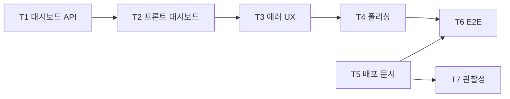

# 08. 마일스톤 M7 — 대시보드 및 폴리싱

- 최종 수정일: 2026-04-17
- 관련 스펙: `../specs/01_기능명세서.md` F-06, `../specs/02_요구사항명세서.md` 비기능 요구, `../specs/05_인프라_배포명세서.md` §9~§11
- 예상 기간: 4~6일

## 1. 목표

- FR-06 (대시보드) — 전체 현황·실행 중 작업·트렌드 차트
- 전반적 UX 폴리싱 (다크 모드, 스켈레톤, 에러 토스트)
- Playwright 기반 E2E 테스트 스위트
- Phase 1 배포 문서화 + 환경변수 템플릿 완성
- 관찰성 기본(구조화 로그, /metrics 엔드포인트 — 선택)

## 2. 선행 조건

- M5 완료 (리포트 데이터)
- M6 완료 (Edit 데이터) — 최소한 M6.S5까지 끝나 대시보드에 Edit 활성 작업 표시 가능해야 함
- 최소 샘플 데이터(프로젝트 1~2개, Run 수십 건, Edit 5~10건)가 시드되어 있으면 좋음

## 3. 태스크 흐름

| 태스크 | 이름 | 내용 |
|--------|------|------|
| M7-T1 | 대시보드 집계 API | 오버뷰·트렌드·활성 작업 |
| M7-T2 | 프론트 대시보드 | 카드·차트·리스트 |
| M7-T3 | 에러·토스트 UX | ErrorBoundary, WS 재연결 배너 |
| M7-T4 | 접근성·폴리싱 | 다크 모드, 스켈레톤, Empty state |
| M7-T5 | 배포 문서·스크립트 | docker-compose 완성, README |
| M7-T6 | E2E 테스트 | Playwright 자기 자신 테스트 |
| M7-T7 | 관찰성 | 로그·메트릭·Sentry(선택) |

## 4. 파일 단위 체크리스트

### M7-T1. 대시보드 집계 API

- [ ] `apps/api/src/services/dashboard.service.ts`
  - `getOverview(orgId): Promise<Overview>` — 프로젝트별 최근 7일 통과율, 마지막 실행 시간
    - SQL: `GROUP BY projectId` + `AVG(CASE WHEN status='PASSED' THEN 1.0 ELSE 0 END)`
  - `getTrends(orgId, { projectId?, days = 30 }): Promise<TrendPoint[]>` — 일별 통과율
    - SQL: `GROUP BY DATE(createdAt)` + 통과율 계산
  - `getActiveWork(orgId): Promise<{ runs: Run[], edits: Edit[] }>` — RUNNING/QUEUED Run + STREAMING/WAITING_INPUT Edit
- [ ] `apps/api/src/routes/dashboard.ts`
  - `GET /dashboard/overview` — 캐시 60s (Redis `dashboard:overview:${orgId}`)
  - `GET /dashboard/trends?projectId=&days=30`
  - `GET /dashboard/active` — 실시간성이라 캐시 없음, 대신 프론트에서 30초 폴링
- [ ] 캐시 무효화: Run/Edit 상태 변경 시 `redis.del('dashboard:overview:'+orgId)`

### M7-T2. 프론트 대시보드

- [ ] `apps/web/app/(main)/dashboard/page.tsx`
  - Server Component로 초기 overview fetch(SSR) → 클라이언트는 TanStack Query로 재사용 + 30초 폴링
- [ ] `apps/web/components/dashboard/ProjectStatusCard.tsx`
  - 프로젝트 이름, 마지막 실행 상태 배지, 통과율(%), 마지막 실행 시간(relative)
- [ ] `apps/web/components/dashboard/RunningJobs.tsx`
  - 실행 중인 Run 목록 + 요약 progress bar (개별 SSE 구독 대신 30초 주기 요약 폴링)
- [ ] `apps/web/components/dashboard/QueueStatus.tsx`
  - 큐 대기 목록 + 예상 대기 시간
- [ ] `apps/web/components/dashboard/TrendChart.tsx`
  - recharts LineChart — 프로젝트별 14일 통과율
- [ ] `apps/web/components/dashboard/ActiveEdits.tsx` (선택)
  - 진행 중 Edit 세션 카드

### M7-T3. 에러·토스트 UX

- [ ] `apps/web/components/ui/toaster.tsx` — shadcn 기본, `app/layout.tsx`에 배치
- [ ] `apps/web/components/common/ErrorBoundary.tsx` — React 18 ErrorBoundary
- [ ] `apps/web/lib/api.ts` — 에러 핸들러에서 자동 toast
- [ ] `apps/web/components/common/SseReconnectBanner.tsx` — SSE(EventSource) 재연결 중 상단 노란 배너
- [ ] `apps/web/components/common/NetworkErrorPage.tsx` — API 접속 실패 시 전체 페이지 대체

### M7-T4. 접근성·UI 폴리싱

- [ ] `apps/web/components/providers/ThemeProvider.tsx` — light/dark 토글, localStorage 지속
- [ ] `apps/web/components/ui/skeleton.tsx` — shadcn Skeleton, 데이터 로딩 중 표시
- [ ] 각 페이지 Empty state 작성 (프로젝트 0개, Run 0개 등)
- [ ] 키보드 네비게이션: Form Enter 제출, 모달 ESC 닫기
- [ ] `web-design-guidelines` skill로 페이지별 리뷰
- [ ] Lighthouse 점수 확인 (접근성 ≥ 90)

### M7-T5. 배포 문서·스크립트

- [ ] `deploy/docker-compose.yml` 최종판 — api, worker, web, postgres, redis 5개 서비스 + healthcheck + restart policy
- [ ] `deploy/.env.example` 전체 env 포함
- [ ] `deploy/init-db.sh` — 첫 배포 시 `prisma migrate deploy` + `prisma db seed`
- [ ] `deploy/scripts/report-cleanup.sh` — M5-T5
- [ ] `docs/deployment.md` — Phase 1 배포 절차(단계별 명령)
- [ ] `docs/operations.md` — 로그 위치, 백업 전략, 업그레이드 절차
- [ ] 루트 `README.md` 업데이트 — 소개·빠른 시작·스펙 링크·구현 계획 링크(`docs/implementation/README.md`)

### M7-T6. E2E 테스트 (Playwright 자가 테스트)

- [ ] `tests/e2e/playwright.config.ts` — webServer: api + web
- [ ] `tests/e2e/auth.spec.ts` — 회원가입 → 로그인 → 대시보드 진입
- [ ] `tests/e2e/project.spec.ts` — 등록(gitUrl 샘플 레포) → 테스트 탐지 → 삭제
- [ ] `tests/e2e/run.spec.ts` — 실행 → WS 이벤트 수신 → 리포트 뷰어
- [ ] `tests/e2e/edit.spec.ts` — Claude 수정(SDK mock) → diff → 승인 → git log 확인
- [ ] `tests/e2e/dashboard.spec.ts` — 카드/차트 렌더링
- [ ] `.github/workflows/ci.yml`에 E2E job 추가 (docker-in-docker 또는 host.docker.internal)

### M7-T7. 관찰성 (선택, 최소 구성)

- [ ] `apps/api/src/lib/logger.ts` — pino + pinoHttp + request-id 주입 (M1 업그레이드)
- [ ] `apps/api/src/routes/metrics.ts` — Prometheus `/metrics` (prom-client)
  - bullmq 큐 waiting/active 카운트
  - HTTP 요청 카운터/latency 히스토그램
  - activeSessions(claude) 수
- [ ] Sentry 연동(선택) — 서버/프론트 양쪽 DSN
- [ ] `docs/monitoring.md` — Grafana 대시보드 템플릿 JSON(선택)

## 5. 내부 의존성 그래프



## 6. 검증 기준

```bash
# 1) 대시보드 API
curl http://localhost:3001/api/v1/dashboard/overview -H "Authorization: Bearer $TOKEN"
# → 프로젝트별 통과율, 최근 실행 시간

curl http://localhost:3001/api/v1/dashboard/trends?days=14 -H "Authorization: Bearer $TOKEN"
# → 일별 통과율 포인트

# 2) 프론트
# /dashboard 접속 → 카드 그리드, RunningJobs, QueueStatus, TrendChart 렌더링

# 3) 에러 UX
# API 중지 상태에서 프론트 사용 → toast + 재연결 배너 표시

# 4) 접근성
pnpm exec playwright test --grep "accessibility" # axe-core 통합 테스트

# 5) E2E 전체
pnpm test:e2e
# → 모든 시나리오 녹색

# 6) 풀 배포 재현
cd /tmp && git clone <repo> playwright-hub-test && cd playwright-hub-test
cp deploy/.env.example .env
# .env에 DB_PASSWORD, JWT_SECRET, CLAUDE_API_KEY 등 채움
docker compose -f deploy/docker-compose.yml up -d
docker compose exec api npx prisma migrate deploy
# 브라우저 http://localhost:3000 → 회원가입 → 프로젝트 등록 → 테스트 실행 → 리포트 → Claude 수정 → 승인

# 7) 관찰성 (선택)
curl http://localhost:3001/metrics
# → Prometheus 포맷 메트릭

# 8) 로드 테스트 (선택)
autocannon -c 50 -d 30 http://localhost:3001/api/v1/dashboard/overview
# → P95 < 500ms (NFR-01-03)
```

## 7. 리스크

| # | 리스크 | 완화 |
|---|-------|------|
| R7.1 | 대시보드 쿼리 성능 (수천 Run 누적 시) | 인덱스 `[projectId, createdAt DESC]` + Redis 60s 캐시 |
| R7.2 | 초기 데이터 부족으로 차트 의미 없음 | "최소 N회 실행 후 차트 표시" 가이드 |
| R7.3 | WSL2 Docker bind mount 성능 | named volume 권장, `.dockerignore` 최적화 |
| R7.4 | E2E 테스트 flaky | retries: 2, deterministic 대기(`expect...toBeVisible()`), 테스트 격리 |
| R7.5 | 배포 문서 미흡으로 재현 실패 | clean VM에서 주기 재현 테스트 |
| R7.6 | 관찰성 추가 작업 과다 | Phase 1은 구조화 로그 + `/metrics`만. Sentry/Grafana는 Phase 4 |

## 8. 산출물

- `GET /dashboard/*` 3종 엔드포인트
- `/dashboard` 프론트 페이지 (4개 섹션)
- 전반 UX 폴리싱 완료
- Playwright E2E 5~6개 시나리오 녹색
- `docker compose up -d`로 clean state에서 재현 가능
- `README.md` + `docs/deployment.md` + `docs/operations.md` 완비

## 9. Phase 1 베타 배포 체크리스트

- [ ] 모든 마일스톤 검증 기준 통과
- [ ] `.env` 강한 시크릿(32+ 문자 JWT, 별도 DB 비밀번호)
- [ ] 리포트 정리 cron 설정(`crontab -l`)
- [ ] 초기 사용자 생성 완료
- [ ] 백업 전략 문서화(PostgreSQL pg_dump 일일)
- [ ] 모니터링 대시보드(최소 `/metrics`)
- [ ] Sentry(선택) DSN 연결
- [ ] 도메인 + HTTPS(Let's Encrypt 또는 리버스 프록시)
- [ ] CORS 허용 도메인 확정
- [ ] 사내 공지(사용 가이드 + 피드백 채널)

## 10. 다음 단계

- `10_검증_시나리오.md` — 전 마일스톤 검증 재확인
- `11_리스크_불확실성.md` — 리스크 대응 점검
- `12_Phase2_Phase3_확장.md` — Phase 2 착수 계획 수립
