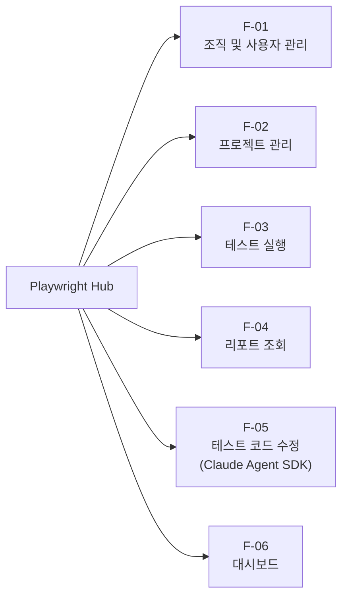
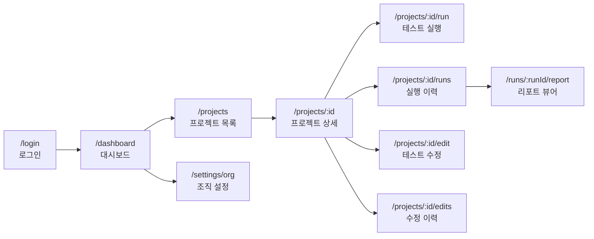

# Playwright Hub — 기능명세서

## 1. 프로젝트 개요

Playwright Hub는 여러 Playwright 테스트 프로젝트를 웹 기반으로 통합 관리하는 플랫폼이다. 테스트 실행, 결과 리포트 조회, Claude Agent SDK를 활용한 테스트 코드 수정을 하나의 인터페이스에서 수행할 수 있다.

### 1.1 목표

- 여러 Playwright 프로젝트를 하나의 웹 UI에서 관리 및 실행
- Docker 기반 격리 환경에서 테스트를 안전하게 실행
- Playwright HTML Report를 웹에서 직접 조회
- Claude Agent SDK를 통한 자연어 기반 테스트 코드 수정
- 팀(조직) 단위의 프로젝트 공유 및 사용자별 이력 추적

### 1.2 사용자

| 역할 | 설명 |
|------|------|
| Admin | 조직 관리, 프로젝트 등록/삭제, 사용자 관리 |
| Member | 테스트 실행, 리포트 조회, 테스트 수정 요청 |

---

## 2. 기능 목록

### F-01. 조직 및 사용자 관리

| ID | 기능 | 설명 |
|----|------|------|
| F-01-01 | 조직 생성 | 새로운 조직(팀)을 생성한다 |
| F-01-02 | 사용자 초대 | 이메일 기반으로 조직에 사용자를 초대한다 |
| F-01-03 | 역할 관리 | Admin/Member 역할을 부여하거나 변경한다 |
| F-01-04 | 인증 | 이메일+비밀번호 또는 OAuth 기반 로그인 |

### F-02. 프로젝트 관리

| ID | 기능 | 설명 |
|----|------|------|
| F-02-01 | 프로젝트 등록 | Git 저장소 URL 또는 직접 업로드로 Playwright 프로젝트를 등록한다 |
| F-02-02 | 프로젝트 목록 조회 | 조직에 등록된 프로젝트 목록을 조회한다 |
| F-02-03 | 프로젝트 설정 | baseURL, 환경변수, 브라우저 옵션 등을 설정한다 |
| F-02-04 | 프로젝트 삭제 | 프로젝트를 삭제한다 (Admin 전용) |
| F-02-05 | 프로젝트 동기화 | Git 원격 저장소에서 최신 코드를 pull한다 |

### F-03. 테스트 실행

| ID | 기능 | 설명 |
|----|------|------|
| F-03-01 | 테스트 목록 조회 | 선택한 프로젝트의 테스트 파일/케이스 목록을 표시한다 |
| F-03-02 | 전체 실행 | 프로젝트의 모든 테스트를 실행한다 |
| F-03-03 | 선택 실행 | 특정 테스트 파일 또는 케이스만 선택하여 실행한다 |
| F-03-04 | 실행 로그 및 진행도 스트리밍 | 실행 중 stdout/stderr와 상태, 완료/전체 테스트 수, passed/failed/skipped, 진행률을 SSE(Server-Sent Events)로 실시간 표시한다 |
| F-03-05 | 실행 중단 | 진행 중인 테스트 실행을 취소한다 |
| F-03-06 | 실행 이력 조회 | 과거 실행 이력을 목록으로 조회한다 (상태, 소요시간 등) |
| F-03-07 | 실행 큐 관리 | 대기 중인 작업을 확인하고 우선순위를 조정한다 |

### F-04. 리포트 조회

| ID | 기능 | 설명 |
|----|------|------|
| F-04-01 | 리포트 목록 | 프로젝트별 실행 결과 리포트 목록을 표시한다 |
| F-04-02 | 리포트 상세 조회 | Playwright HTML Report의 데이터를 파싱하여 자체 UI로 렌더링한다 |
| F-04-03 | 테스트 케이스 결과 | 개별 테스트 케이스의 통과/실패/스킵 상태를 표시한다 |
| F-04-04 | 스크린샷 조회 | 실패 시 캡처된 스크린샷을 조회한다 |
| F-04-05 | Trace 뷰어 | Playwright Trace 파일을 조회한다 |
| F-04-06 | 비디오 재생 | 녹화된 테스트 영상을 재생한다 |
| F-04-07 | 리포트 비교 | 두 실행 결과를 비교하여 차이를 표시한다 |

### F-05. 테스트 코드 수정 (Claude Agent SDK)

| ID | 기능 | 설명 |
|----|------|------|
| F-05-01 | 수정 요청 | 자연어로 테스트 수정 의도를 입력한다 |
| F-05-02 | Diff 미리보기 | Claude Agent SDK가 생성한 변경 사항을 diff 형태로 표시한다 |
| F-05-03 | 수정 승인 | diff를 확인 후 승인하면 stable 디렉토리에 동기화한다 |
| F-05-04 | 수정 거부 | diff를 거부하면 working 디렉토리의 변경을 롤백한다 |
| F-05-05 | 수정 이력 | 과거 수정 요청과 결과(prompt, diff, 승인여부)를 조회한다 |
| F-05-06 | Git 커밋 | 승인된 수정 사항을 자동으로 Git commit한다 |
| F-05-07 | 실시간 스트리밍 | Claude의 작업 과정(파일 읽기, 코드 수정, 분석)을 SSE(Server-Sent Events)로 실시간 표시한다 |
| F-05-08 | 멀티턴 대화 | 후속 메시지를 전송하여 수정 사항을 보완하거나 추가 수정을 요청한다 |
| F-05-09 | 세션 관리 | 이전 수정 세션을 재개하거나 세션 이력을 조회한다 |
| F-05-10 | 작업 중단 | 진행 중인 SDK 작업을 즉시 취소한다 |
| F-05-11 | 파일 변경 되돌리기 | 대화 중 특정 시점으로 파일 변경을 롤백한다 |
| F-05-12 | 작업 활동 피드 | Claude가 사용하는 도구(Read, Edit, Grep 등)의 현황을 실시간으로 표시한다 |

### F-06. 대시보드

| ID | 기능 | 설명 |
|----|------|------|
| F-06-01 | 전체 현황 | 프로젝트별 최근 실행 결과 요약 (통과율, 마지막 실행시간) |
| F-06-02 | 실행 중 현황 | 현재 실행 중이거나 대기 중인 작업과 요약 진행도(상태, 완료/전체, 진행률)를 표시한다 |
| F-06-03 | 트렌드 차트 | 프로젝트별 통과율 추이 그래프 |

---

## 3. 화면 구성

### 3.1 UI/UX 디자인 참조

전반적인 UI/UX 디자인은 [Supabase](https://supabase.com/)를 벤치마킹한다. 레이아웃 구성(좌측 사이드바 + 상단 헤더 + 메인 콘텐츠), 컬러 팔레트(강조색 그린), 컴포넌트 스타일(카드·테이블·버튼·탭·토스트), 타이포그래피, 밀도(공간감 있는 여백)를 주요 참고 지점으로 삼는다. 본 문서의 각 화면은 아래 화면 맵과 Supabase의 관련 패턴을 조합해 구현한다.

### 3.2 화면 맵

| 화면 | 경로 | 설명 |
|------|------|------|
| 로그인 | `/login` | 인증 화면 |
| 대시보드 | `/dashboard` | 전체 현황 |
| 프로젝트 목록 | `/projects` | 등록된 프로젝트 리스트 |
| 프로젝트 상세 | `/projects/:id` | 설정, 테스트 목록, 최근 실행 |
| 테스트 실행 | `/projects/:id/run` | 테스트 선택 및 실행, 큐 대기 정보와 로그/실시간 진행도 표시 |
| 실행 이력 | `/projects/:id/runs` | 과거 실행 목록 |
| 리포트 뷰어 | `/runs/:runId/report` | HTML 리포트 상세 |
| 테스트 수정 | `/projects/:id/edit` | Claude Agent SDK 대화형 수정 (실시간 스트리밍, 멀티턴) |
| 수정 이력 | `/projects/:id/edits` | 과거 수정 요청 목록 |
| 조직 설정 | `/settings/org` | 조직 및 사용자 관리 |
