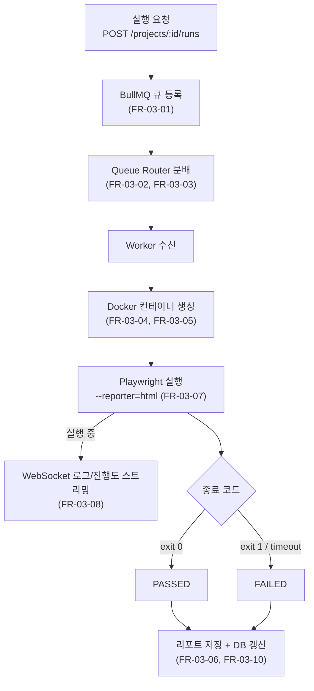
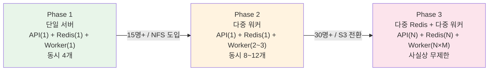

# Playwright Hub — 요구사항 명세서

## 1. 기능 요구사항 (Functional Requirements)

### FR-01. 인증 및 권한

| ID | 요구사항 | 우선순위 |
|----|----------|----------|
| FR-01-01 | 시스템은 이메일/비밀번호 기반 회원가입 및 로그인을 지원해야 한다 | 필수 |
| FR-01-02 | 시스템은 JWT 기반 세션 관리를 제공해야 한다 | 필수 |
| FR-01-03 | Admin은 조직 내 사용자를 초대하고 역할을 변경할 수 있어야 한다 | 필수 |
| FR-01-04 | 모든 API 요청은 사용자가 속한 조직의 데이터만 접근 가능해야 한다 | 필수 |
| FR-01-05 | OAuth(Google, GitHub) 연동을 지원해야 한다 | 선택 |

### FR-02. 프로젝트 관리

| ID | 요구사항 | 우선순위 |
|----|----------|----------|
| FR-02-01 | Admin은 Git URL을 통해 Playwright 프로젝트를 등록할 수 있어야 한다 | 필수 |
| FR-02-02 | 시스템은 프로젝트 등록 시 stable/과 working/ 디렉토리를 자동 생성해야 한다 | 필수 |
| FR-02-03 | 사용자는 프로젝트별 환경변수(baseURL 등)를 설정할 수 있어야 한다 | 필수 |
| FR-02-04 | 사용자는 프로젝트를 원격 저장소와 수동 동기화할 수 있어야 한다 | 필수 |
| FR-02-05 | 시스템은 프로젝트 디렉토리에서 테스트 파일 목록을 자동 탐지해야 한다 | 필수 |

### FR-03. 테스트 실행

| ID | 요구사항 | 우선순위 |
|----|----------|----------|
| FR-03-01 | 시스템은 테스트 실행 요청을 BullMQ 작업 큐에 등록해야 한다 | 필수 |
| FR-03-02 | API 서버는 Queue Router를 통해 적절한 큐에 작업을 분배해야 한다 | 필수 |
| FR-03-03 | Queue Router는 부하 기반 또는 프로젝트별 라우팅 전략을 지원해야 한다 | 필수 |
| FR-03-04 | 워커는 Docker 컨테이너를 생성하여 테스트를 실행해야 한다 | 필수 |
| FR-03-05 | Docker 컨테이너는 stable/과 reports/{run-id}/를 볼륨 마운트해야 한다 | 필수 |
| FR-03-06 | 각 실행은 고유한 run-id 디렉토리에 리포트를 저장하여 동시 실행 간 충돌을 방지해야 한다 | 필수 |
| FR-03-07 | 테스트 실행 시 `--reporter=html` 옵션으로 HTML 리포트를 생성해야 한다 | 필수 |
| FR-03-08 | 실행 로그와 진행도(status, totalTests, completedTests, passedTests, failedTests, skippedTests, progressPercent)는 WebSocket을 통해 실시간으로 클라이언트에 전달되어야 한다 | 필수 |
| FR-03-09 | 사용자는 진행 중인 테스트 실행을 중단할 수 있어야 한다 | 필수 |
| FR-03-10 | 실행 완료 시 상태, 소요시간, 리포트 경로가 DB에 기록되어야 한다 | 필수 |
| FR-03-11 | 대기 중인 사용자에게 큐 위치와 예상 대기 시간을 표시해야 한다 | 권장 |

- `QUEUED` 상태에서는 큐 위치와 예상 대기 시간을 화면에 표시한다.
- `RUNNING` 상태에서는 진행률, 완료/전체 테스트 수, passed/failed/skipped 집계를 실시간으로 화면에 갱신한다.

### FR-04. 리포트 조회

| ID | 요구사항 | 우선순위 |
|----|----------|----------|
| FR-04-01 | 시스템은 Playwright HTML Report의 data/ JSON을 파싱하여 API로 제공해야 한다 | 필수 |
| FR-04-02 | 웹 UI는 자체 React 컴포넌트로 리포트 결과를 렌더링해야 한다 | 필수 |
| FR-04-03 | 테스트 케이스별 통과/실패/스킵 상태를 표시해야 한다 | 필수 |
| FR-04-04 | 실패한 테스트의 스크린샷을 조회할 수 있어야 한다 | 필수 |
| FR-04-05 | Playwright Trace 파일을 다운로드하거나 조회할 수 있어야 한다 | 필수 |
| FR-04-06 | 실패 시 녹화된 영상을 브라우저에서 재생할 수 있어야 한다 | 필수 |
| FR-04-07 | 두 실행 결과를 비교하여 차이를 표시할 수 있어야 한다 | 선택 |

### FR-05. 테스트 코드 수정

| ID | 요구사항 | 우선순위 |
|----|----------|----------|
| FR-05-01 | 사용자는 자연어로 테스트 수정 의도를 입력할 수 있어야 한다 | 필수 |
| FR-05-02 | 시스템은 Claude Agent SDK를 호출하여 working/의 코드를 수정해야 한다 | 필수 |
| FR-05-03 | 수정 결과는 diff 형태로 사용자에게 표시되어야 한다 | 필수 |
| FR-05-04 | 사용자가 승인하면 working/에서 stable/로 동기화되어야 한다 | 필수 |
| FR-05-05 | 승인된 수정은 자동으로 Git commit되어야 한다 | 필수 |
| FR-05-06 | 사용자가 거부하면 working/의 변경이 롤백되어야 한다 | 필수 |
| FR-05-07 | 수정 요청 원문, diff, 승인 여부가 DB에 기록되어야 한다 | 필수 |

### FR-06. 동시성 제어

| ID | 요구사항 | 우선순위 |
|----|----------|----------|
| FR-06-01 | 동기화 진행 중 해당 프로젝트의 테스트 실행을 대기시켜야 한다 | 필수 |
| FR-06-02 | 프로젝트별 락은 Redis 기반으로 관리해야 한다 | 필수 |
| FR-06-03 | 락 획득 실패 시 사용자에게 대기 상태를 표시해야 한다 | 필수 |
| FR-06-04 | 동시 실행 시 각 실행의 리포트 출력 경로가 run-id로 격리되어야 한다 | 필수 |

---

## 2. 비기능 요구사항 (Non-Functional Requirements)

### NFR-01. 성능

| ID | 요구사항 | 기준 |
|----|----------|------|
| NFR-01-01 | 테스트 실행 요청부터 Docker 컨테이너 시작까지 5초 이내 | 평균 |
| NFR-01-02 | 리포트 조회 API 응답시간 500ms 이내 | P95 |
| NFR-01-03 | WebSocket 로그 스트리밍 지연 1초 이내 | 평균 |

### NFR-02. 스케일링

| ID | 요구사항 |
|----|----------|
| NFR-02-01 | 워커의 concurrency를 환경변수로 조절할 수 있어야 한다 |
| NFR-02-02 | 워커 서버를 추가하면 코드 변경 없이 동시 처리량이 증가해야 한다 |
| NFR-02-03 | Phase 3에서 Redis를 분리하여 프로젝트 그룹별 큐를 운영할 수 있어야 한다 |
| NFR-02-04 | Queue Router는 부하 기반, 프로젝트별, 라운드로빈 전략을 지원해야 한다 |
| NFR-02-05 | 다중 워커 서버 시 공유 스토리지(NFS/S3)를 사용해야 한다 |

### NFR-03. 보안

| ID | 요구사항 |
|----|----------|
| NFR-03-01 | 모든 API 엔드포인트는 인증을 요구해야 한다 |
| NFR-03-02 | 조직 간 데이터 격리를 보장해야 한다 |
| NFR-03-03 | Docker 컨테이너는 호스트에 대한 접근을 최소화해야 한다 |
| NFR-03-04 | 환경변수(비밀번호, API 키)는 암호화 저장해야 한다 |
| NFR-03-05 | Claude Agent SDK 호출 시 프로젝트 디렉토리 외부 접근을 차단해야 한다 |

### NFR-04. 가용성 및 운영

| ID | 요구사항 |
|----|----------|
| NFR-04-01 | Docker 컨테이너 비정상 종료 시 실행 상태를 FAILED로 갱신해야 한다 |
| NFR-04-02 | 리포트는 보존 기간(기본 30일) 이후 자동 삭제해야 한다 |
| NFR-04-03 | docker-compose로 단일 명령어 배포가 가능해야 한다 |
| NFR-04-04 | 에러 발생 시 구조화된 로그를 남겨야 한다 |
| NFR-04-05 | 워커 장애 시 미완료 작업이 BullMQ에 의해 자동 재시도되어야 한다 |

---

## 3. 스케일링 단계

### Phase 1 — 단일 서버 (소규모 팀, 5~15명)

| 구성 | 사양 |
|------|------|
| API 서버 | 1대 |
| Redis | 1대 |
| Worker 프로세스 | 1개 (concurrency: 4) |
| 동시 실행 | 최대 4개 |
| 스토리지 | 로컬 디스크 |

### Phase 2 — 다중 워커 (중규모 팀, 15~30명)

| 구성 | 사양 |
|------|------|
| API 서버 | 1대 |
| Redis | 1대 |
| Worker 서버 | 2~3대 (각 concurrency: 4) |
| 동시 실행 | 최대 8~12개 |
| 스토리지 | NFS 또는 공유 볼륨 |

### Phase 3 — 다중 Redis + 다중 워커 (대규모 팀, 30명+)

| 구성 | 사양 |
|------|------|
| API 서버 | 1~N대 (로드밸런서) |
| Redis | N대 (프로젝트 그룹별) |
| Worker 서버 | Redis당 1~N대 |
| 동시 실행 | 사실상 무제한 |
| 스토리지 | S3 호환 오브젝트 스토리지 |

---

## 4. 제약사항

| 항목 | 내용 |
|------|------|
| 프론트엔드 | Next.js (App Router) |
| 백엔드 | Node.js + Express |
| DB | PostgreSQL |
| 큐 | BullMQ + Redis |
| 컨테이너 | Docker |
| ORM | Prisma |
| 테스트 수정 | Claude Agent SDK |
| 인증 | JWT |
| 스토리지 | 로컬 (Phase 1) → NFS (Phase 2) → S3 (Phase 3) |

---

## 5. 용어 정의

| 용어 | 설명 |
|------|------|
| stable/ | Docker가 마운트하여 테스트를 실행하는 안정 버전 디렉토리 |
| working/ | Claude Agent SDK가 수정 작업을 수행하는 작업용 디렉토리 |
| Run | 한 번의 테스트 실행 단위 |
| Edit | Claude Agent SDK를 통한 한 번의 수정 요청 단위 |
| 동기화 | working/의 수정 사항을 stable/에 반영하는 작업 |
| Worker | BullMQ 큐에서 작업을 꺼내 Docker 컨테이너를 실행하는 Node.js 프로세스 |
| concurrency | 하나의 Worker 프로세스가 동시에 처리할 수 있는 작업 수 |
| Queue Router | API 서버에서 작업을 적절한 큐/Redis에 분배하는 라우팅 모듈 |
