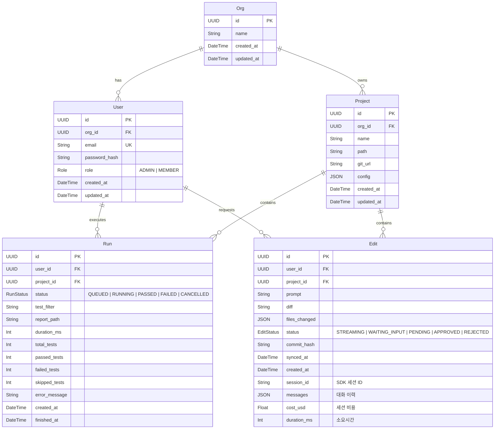
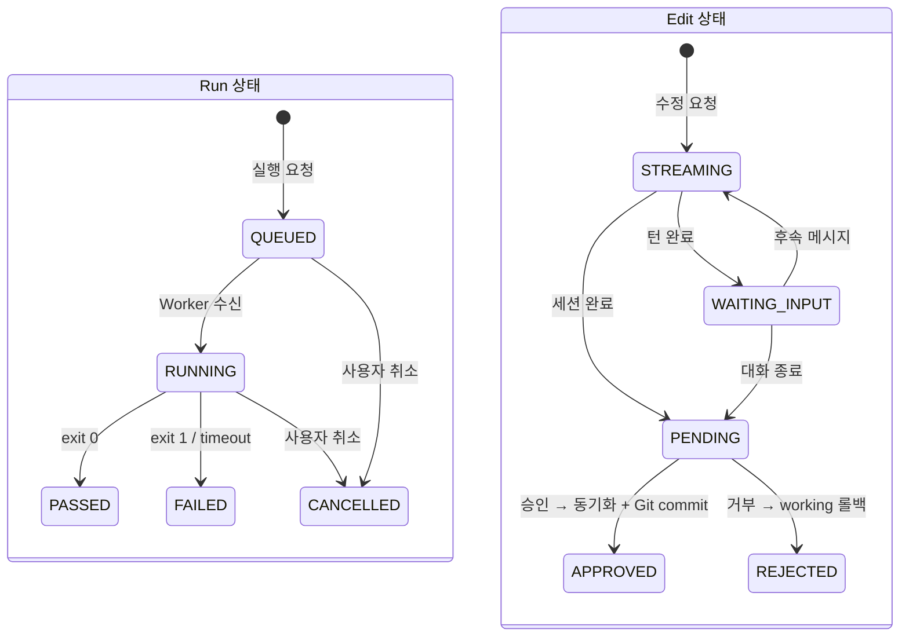

# Playwright Hub — ERD 및 DB 스키마

## 1. ER 다이어그램

## 2. 관계 요약

| 관계 | 설명 |
|------|------|
| Org → User | 1:N. 하나의 조직에 여러 사용자가 소속 |
| Org → Project | 1:N. 하나의 조직이 여러 프로젝트를 소유 |
| User → Run | 1:N. 하나의 사용자가 여러 실행을 수행 |
| Project → Run | 1:N. 하나의 프로젝트에 여러 실행 이력 |
| User → Edit | 1:N. 하나의 사용자가 여러 수정 요청 |
| Project → Edit | 1:N. 하나의 프로젝트에 여러 수정 이력 |

## 3. Prisma Schema

> **구현 참고**: Prisma(PostgreSQL 프로바이더)로 `Org`, `User`, `Project`, `Run`, `Edit` 모델과 `Role`, `RunStatus`, `EditStatus` 열거형을 정의한다. 엔티티 간 관계는 위 ER 다이어그램과 동일하며, `Project → Org`, `Run → Project`, `Edit → Project` 관계에 `onDelete: Cascade`가 적용된다. 실제 스키마는 `prisma/schema.prisma`에서 관리한다.

## 4. config JSON 구조 (Project.config)

> **구현 참고**: `Project.config`(JSON)는 `baseURL`, `env`(암호화 문자열 포함), `browser`, `timeout`, `retries`, `workers`, `reportOptions`(screenshots/video/trace 캡처 정책) 필드를 담는 Playwright 실행 설정이다.

## 5. 인덱스 전략

| 테이블 | 인덱스 | 용도 |
|--------|--------|------|
| users | org_id | 조직별 사용자 조회 |
| projects | org_id, name (unique) | 조직 내 프로젝트명 중복 방지 |
| runs | project_id, created_at DESC | 프로젝트별 최근 실행 조회 |
| runs | status | 상태별 필터 (대기 중 작업 조회) |
| runs | user_id | 사용자별 실행 이력 |
| edits | project_id, created_at DESC | 프로젝트별 최근 수정 이력 |
| edits | user_id | 사용자별 수정 이력 |

## 6. 상태 전이도

