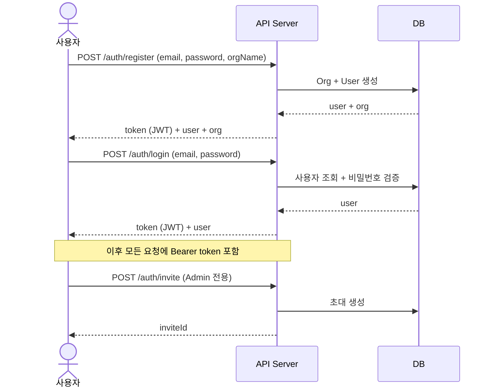
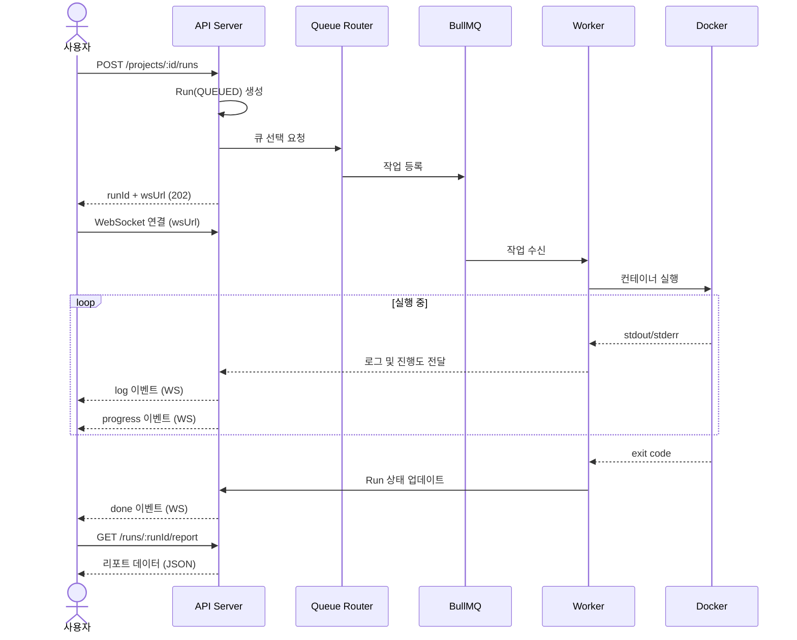
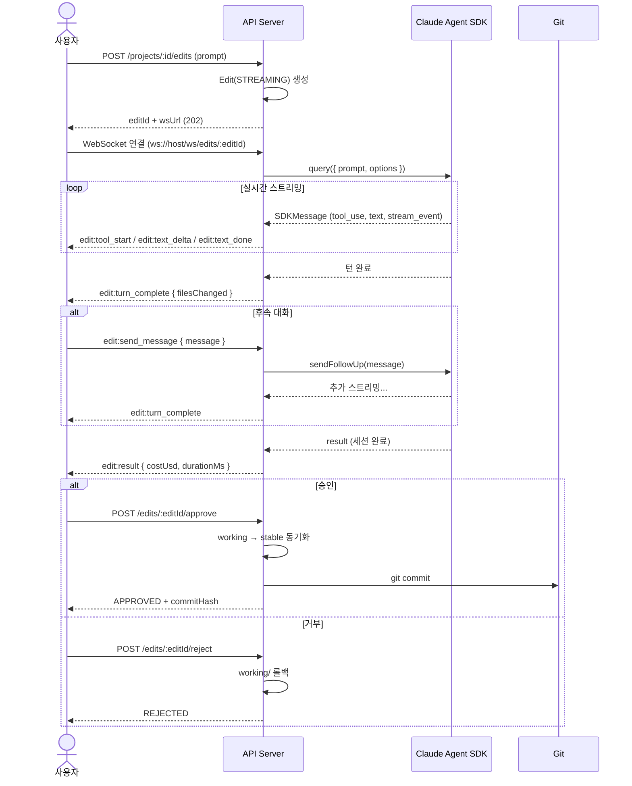

# Playwright Hub — API 명세서

## 1. 공통 사항

### Base URL

기본 Base URL은 `http://localhost:3001/api/v1`이다.

### 인증

모든 API 요청에 JWT 토큰을 `Authorization: Bearer <token>` 헤더로 포함해야 한다.

### 공통 응답 형식

> **구현 참고**: 성공 응답은 `{ "success": true, "data": ... }` 형태이며, 실패 응답은 `{ "success": false, "error": { "code", "message" } }` 형태로 통일한다.

### 공통 에러 코드

| HTTP | 코드 | 설명 |
|------|------|------|
| 400 | VALIDATION_ERROR | 요청 파라미터 검증 실패 |
| 401 | UNAUTHORIZED | 인증 실패 |
| 403 | FORBIDDEN | 권한 없음 |
| 404 | NOT_FOUND | 리소스 없음 |
| 409 | CONFLICT | 리소스 충돌 (락 등) |
| 429 | RATE_LIMIT | 요청 제한 초과 |
| 500 | INTERNAL_ERROR | 서버 내부 오류 |

---

## 2. 인증 (Auth)

### POST /auth/register

회원가입.

> **구현 참고**: `email`, `password`, `orgName`을 요청 바디로 받아 Org와 첫 User(ADMIN)를 생성하고 `user`, `org`, JWT `token`을 201로 반환한다.

### POST /auth/login

로그인.

> **구현 참고**: `email`, `password`를 받아 검증 후 `user`(orgId 포함)와 JWT `token`을 200으로 반환한다.

### POST /auth/invite

사용자 초대 (Admin 전용).

> **구현 참고**: `email`, `role`을 받아 초대를 생성하고 `inviteId`를 201로 반환한다.

---

## 3. 프로젝트 (Projects)

### GET /projects

조직의 프로젝트 목록 조회.

> **구현 참고**: 각 항목은 `id`, `name`, `path`, `gitUrl`, `lastRun`(status/createdAt), `createdAt`을 포함한다.

### POST /projects

프로젝트 등록 (Admin 전용).

> **구현 참고**: `name`, `gitUrl`, `config`(baseURL·browser 등)를 받아 `id`, `name`, `path`를 201로 반환한다.

### GET /projects/:id

프로젝트 상세 조회.

### PATCH /projects/:id

프로젝트 설정 수정.

> **구현 참고**: `config`의 부분 필드(예: `baseURL`, `timeout`)를 받아 병합 갱신한다.

### DELETE /projects/:id

프로젝트 삭제 (Admin 전용).

### POST /projects/:id/sync

원격 저장소와 동기화 (git pull).

> **구현 참고**: 응답 `data`에 `commitHash`와 `filesChanged`(변경 파일 수)를 담아 반환한다.

### GET /projects/:id/tests

테스트 파일 및 케이스 목록 조회.

> **구현 참고**: 파일 단위로 `{ file, tests: [{ title, line }] }` 배열을 반환한다.

---

## 4. 실행 (Runs)

### POST /projects/:id/runs

테스트 실행 요청.

> **구현 참고**: `testFilter`와 `env`(환경변수 오버라이드)를 받아 Run을 QUEUED로 생성한 뒤 `runId`, `status`, `wsUrl`을 202로 반환한다.

실행 화면의 실시간 진행도 값은 WebSocket `progress` 이벤트를 기준으로 갱신한다. `GET /runs/:runId`와 `GET /projects/:id/runs`는 마지막 저장 상태와 완료 후 집계값 조회에 사용한다.

### GET /projects/:id/runs

실행 이력 조회. 쿼리스트링으로 `page`, `limit`, `status`를 받는다.

> **구현 참고**: 응답은 `{ runs: [...], total, page, limit }` 형태이며 각 run은 `id`, `status`, `testFilter`, 테스트 집계(`totalTests`, `passedTests`, `failedTests`, `skippedTests`), `durationMs`, `userId/userName`, `createdAt`, `finishedAt`을 포함한다.

### GET /runs/:runId

실행 상세 조회.

### DELETE /runs/:runId

실행 중단 (status가 QUEUED 또는 RUNNING인 경우).

> **구현 참고**: 성공 시 `{ status: "CANCELLED" }`를 반환한다.

---

## 5. 리포트 (Reports)

### GET /runs/:runId/report

리포트 요약 데이터 (파싱된 JSON).

> **구현 참고**: 응답 `data`는 `summary`(total/passed/failed/skipped/duration)와 `suites` 배열을 포함하며, 각 suite는 `title`, `file`, `tests` 배열을 갖는다. 각 test는 `title`, `status`, `duration`, `retries`를 기본으로 하고, 실패 시 `error`(`message`, `stack`)와 `attachments`(스크린샷·trace·비디오의 name/path/contentType)를 포함한다.

### GET /runs/:runId/report/files/:path

리포트 첨부 파일(스크린샷, trace, 비디오) 정적 서빙.

> **구현 참고**: 경로 규칙은 `/runs/{runId}/report/files/{path}`이며 확장자별로 `image/png`, `application/zip`, `video/webm` 등의 `Content-Type`을 적절히 반환한다.

---

## 6. 수정 (Edits)

### POST /projects/:id/edits

수정 세션 시작.

> **구현 참고**: `prompt`를 받아 Edit을 STREAMING 상태로 생성하고 `editId`, `status`, `wsUrl`을 202로 반환한다.

### GET /edits/:editId

수정 상세 조회 (대화 이력 + diff 포함).

> **구현 참고**: 응답 `data`에 `id`, `prompt`, `status`, `diff`(unified diff), `filesChanged`, SDK 세션 정보(`sessionId`, `messages[]`, `costUsd`, `durationMs`), `createdAt`을 담는다.

### GET /edits/:editId/sessions

SDK 세션 목록 조회 (세션 재개 시 사용).

> **구현 참고**: `sessionId`, `summary`, `lastModified`(epoch ms)로 이루어진 세션 배열을 반환한다.

### POST /edits/:editId/resume

이전 세션 재개.

> **구현 참고**: `sessionId`와 후속 `prompt`를 받아 해당 세션을 재개하고 새 스트리밍 세션(`editId`, `status`, `wsUrl`)을 202로 반환한다.

### POST /edits/:editId/approve

수정 승인 (stable 동기화 + Git commit).

> **구현 참고**: 응답 `data`에 `status: "APPROVED"`, `commitHash`, `syncedAt`을 담는다.

### POST /edits/:editId/reject

수정 거부 (working 롤백).

> **구현 참고**: 응답은 `{ status: "REJECTED" }`.

### GET /projects/:id/edits

프로젝트별 수정 이력 조회. 쿼리스트링으로 `page`, `limit`을 받는다.

---

## 7. WebSocket

### ws://host/ws/runs/:runId

테스트 실행 로그 및 진행도 스트리밍.

> **구현 참고**: 서버→클라이언트 메시지는 공통적으로 `{ type, data, timestamp }` 형태이며 타입은 다음과 같다.
> - `log` — 실행 로그 라인 문자열
> - `status` — 상태 문자열(`QUEUED`/`RUNNING`/...)
> - `progress` — 집계 스냅샷(`status`, `totalTests`, `completedTests`, `passedTests`, `failedTests`, `skippedTests`, `progressPercent`)
> - `test_result` — 개별 테스트 결과(`title`, `status`, `duration`)
> - `done` — 최종 상태 및 `reportPath`
> - `error` — 실패 원인 메시지

`QUEUED` 상태에서는 별도의 큐 위치/예상 대기 시간 표시를 유지하고, `RUNNING`부터 `progress` 이벤트를 사용해 화면의 진행도 바와 집계 수치를 갱신한다.

---

## 8. 조직/사용자 관리

### GET /org

현재 조직 정보 조회

### PATCH /org

조직 정보 수정 (Admin 전용)

### GET /org/members

조직 멤버 목록

### PATCH /org/members/:userId

멤버 역할 변경 (Admin 전용)

### DELETE /org/members/:userId

멤버 제거 (Admin 전용)
