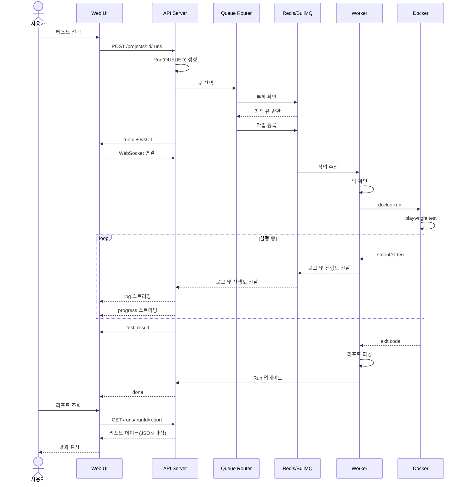
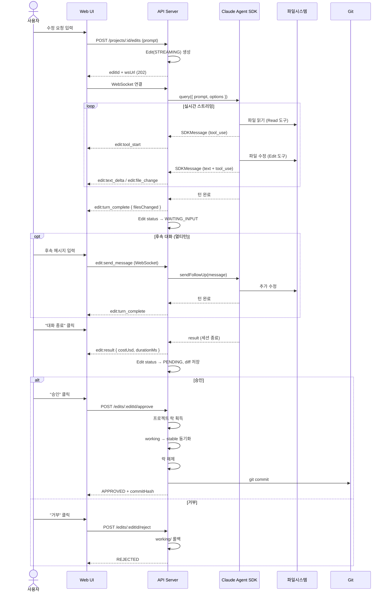
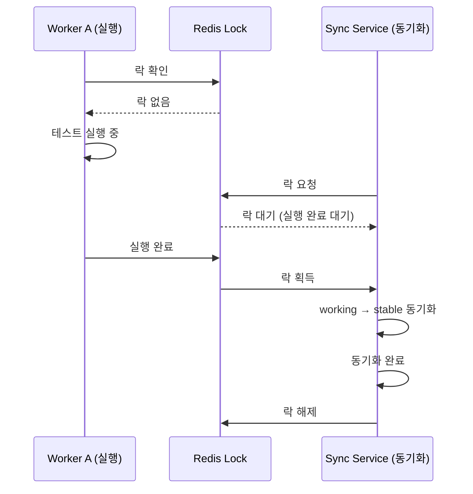
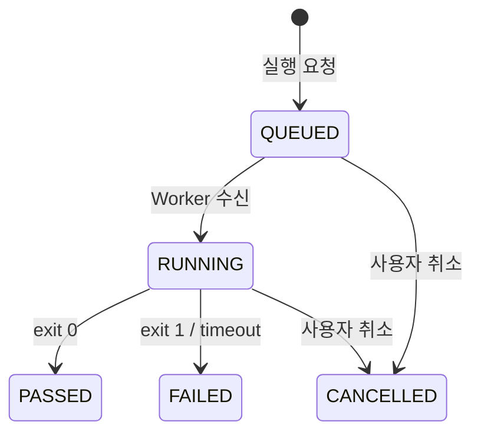
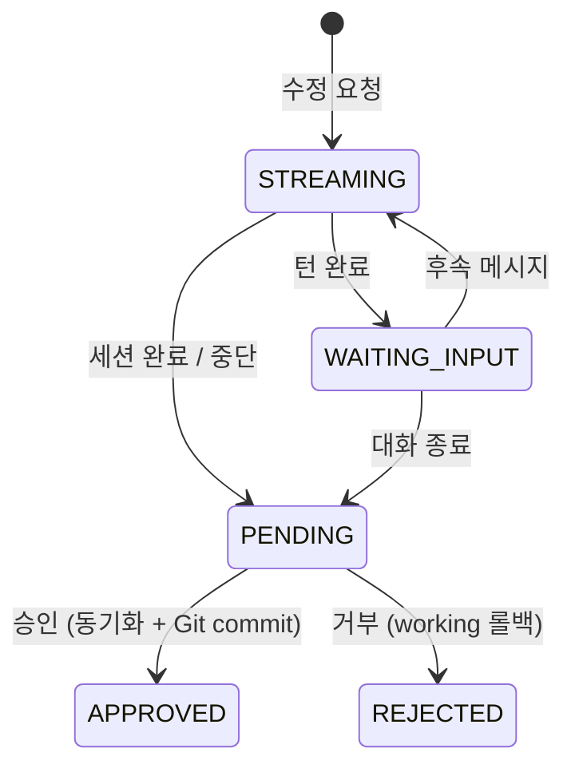

# Playwright Hub — 워크플로우 명세서

## 1. 테스트 실행 워크플로우



- `QUEUED` 상태에서는 UI가 큐 위치와 예상 대기 시간을 표시한다.
- `RUNNING` 상태에서는 UI가 진행도 바, 완료/전체 테스트 수, passed/failed/skipped, 현재 상태를 `progress` 이벤트로 실시간 갱신한다.
- `done` 수신 후에는 최종 상태와 리포트 이동 링크를 표시한다.

## 2. 큐 라우팅 워크플로우

### Phase 1: 단일 Redis

```
API Server
  │
  │─ 작업 등록 ──> [Redis (1대)] ──> [Worker (concurrency: 4)]
  │                                   ├── Docker 컨테이너 1
  │                                   ├── Docker 컨테이너 2
  │                                   ├── Docker 컨테이너 3
  │                                   └── Docker 컨테이너 4
```

### Phase 2: 단일 Redis + 다중 워커

```
API Server
  │
  │─ 작업 등록 ──> [Redis (1대)] ──> [Worker Server A (×4)]
  │                              ├──> [Worker Server B (×4)]
  │                              └──> [Worker Server C (×4)]
  │
  │  BullMQ가 자동으로 유휴 워커에 작업 분배
  │  코드 변경 없음, 워커 서버만 추가
```

### Phase 3: 다중 Redis + 다중 워커

```
API Server ─── Queue Router
                  │
                  ├─ 프로젝트 A,B → [Redis A] → [Worker Group A (×4)]
                  ├─ 프로젝트 C,D → [Redis B] → [Worker Group B (×4)]
                  └─ 프로젝트 E,F → [Redis C] → [Worker Group C (×4)]

라우팅 전략:
  - least-busy: 대기 작업이 가장 적은 큐에 등록
  - round-robin: 순서대로 돌아가며 등록
  - project-based: 프로젝트를 특정 큐 그룹에 고정 배정
```

## 3. 테스트 수정 워크플로우



## 4. 동시성 제어 흐름



## 5. 리포트 조회 흐름

```
사용자            Web UI           API Server        Storage
  │                │                  │                 │
  │─ 실행 이력 ───>│                  │                 │
  │                │─ GET /runs/:runId/report ───>│     │
  │                │                  │─ {runId}/data/  │
  │                │                  │  JSON 파싱 ────>│
  │                │                  │<─ JSON 데이터 ──│
  │                │<─ 리포트 데이터 ─│                 │
  │<─ 결과 렌더링 ─│                  │                 │
  │                │                  │                 │
  │─ 스크린샷 ────>│─ GET /files/ ───>│─ 파일 읽기 ────>│
  │<─ 이미지 표시 ─│<─ 바이너리 ──────│<────────────────│
  │                │                  │                 │
  │─ trace ───────>│─ GET /files/ ───>│─ zip 읽기 ─────>│
  │<─ 다운로드 ────│<─ 바이너리 ──────│<────────────────│
  │                │                  │                 │
  │─ 영상 재생 ───>│─ GET /files/ ───>│─ 스트리밍 ─────>│
  │<─ video 재생 ──│<─ webm 스트림 ───│<────────────────│
```

## 6. 리포트 충돌 방지

동시 실행 시 리포트가 덮어쓰이는 문제를 run-id 디렉토리 분리로 해결한다.

```
실행 A (run-aaa-111)                    실행 B (run-bbb-222)
  │                                       │
  │ docker run                            │ docker run
  │ -v reports/run-aaa-111:/report        │ -v reports/run-bbb-222:/report
  │                                       │
  │ → reports/run-aaa-111/index.html      │ → reports/run-bbb-222/index.html
  │ → reports/run-aaa-111/data/           │ → reports/run-bbb-222/data/
  │ → reports/run-aaa-111/screenshots/    │ → reports/run-bbb-222/screenshots/
  │                                       │
  │ 서로의 존재를 모름, 충돌 없음          │ 서로의 존재를 모름, 충돌 없음
```

## 7. 상태 전이도

### Run 상태



### Edit 상태



## 8. 에러 처리

| 상황 | 처리 |
|------|------|
| Docker 컨테이너 타임아웃 | status=FAILED, errorMessage에 타임아웃 기록 |
| Docker 이미지 없음 | 작업 실패, 이미지 빌드 필요 알림 |
| 모든 워커 슬롯 사용 중 | QUEUED 상태 유지, 예상 대기 시간 표시 |
| 워커 서버 장애 | BullMQ가 해당 워커의 작업을 다른 워커에 재분배 |
| Claude Agent SDK API 오류 | edit:error 이벤트 전송, 재시도 안내 |
| Claude Agent SDK 비용 한도 초과 | edit:result (error_max_budget_usd), 한도 초과 안내 |
| Claude Agent SDK 턴 한도 초과 | edit:result (error_max_turns), 턴 한도 초과 안내 |
| Claude Agent SDK Rate Limit | edit:error, 잠시 후 재시도 안내 |
| 동시 세션 한도 초과 | 429 RATE_LIMIT 응답 |
| Git pull 충돌 | 충돌 내용 표시, 수동 해결 요청 |
| stable/ 동기화 중 실행 요청 | QUEUED 유지, 락 해제 후 자동 실행 |
| DB 연결 실패 | BullMQ 자동 재시도 |
| 리포트 파일 손상 | 에러 표시, 재실행 유도 |
| Redis 연결 실패 (Phase 3) | 해당 큐 그룹 비활성화, 다른 큐로 라우팅 |
