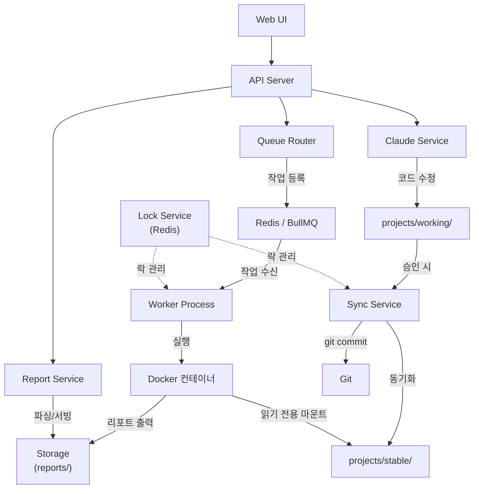
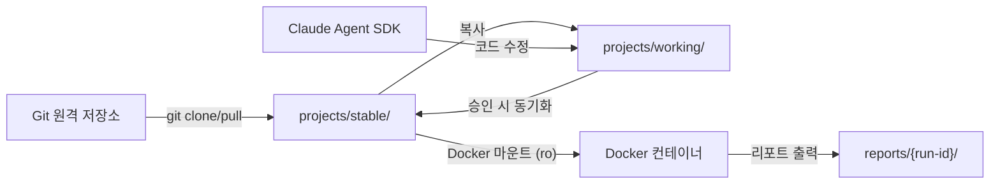

# Playwright Hub — 기술 스택 및 프로젝트 구조

## 1. 기술 스택

| 영역 | 기술 | 버전 | 용도 |
|------|------|------|------|
| 프론트엔드 | Next.js | 14+ | App Router 기반 웹 UI |
| 프론트엔드 | React | 18+ | UI 컴포넌트 |
| 프론트엔드 | Tailwind CSS | 3+ | 스타일링 |
| 프론트엔드 | shadcn/ui | - | UI 컴포넌트 라이브러리 |
| 프론트엔드 | react-diff-viewer | - | diff 표시 |
| 백엔드 | Node.js | 20+ | 런타임 |
| 백엔드 | Express | 4+ | API 서버 |
| 백엔드 | Socket.IO | 4+ | WebSocket (로그/진행도 스트리밍) |
| 백엔드 | BullMQ | 5+ | 작업 큐 |
| 백엔드 | Dockerode | - | Docker API 클라이언트 |
| DB | PostgreSQL | 16 | 메인 데이터베이스 |
| DB | Prisma | 5+ | ORM |
| DB | Redis | 7 | 큐 브로커, 락, 캐시 |
| 인증 | jsonwebtoken | - | JWT 발급/검증 |
| 인증 | bcrypt | - | 비밀번호 해싱 |
| AI | Claude Agent SDK | latest | 테스트 코드 수정 (실시간 스트리밍, 멀티턴 대화) |
| 인프라 | Docker | 24+ | 테스트 실행 격리 |
| 인프라 | Docker Compose | 2+ | 서비스 오케스트레이션 |
| 테스트 런타임 | Playwright | 1.50+ | 브라우저 테스트 실행 |
| 공통 | TypeScript | 5+ | 전체 프로젝트 |
| 공통 | Zod | - | 요청 검증 |

## 2. 프로젝트 디렉토리 구조

```
playwright-hub/
│
├── apps/
│   ├── web/                                # Next.js 프론트엔드
│   │   ├── app/
│   │   │   ├── layout.tsx
│   │   │   ├── page.tsx                    # → /dashboard 리다이렉트
│   │   │   ├── login/
│   │   │   │   └── page.tsx
│   │   │   ├── dashboard/
│   │   │   │   └── page.tsx
│   │   │   ├── projects/
│   │   │   │   ├── page.tsx
│   │   │   │   └── [id]/
│   │   │   │       ├── page.tsx
│   │   │   │       ├── run/
│   │   │   │       │   └── page.tsx
│   │   │   │       ├── runs/
│   │   │   │       │   └── page.tsx
│   │   │   │       ├── edit/
│   │   │   │       │   └── page.tsx
│   │   │   │       └── edits/
│   │   │   │           └── page.tsx
│   │   │   ├── runs/
│   │   │   │   └── [runId]/
│   │   │   │       └── report/
│   │   │   │           └── page.tsx
│   │   │   └── settings/
│   │   │       └── org/
│   │   │           └── page.tsx
│   │   │
│   │   ├── components/
│   │   │   ├── ui/                         # shadcn/ui
│   │   │   ├── layout/
│   │   │   │   ├── Sidebar.tsx
│   │   │   │   ├── Header.tsx
│   │   │   │   └── AuthGuard.tsx
│   │   │   ├── dashboard/
│   │   │   │   ├── ProjectStatusCard.tsx
│   │   │   │   ├── RunningJobs.tsx         # 실행 중 작업과 요약 진행도
│   │   │   │   ├── QueueStatus.tsx         # 큐 대기 현황
│   │   │   │   └── TrendChart.tsx
│   │   │   ├── runner/
│   │   │   │   ├── TestSelector.tsx
│   │   │   │   ├── LogViewer.tsx
│   │   │   │   ├── RunProgress.tsx         # 실시간 진행도 바 및 집계 표시
│   │   │   │   └── QueuePosition.tsx       # 대기 순서 표시
│   │   │   ├── report/
│   │   │   │   ├── ReportSummary.tsx
│   │   │   │   ├── TestSuiteList.tsx
│   │   │   │   ├── TestCaseRow.tsx
│   │   │   │   ├── ScreenshotViewer.tsx
│   │   │   │   ├── TraceDownload.tsx
│   │   │   │   └── VideoPlayer.tsx
│   │   │   └── editor/
│   │   │       ├── EditChatView.tsx       # 대화형 수정 메인 컨테이너
│   │   │       ├── ChatMessage.tsx        # 개별 메시지 (user/assistant)
│   │   │       ├── ToolActivity.tsx       # 도구 사용 실시간 표시
│   │   │       ├── PromptInput.tsx        # 초기 프롬프트 입력
│   │   │       ├── FollowUpInput.tsx      # 후속 메시지 입력
│   │   │       ├── SessionControls.tsx    # 세션 제어 (중단/되돌리기/승인/거부)
│   │   │       ├── FileChangeTracker.tsx  # 변경 파일 추적
│   │   │       ├── DiffViewer.tsx         # diff 표시
│   │   │       └── ApprovalActions.tsx    # 승인/거부 (SessionControls에 통합)
│   │   │
│   │   ├── lib/
│   │   │   ├── api.ts
│   │   │   ├── ws.ts
│   │   │   ├── ws-edit.ts                # 수정 세션 WebSocket 훅
│   │   │   └── auth.ts
│   │   │
│   │   ├── Dockerfile
│   │   ├── next.config.js
│   │   ├── tailwind.config.ts
│   │   ├── tsconfig.json
│   │   └── package.json
│   │
│   └── api/                                # Express 백엔드
│       ├── src/
│       │   ├── index.ts
│       │   ├── routes/
│       │   │   ├── auth.ts
│       │   │   ├── projects.ts
│       │   │   ├── runs.ts
│       │   │   ├── edits.ts
│       │   │   ├── reports.ts
│       │   │   └── org.ts
│       │   ├── workers/
│       │   │   └── playwright.worker.ts
│       │   ├── services/
│       │   │   ├── docker.service.ts
│       │   │   ├── claude.service.ts
│       │   │   ├── sync.service.ts
│       │   │   ├── report.service.ts
│       │   │   ├── git.service.ts
│       │   │   ├── lock.service.ts
│       │   │   └── queue-router.service.ts # 큐 라우팅
│       │   ├── middleware/
│       │   │   ├── auth.ts
│       │   │   ├── orgScope.ts
│       │   │   └── validation.ts
│       │   ├── ws/
│       │   │   ├── runSocket.ts
│       │   │   └── editSocket.ts         # 수정 세션 WebSocket 핸들러
│       │   └── lib/
│       │       ├── prisma.ts
│       │       ├── redis.ts
│       │       ├── queue.ts
│       │       └── config.ts
│       │
│       ├── Dockerfile
│       ├── tsconfig.json
│       └── package.json
│
├── docker/
│   └── playwright-runner/
│       └── Dockerfile
│
├── deploy/                                 # 배포 설정
│   ├── docker-compose.yml                  # Phase 1: 전체 서비스
│   └── worker-compose.yml                  # Phase 2+: 워커 서버용
│
├── prisma/
│   ├── schema.prisma
│   └── migrations/
│
├── projects/
│   ├── stable/
│   └── working/
│
├── reports/
│
├── .env.example
├── .gitignore
├── tsconfig.base.json
├── package.json
└── README.md
```

## 3. 핵심 모듈 설명



### Queue Router (queue-router.service.ts)

API 서버에서 테스트 실행 요청이 들어오면 어떤 Redis/큐에 작업을 등록할지 결정하는 모듈이다.

- Phase 1에서는 단일 Redis이므로 바로 통과
- Phase 2에서는 단일 Redis, 다중 워커이므로 BullMQ가 자동 분배
- Phase 3에서는 다중 Redis에 대해 라우팅 전략(부하 기반/프로젝트별/라운드로빈) 적용

### Worker Process (playwright.worker.ts)

BullMQ 큐를 구독하여 작업을 수신하고 Docker 컨테이너를 실행하는 Node.js 프로세스이다.

- `concurrency` 설정으로 동시 실행 수 제어
- 같은 Redis를 바라보는 워커가 여러 개면 BullMQ가 자동으로 유휴 워커에 작업 분배
- 워커 서버 추가 = `node dist/workers/playwright.worker.js` 프로세스 추가
- 실행 중 stdout/stderr와 진행도 스냅샷을 Socket.IO 계층으로 전달

### Report Service (report.service.ts)

Playwright HTML Report의 `data/` 디렉토리에 있는 JSON 파일을 파싱하여 구조화된 데이터로 변환한다. 스크린샷, trace, 영상 파일은 정적 파일로 서빙한다.

### Sync Service (sync.service.ts)

Claude Agent SDK가 수정한 working/ 디렉토리의 변경 사항을 stable/ 디렉토리에 동기화한다. Redis 분산 락으로 동기화 중 테스트 실행을 방지한다.



## 4. 패키지 의존성

### apps/web/package.json

> **구현 참고**: Next.js 14, React 18, socket.io-client, react-diff-viewer-continued, recharts, TanStack Query v5, zustand, zod를 런타임 의존성으로, TypeScript 5 / Tailwind 3 / @types/react를 개발 의존성으로 갖는다.

### apps/api/package.json

> **구현 참고**: Express 4, socket.io, BullMQ 5, ioredis, @prisma/client, dockerode, jsonwebtoken, bcryptjs, zod, simple-git, `@anthropic-ai/claude-agent-sdk`를 런타임 의존성으로, TypeScript 5 / Prisma 5 및 관련 @types 패키지를 개발 의존성으로 갖는다.
