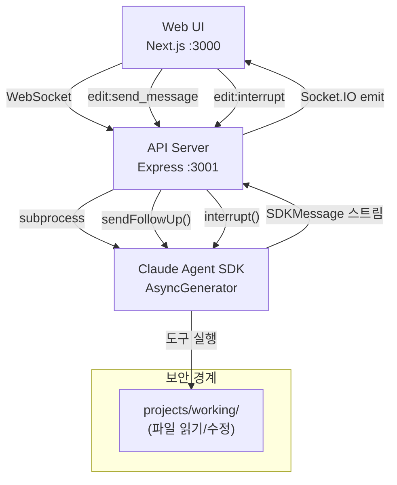
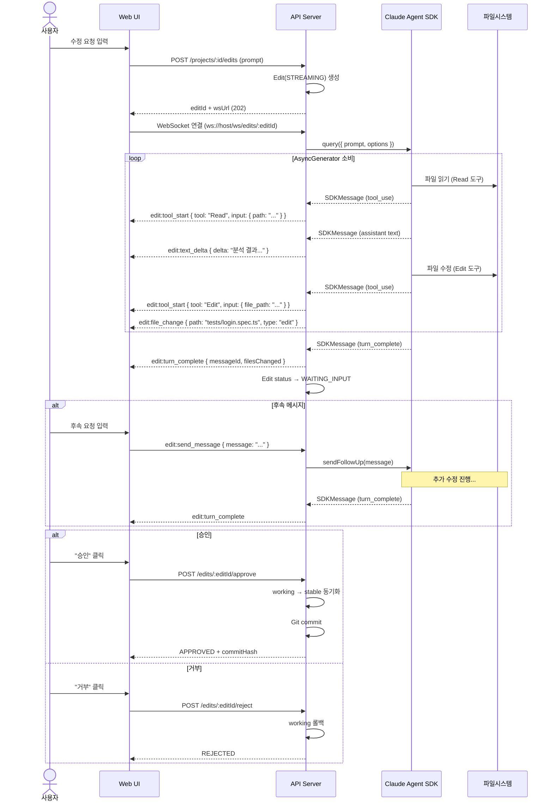
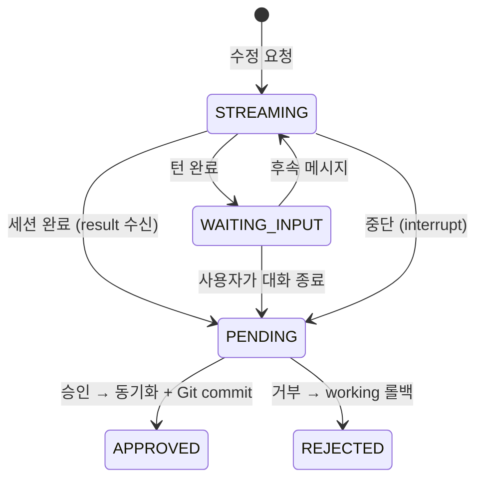
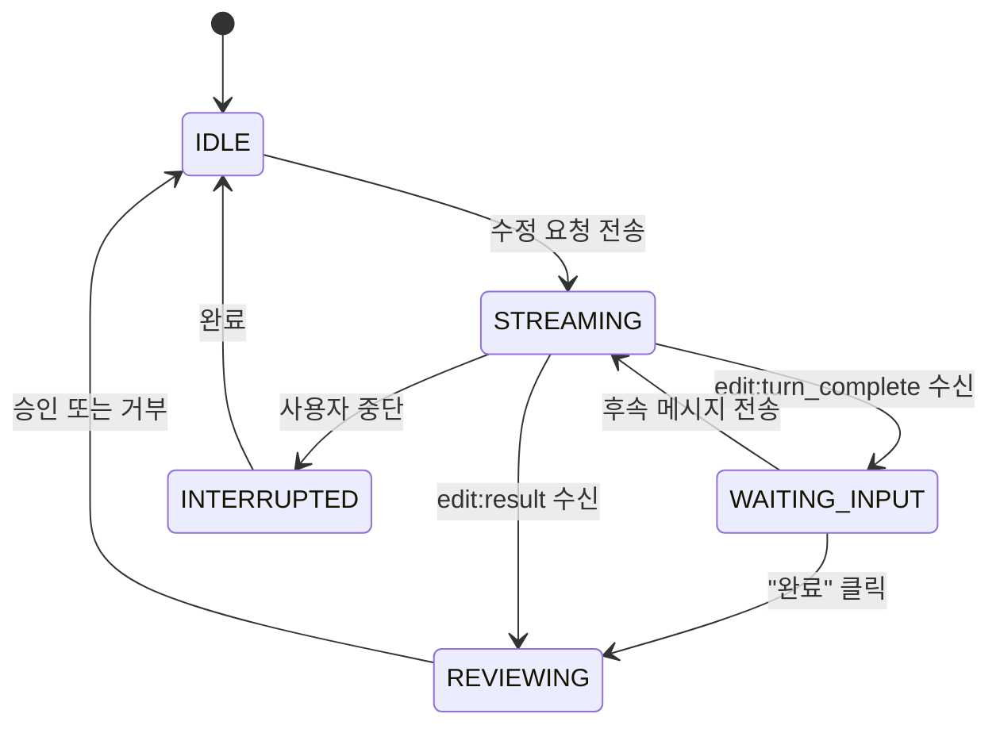

# Playwright Hub — Claude Agent SDK 연동 명세서

## 1. SDK 개요

### 1.1 패키지 정보

| 항목 | 내용 |
|------|------|
| 패키지명 | `@anthropic-ai/claude-agent-sdk` |
| 구 패키지명 | `@anthropic-ai/claude-code` (deprecated) |
| 핵심 함수 | `query()` |
| 용도 | 자연어 기반 Playwright 테스트 코드 수정 |
| 관련 요구사항 | FR-05 (테스트 코드 수정), NFR-03-05 (디렉토리 외부 접근 차단) |

### 1.2 변경 사항

기존 설계는 `claude()` 함수를 한 번 호출하고 결과를 폴링하는 **fire-and-forget** 방식이었다. 새로운 설계는 `query()` 함수의 **AsyncGenerator 스트리밍**과 **멀티턴 대화**를 활용하여, 사용자가 웹 UI에서 Claude와 실시간으로 상호작용하는 경험을 제공한다.

| 비교 | 기존 (claude-code) | 변경 (claude-agent-sdk) |
|------|-------------------|----------------------|
| 호출 방식 | `claude({ prompt })` 단발 호출 | `query({ prompt, options })` 스트리밍 |
| 결과 수신 | HTTP 폴링 (2초 간격) | WebSocket 실시간 스트리밍 |
| 대화 | 단발성 (1회 prompt → 1회 diff) | 멀티턴 (후속 메시지로 보완/수정) |
| 세션 | 없음 | 세션 생성/재개/목록 조회 |
| 중간 과정 | 보이지 않음 | 도구 사용, 파일 읽기/수정 실시간 표시 |
| 취소 | 불가 | `interrupt()` 로 즉시 중단 |
| 되돌리기 | 거부 시 전체 롤백만 가능 | `rewindFiles()` 로 특정 시점 롤백 |

### 1.3 핵심 API

`@anthropic-ai/claude-agent-sdk` 패키지에서 `query`, `listSessions`, `getSessionMessages`, `getSessionInfo`를 사용한다.

| 함수 | 용도 |
|------|------|
| `query()` | SDK 메인 함수. Claude와의 대화 세션을 시작하고 스트리밍 메시지를 반환 |
| `listSessions()` | 과거 세션 목록 조회 (sessionId, summary, 날짜 등) |
| `getSessionMessages()` | 특정 세션의 메시지 이력 조회 |
| `getSessionInfo()` | 특정 세션의 메타데이터 조회 |

---

## 2. 아키텍처

### 2.1 시스템 구성



### 2.2 실시간 스트리밍 흐름



---

## 3. SDK `query()` 함수 상세

### 3.1 함수 시그니처

> **구현 참고**: `query({ prompt, options })` 형태로 호출하며, `prompt`는 `string` 또는 `AsyncIterable<SDKUserMessage>`(멀티턴용)이고 반환값은 `AsyncGenerator`를 확장한 `Query` 객체다.

### 3.2 프로젝트에서 사용하는 Options

> **구현 참고**: Options에는 `cwd`(=projects/working/{projectPath}), `systemPrompt`(`PLAYWRIGHT_SYSTEM_PROMPT`), `allowedTools=[Read,Edit,Write,Glob,Grep,Bash]`, `disallowedTools=[Agent,WebSearch,WebFetch]`, `permissionMode: 'acceptEdits'`, 세션 관리 필드(`sessionId`/`resume`/`continue`/`persistSession`), 스트리밍(`includePartialMessages: true`), 제한(`maxTurns: 20`, `maxBudgetUsd: 1.00`), 안전장치(`abortController`, `enableFileCheckpointing: true`)를 지정한다.

#### Options 상세

| 옵션 | 타입 | 설명 |
|------|------|------|
| `cwd` | `string` | SDK 작업 디렉토리. `projects/working/{projectPath}` 로 설정 |
| `systemPrompt` | `string` | Playwright 전용 시스템 프롬프트 |
| `allowedTools` | `string[]` | 허용할 도구 목록 |
| `disallowedTools` | `string[]` | 차단할 도구 목록 |
| `permissionMode` | `PermissionMode` | `'acceptEdits'`: 파일 수정을 자동 승인 |
| `maxTurns` | `number` | 최대 턴 수 (무한루프 방지) |
| `maxBudgetUsd` | `number` | 세션당 최대 비용 (USD) |
| `abortController` | `AbortController` | 세션 취소용 |
| `includePartialMessages` | `boolean` | `true`로 설정 시 `stream_event` 메시지 수신 |
| `enableFileCheckpointing` | `boolean` | `true`로 설정 시 `rewindFiles()` 사용 가능 |
| `sessionId` | `string` | 세션 ID (자동 생성 또는 명시) |
| `resume` | `string` | 재개할 세션 ID |
| `continue` | `boolean` | 가장 최근 세션 이어가기 |
| `persistSession` | `boolean` | 세션 데이터 영속화 여부 |

#### PermissionMode 옵션

| 값 | 설명 | 프로젝트 사용 |
|----|------|-------------|
| `'default'` | 표준 권한 동작 (사용자 승인 필요) | - |
| `'acceptEdits'` | 파일 수정 자동 승인 | **사용** |
| `'bypassPermissions'` | 모든 권한 우회 | - |
| `'plan'` | 계획 모드 (실행 없음) | - |
| `'dontAsk'` | 승인 불가 시 거부 | - |

### 3.3 Query 객체 메서드

> **구현 참고**: `Query`는 `AsyncGenerator<SDKMessage, void>`를 확장하며 `interrupt()`, `rewindFiles(messageId, { dryRun? })`, `close()`, `setModel(model?)` 메서드를 노출한다.

| 메서드 | 용도 | 호출 시점 |
|--------|------|----------|
| `interrupt()` | 진행 중인 작업 즉시 중단 | 사용자가 "중단" 클릭 시 |
| `rewindFiles(messageId)` | 특정 메시지 시점으로 파일 변경 되돌리기 | 사용자가 "되돌리기" 클릭 시 |
| `rewindFiles(messageId, { dryRun: true })` | 되돌릴 파일 목록만 미리 확인 | 되돌리기 전 프리뷰 |
| `close()` | 세션 종료 및 리소스 정리 | 승인/거부 후 또는 타임아웃 |

### 3.4 SDKMessage 타입

SDK의 AsyncGenerator가 yield하는 메시지 타입들:

| 타입 | 설명 | WebSocket 변환 |
|------|------|---------------|
| `assistant` | Claude 응답 (텍스트 + tool_use 블록) | `edit:text_done`, `edit:tool_start` |
| `stream_event` | 실시간 부분 콘텐츠 | `edit:text_delta` |
| `result` | 최종 결과 (비용, 사용량, 소요시간) | `edit:result` |
| `system` (init) | 초기화 정보 (도구, 모델, 권한모드) | `edit:connected` |
| `system` (status) | 상태 변경 | 내부 처리 |

#### assistant 메시지 구조

> **구현 참고**: `SDKAssistantMessage`는 `type: 'assistant'`, `uuid`, `session_id`, `message.content`(블록 배열 — `text` 또는 `tool_use`) 필드를 가지며, 선택적 `error` 필드로 `rate_limit`/`server_error`/`max_output_tokens` 등의 원인을 전달한다.

#### stream_event 메시지 구조

> **구현 참고**: `SDKPartialAssistantMessage`는 `type: 'stream_event'`, `event`(Anthropic 스트리밍 이벤트 — `content_block_delta.text_delta`, `content_block_start.tool_use` 등), `uuid`, `session_id`를 포함한다.

#### result 메시지 구조

> **구현 참고**: `SDKResultMessage`는 `type: 'result'`, `subtype`(`success`/`error_max_turns`/`error_during_execution`/`error_max_budget_usd`), `duration_ms`, `total_cost_usd`, `num_turns`, `usage`(입출력 토큰 등), 성공 시 `result` 문자열, 실패 시 `errors` 배열을 가진다.

---

## 4. 백엔드 서비스 설계

### 4.1 `claude.service.ts` 구조

> **구현 참고**: `apps/api/src/services/claude.service.ts`는 SDK에서 `query`, `listSessions`, `getSessionMessages`와 `Query`/`SDKMessage`/`SDKUserMessage` 타입을 가져와 사용한다. 모듈 내부에 `ActiveSession`(queryInstance, abortController, editId, projectId, sessionId, inputEmitter 멀티턴 큐) 인터페이스를 정의하고 `activeSessions: Map<editId, ActiveSession>` 레지스트리로 활성 세션을 추적한다.

### 4.2 `startSession()` — 세션 시작

> **구현 참고**: `startSession({ editId, projectId, projectPath, prompt, emitToClient })`는 working 디렉토리 경로를 계산하고 `AbortController`를 만든 뒤, 후속 메시지를 받을 수 있는 `messageStream()` AsyncIterable을 구성한다(첫 메시지로 `prompt`를 yield하고 이후는 Promise 기반 큐에서 대기). `query()`를 Options(cwd, allowedTools, disallowedTools, permissionMode, maxTurns, maxBudgetUsd, abortController, includePartialMessages, enableFileCheckpointing, systemPrompt)로 호출한 뒤 `activeSessions`에 등록하고 `processStream`을 비동기 실행한다. 스트림 오류는 `edit:error`(`STREAM_ERROR`)로 중계한다.

### 4.3 스트림 처리 루프

> **구현 참고**: `processStream(q, editId, emitToClient)`는 `for await (const message of q)`로 SDK 이터레이터를 순회하며 타입별로 처리한다.
> - `system` + `subtype: 'init'` → `session.sessionId`를 채우고 `edit:connected`(editId, sessionId, tools, model) emit
> - `assistant` → `text` 블록은 `edit:text_done`, `tool_use` 블록은 `edit:tool_start`로 emit. `Edit`/`Write` 도구인 경우 `file_path`를 `filesChanged`에 누적하고 `edit:file_change`(type=edit|create) emit. 처리 후 `edit:turn_complete` emit + Edit status를 `WAITING_INPUT`으로 갱신
> - `stream_event.content_block_delta` → `text_delta`는 `edit:text_delta`, `thinking_delta`는 `edit:thinking` emit. `content_block_start`의 `tool_use`는 `edit:tool_start` emit
> - `result` → `edit:result`(subtype, costUsd, durationMs, totalTurns, usage, result|errors) emit. working 디렉토리 diff를 계산해 Edit를 `PENDING`/diff/filesChanged/sessionId/costUsd/durationMs로 갱신 후 `activeSessions`에서 제거
> - `tool_use.input`은 `sanitizeToolInput()`을 거쳐 민감 정보를 제거한 뒤 전달한다.

### 4.4 `sendFollowUp()` — 후속 메시지

> **구현 참고**: `sendFollowUp(editId, message)`는 `activeSessions`에서 세션을 찾고(없으면 `NotFoundError`), Edit status를 `STREAMING`으로 되돌린 뒤 `session.inputEmitter`를 호출해 `messageStream()`이 대기 중인 Promise를 resolve한다. 이로써 AsyncGenerator가 다음 유저 메시지를 yield한다.

### 4.5 `interruptSession()` — 작업 중단

> **구현 참고**: `interruptSession(editId)`는 활성 세션의 `queryInstance.interrupt()`를 호출한다. 세션이 없으면 `NotFoundError`를 던진다.

### 4.6 `rewindSession()` — 파일 변경 되돌리기

> **구현 참고**: `rewindSession(editId, messageId, dryRun = false)`는 활성 세션의 `queryInstance.rewindFiles(messageId, { dryRun })`을 호출하여 `RewindFilesResult`(`canRewind`, 선택적 `error`/`filesChanged`/`insertions`/`deletions`)를 반환한다.

### 4.7 `resumeSession()` — 세션 재개

> **구현 참고**: `resumeSession({ editId, projectId, projectPath, sessionId, prompt, emitToClient })`는 working 디렉토리를 기준으로 `query()`를 `resume: sessionId` 옵션과 함께 호출한다. 나머지 옵션(cwd, allowedTools, disallowedTools, permissionMode, maxTurns, abortController, includePartialMessages, enableFileCheckpointing)은 `startSession`과 동일하며, 이후 `processStream`으로 스트림을 처리한다.

### 4.8 세션 목록 / 이력 조회

> **구현 참고**: `getEditSessions(projectPath)`는 `listSessions({ dir: workingDir, limit: 20 })`로 세션 목록을, `getEditSessionMessages(sessionId, projectPath)`는 `getSessionMessages(sessionId, { dir: workingDir })`로 메시지 이력을 조회한다.

### 4.9 Playwright 시스템 프롬프트

> **구현 참고**: `PLAYWRIGHT_SYSTEM_PROMPT`는 상수 문자열이며 Playwright 테스트 코드 어시스턴트의 역할·규칙(작업 디렉토리 내 파일만 수정, `*.spec.ts`·`*.test.ts` 집중, auto-waiting·web-first assertion 등 모범사례 준수, 기존 구조/명명 유지, 주요 변경에만 주석 추가, 요청 없이는 `playwright.config.ts`·의존성 수정 금지)과 작업 절차(대상 파일 먼저 읽기 → 최소 변경 → 문법 검증)를 명시한다.

---

## 5. API 엔드포인트

### 5.1 HTTP 엔드포인트

#### `POST /projects/:id/edits` → 202

수정 세션 시작. 기존 동작과 동일하되 `wsUrl` 추가 반환.

> **구현 참고**: `prompt`를 받아 Edit을 STREAMING 상태로 생성하고 `editId`, `status`, `wsUrl`을 응답한다.

#### `GET /edits/:editId` → 200

수정 상세 조회. 대화 이력 포함.

> **구현 참고**: 응답 `data`에 `id`, `prompt`, `status`(예: `WAITING_INPUT`), `diff`, `filesChanged`, `sessionId`, `messages[]`(role·content·timestamp, assistant의 경우 `toolUses` 포함), `costUsd`, `durationMs`, `createdAt`을 담는다.

#### `GET /edits/:editId/sessions` → 200 (신규)

SDK 세션 목록 조회. 세션 재개 시 사용.

> **구현 참고**: `sessionId`, `summary`, `lastModified`(epoch ms), `firstPrompt`로 구성된 세션 목록을 반환한다.

#### `POST /edits/:editId/resume` → 202 (신규)

이전 세션 재개.

> **구현 참고**: `sessionId`와 후속 `prompt`를 받아 해당 세션을 재개하고 `editId`, `status: STREAMING`, `wsUrl`을 응답한다.

#### 기존 엔드포인트 (변경 없음)

- `POST /edits/:editId/approve` → 200 (승인)
- `POST /edits/:editId/reject` → 200 (거부)
- `GET /projects/:id/edits` → 200 (이력 조회)

### 5.2 WebSocket 엔드포인트

#### `ws://host/ws/edits/:editId`

수정 세션의 실시간 스트리밍.

**연결 시**: JWT 인증 + 조직 권한 확인 (기존 `runSocket.ts`와 동일 패턴)

---

## 6. WebSocket 이벤트 설계

### 6.1 Server → Client 이벤트

| 이벤트 | 설명 | 데이터 |
|--------|------|--------|
| `edit:connected` | 세션 연결 완료 | `{ editId, sessionId, tools, model }` |
| `edit:text_delta` | 텍스트 스트리밍 청크 | `{ delta: string }` |
| `edit:text_done` | 텍스트 블록 완성 | `{ text: string, messageId: string }` |
| `edit:thinking` | Claude 사고 과정 | `{ thinking: string }` |
| `edit:tool_start` | 도구 사용 시작 | `{ tool: string, toolUseId: string, input: object }` |
| `edit:tool_result` | 도구 실행 결과 | `{ toolUseId: string, output: string, isError: boolean }` |
| `edit:file_change` | 파일 변경 감지 | `{ path: string, type: 'edit' \| 'create' \| 'delete' }` |
| `edit:turn_complete` | 턴 완료 (입력 대기) | `{ messageId: string, filesChanged: string[] }` |
| `edit:result` | 세션 최종 결과 | `{ subtype, costUsd, durationMs, totalTurns, usage }` |
| `edit:error` | 에러 발생 | `{ code: string, message: string }` |

### 6.2 Client → Server 이벤트

| 이벤트 | 설명 | 데이터 |
|--------|------|--------|
| `edit:send_message` | 후속 메시지 전송 | `{ message: string }` |
| `edit:interrupt` | 현재 작업 중단 | `{}` |
| `edit:rewind` | 파일 변경 되돌리기 | `{ messageId: string, dryRun?: boolean }` |

### 6.3 이벤트 흐름 예시

```
[연결]    → edit:connected { sessionId: "abc-123", tools: ["Read","Edit",...] }

[스트리밍] → edit:tool_start { tool: "Read", input: { file_path: "tests/login.spec.ts" } }
           → edit:tool_result { output: "// file content...", isError: false }
           → edit:text_delta { delta: "분석" }
           → edit:text_delta { delta: "해보니" }
           → edit:text_delta { delta: " password 입력 후에" }
           → edit:tool_start { tool: "Edit", input: { file_path: "tests/login.spec.ts", ... } }
           → edit:file_change { path: "tests/login.spec.ts", type: "edit" }
           → edit:tool_result { output: "File edited successfully", isError: false }
           → edit:text_done { text: "수정을 완료했습니다. waitForTimeout(1000)을 추가했습니다." }
           → edit:turn_complete { messageId: "msg-001", filesChanged: ["tests/login.spec.ts"] }

[후속]     ← edit:send_message { message: "대기 시간을 2초로 변경해줘" }
           → edit:tool_start { tool: "Edit", ... }
           → edit:file_change { ... }
           → edit:text_done { text: "2초로 변경했습니다." }
           → edit:turn_complete { messageId: "msg-002", filesChanged: [...] }

[결과]     → edit:result { subtype: "success", costUsd: 0.05, durationMs: 12000, totalTurns: 3 }
```

---

## 7. DB 스키마 변경

### 7.1 Edit 모델 확장

> **구현 참고**: `EditStatus`에 `STREAMING`, `WAITING_INPUT`, `PENDING`, `APPROVED`, `REJECTED`를 둔다. `Edit` 모델은 기존 필드(`id`, `userId`, `projectId`, `prompt`, `diff`, `filesChanged`, `status`, `commitHash`, `syncedAt`, `createdAt`)에 더해 SDK 연동용 신규 필드 `sessionId`(`session_id`), `messages`(기본 `"[]"`), `costUsd`(`cost_usd`), `durationMs`(`duration_ms`)를 추가한다. 인덱스는 `[projectId, createdAt desc]`와 `[userId]`. 상세 스키마는 03_ERD 문서의 Prisma 정의를 기준으로 한다.

### 7.2 상태 전이도



### 7.3 `messages` JSON 구조

> **구현 참고**: `Edit.messages` 컬럼은 `{ role, content, timestamp }` 오브젝트의 시간순 배열로 대화 이력을 누적 저장한다. `assistant` 항목은 추가로 `toolUses: [{ tool, input }]` 배열(Read/Edit/Write 등 도구 사용 요약)을 가질 수 있다.

---

## 8. 프론트엔드 UI 설계

### 8.1 상태 머신



### 8.2 화면 레이아웃

```
┌──────────────────────────────────────────────────┐
│  테스트 수정 - project-a                     [X]  │
├──────────────────────────────────────────────────┤
│                                                   │
│  ┌─────────────────────────────────────────────┐  │
│  │  [채팅 영역 - EditChatView]                  │  │
│  │                                              │  │
│  │  👤 "login 테스트에서 비밀번호 입력 후       │  │
│  │      1초 대기를 추가해줘"                     │  │
│  │                                              │  │
│  │  🤖 ┌─ 활동 ──────────────────┐             │  │
│  │     │ 📖 Reading login.spec.ts │             │  │
│  │     │ ✏️  Editing login.spec.ts │             │  │
│  │     └──────────────────────────┘             │  │
│  │     "수정을 완료했습니다.                     │  │
│  │      waitForTimeout(1000)을 추가했습니다."   │  │
│  │                                              │  │
│  │  👤 "대기 시간을 2초로 변경해줘"             │  │
│  │                                              │  │
│  │  🤖 ┌─ 활동 ──────────────────┐             │  │
│  │     │ ✏️  Editing login.spec.ts │             │  │
│  │     └──────────────────────────┘             │  │
│  │     "2초로 변경했습니다."                     │  │
│  │                                              │  │
│  └─────────────────────────────────────────────┘  │
│                                                   │
│  ┌─────────────────────────────────────────────┐  │
│  │  [변경 파일 목록 - FileChangeTracker]        │  │
│  │  📄 tests/login.spec.ts  [diff 보기]         │  │
│  └─────────────────────────────────────────────┘  │
│                                                   │
│  ┌─────────────────────────────────────────────┐  │
│  │  [입력 영역 - FollowUpInput]                 │  │
│  │  ┌─────────────────────────────┐  [전송]     │  │
│  │  │ 추가 수정 사항을 입력하세요...│             │  │
│  │  └─────────────────────────────┘             │  │
│  └─────────────────────────────────────────────┘  │
│                                                   │
│  ┌─────────────────────────────────────────────┐  │
│  │ [중단] [되돌리기]     [승인 ✓]  [거부 ✗]    │  │
│  └─────────────────────────────────────────────┘  │
└──────────────────────────────────────────────────┘
```

### 8.3 신규 컴포넌트

#### `EditChatView.tsx` — 메인 채팅 컨테이너

- Props: `editId: string`
- `useEditSocket(editId)` 훅으로 WebSocket 연결
- 메시지 목록 렌더링 (user + assistant + tool activity)
- 자동 스크롤 (새 메시지 도착 시)
- 스트리밍 텍스트 실시간 표시

#### `ChatMessage.tsx` — 개별 메시지

- Props: `message: { role, content, toolUses?, timestamp }`
- 사용자 메시지: 우측 정렬, 파란색 배경
- Claude 메시지: 좌측 정렬, 회색 배경
- 도구 사용 표시: 접기/펼치기 가능한 활동 목록

#### `ToolActivity.tsx` — 도구 사용 표시

- Props: `toolUses: { tool, input, output?, isActive }[]`
- 아이콘: Read(📖), Edit(✏️), Write(📝), Grep(🔍), Glob(📂), Bash(⚡)
- 진행 중: 애니메이션 스피너
- 완료: 체크마크
- 입력 요약 표시 (파일 경로 등)

#### `FollowUpInput.tsx` — 후속 메시지 입력

- Props: `onSend: (message: string) => void`, `disabled: boolean`
- `WAITING_INPUT` 상태에서만 활성화
- `STREAMING` 상태에서는 비활성화 + "Claude가 작업 중..." 표시
- Ctrl+Enter로 전송

#### `SessionControls.tsx` — 세션 제어

- "중단" 버튼: `STREAMING` 상태에서만 활성화, `edit:interrupt` 이벤트 전송
- "되돌리기" 버튼: 메시지 시점 선택 → `edit:rewind` 이벤트 전송
- "대화 종료" 버튼: `WAITING_INPUT` 상태에서 대화 종료 → `REVIEWING` 전환
- "승인" / "거부" 버튼: `REVIEWING` 상태에서 활성화

#### `FileChangeTracker.tsx` — 변경 파일 추적

- Props: `filesChanged: string[]`, `editId: string`
- 변경된 파일 목록 표시
- 각 파일 클릭 시 DiffViewer 모달 오픈
- `edit:file_change` 이벤트로 실시간 업데이트

### 8.4 WebSocket 훅

> **구현 참고**: `apps/web/lib/ws-edit.ts`의 `useEditSocket(editId)` 훅은 editId가 있을 때 JWT를 실어 Socket.IO 연결을 맺고 다음 상태를 관리한다 — `messages`, `currentStream`, `status`(idle/streaming/waiting_input/reviewing/error), `filesChanged`, `activeTools`, `sessionInfo`, `isConnected`. 서버 이벤트 핸들러는 `edit:connected` → sessionInfo 저장 + status streaming, `edit:text_delta` → currentStream 누적, `edit:text_done` → messages에 assistant 메시지 추가 + currentStream 초기화, `edit:tool_start`/`edit:tool_result` → activeTools 갱신, `edit:file_change` → filesChanged 중복 없이 추가, `edit:turn_complete` → status waiting_input, `edit:result` → status reviewing, `edit:error` → status error. 반환 API는 `sendMessage(msg)`(user 메시지 추가 후 `edit:send_message` emit), `interrupt()`(`edit:interrupt` emit), `rewind(messageId, dryRun)`(`edit:rewind` emit)이며 언마운트 시 소켓을 disconnect 한다.

---

## 9. 보안 및 제약사항

### 9.1 도구 제한

| 허용 도구 | 용도 |
|----------|------|
| `Read` | 파일 읽기 |
| `Edit` | 파일 수정 (기존 파일의 부분 교체) |
| `Write` | 파일 생성/덮어쓰기 |
| `Glob` | 파일 패턴 검색 |
| `Grep` | 파일 내용 검색 |
| `Bash` | 셸 명령 실행 (제한적) |

| 차단 도구 | 이유 |
|----------|------|
| `Agent` | 서브에이전트 생성 차단 (비용/보안) |
| `WebSearch` | 외부 인터넷 접근 차단 |
| `WebFetch` | 외부 URL 접근 차단 |

### 9.2 디렉토리 샌드박싱

> **구현 참고**: Options의 `cwd`는 `/data/projects/working/{projectPath}`로 지정하고, `additionalDirectories`는 설정하지 않아 `cwd` 외부 접근을 차단한다.

- SDK는 `cwd`로 설정된 `projects/working/{projectPath}` 디렉토리만 접근 가능
- `projects/stable/`은 접근 불가 (Docker 마운트 전용)
- 시스템 디렉토리, 다른 프로젝트 디렉토리 접근 불가
- NFR-03-05 요구사항 충족

### 9.3 권한 모드

`permissionMode: 'acceptEdits'` 사용:
- SDK가 Read, Edit, Write 등 파일 조작 도구를 사용할 때 자동 승인
- 샌드박스 내에서만 동작하므로 안전
- 사용자의 최종 승인/거부는 working → stable 동기화 단계에서 수행

### 9.4 비용 제한

| 제한 | 환경변수 | 기본값 |
|------|---------|--------|
| 세션당 최대 비용 | `CLAUDE_AGENT_MAX_COST_PER_EDIT` | 1.00 USD |
| 일일 조직 최대 비용 | `CLAUDE_AGENT_MAX_COST_PER_DAY` | 50.00 USD |
| 세션당 최대 턴 수 | `CLAUDE_AGENT_MAX_TURNS` | 20 |

비용 초과 시 SDK가 자동으로 `result.subtype: 'error_max_budget_usd'` 또는 `'error_max_turns'`를 반환한다.

### 9.5 동시성 제한

| 제한 | 환경변수 | 기본값 |
|------|---------|--------|
| 조직당 동시 세션 | `CLAUDE_AGENT_MAX_CONCURRENT` | 3 |
| 세션 유휴 타임아웃 | `CLAUDE_AGENT_SESSION_TIMEOUT_MS` | 600000 (10분) |

- 동시 세션 한도 초과 시: 429 `RATE_LIMIT` 응답
- 유휴 타임아웃 초과 시: 세션 자동 종료 + `edit:error` 이벤트

### 9.6 에러 처리

| SDK 에러 | 처리 |
|----------|------|
| `error: 'rate_limit'` | `edit:error` + 재시도 안내 |
| `error: 'server_error'` | `edit:error` + 재시도 안내 |
| `error: 'authentication_failed'` | `edit:error` + API 키 확인 안내 |
| `subtype: 'error_max_turns'` | `edit:result` + "최대 턴 수 초과" 안내 |
| `subtype: 'error_max_budget_usd'` | `edit:result` + "비용 한도 초과" 안내 |
| `subtype: 'error_during_execution'` | `edit:result` + 에러 메시지 표시 |
| AbortController abort | 세션 종료 + 정리 |

---

## 10. 환경변수

### 10.1 기존 환경변수 (유지)

| 변수 | 설명 |
|------|------|
| `CLAUDE_API_KEY` | Claude API 키 (`sk-ant-...`) |

### 10.2 신규 환경변수

| 변수 | 설명 | 기본값 |
|------|------|--------|
| `CLAUDE_AGENT_MAX_TURNS` | 세션당 최대 턴 수 | 20 |
| `CLAUDE_AGENT_MAX_COST_PER_EDIT` | 세션당 최대 비용 (USD) | 1.00 |
| `CLAUDE_AGENT_MAX_COST_PER_DAY` | 조직당 일일 최대 비용 (USD) | 50.00 |
| `CLAUDE_AGENT_SESSION_TIMEOUT_MS` | 유휴 세션 타임아웃 (ms) | 600000 |
| `CLAUDE_AGENT_MAX_CONCURRENT` | 조직당 최대 동시 세션 수 | 3 |
| `CLAUDE_AGENT_ALLOWED_TOOLS` | 허용 도구 (쉼표 구분) | `Read,Edit,Write,Glob,Grep,Bash` |
| `CLAUDE_AGENT_SYSTEM_PROMPT` | 커스텀 시스템 프롬프트 (선택) | 내장 프롬프트 사용 |

### 10.3 config.ts 스키마 확장

> **구현 참고**: 기존 `configSchema`(zod)에 다음 필드를 추가한다 — `CLAUDE_AGENT_MAX_TURNS`(default 20), `CLAUDE_AGENT_MAX_COST_PER_EDIT`(default 1.0), `CLAUDE_AGENT_MAX_COST_PER_DAY`(default 50.0), `CLAUDE_AGENT_SESSION_TIMEOUT_MS`(default 600000), `CLAUDE_AGENT_MAX_CONCURRENT`(default 3), `CLAUDE_AGENT_ALLOWED_TOOLS`(default `'Read,Edit,Write,Glob,Grep,Bash'`), `CLAUDE_AGENT_SYSTEM_PROMPT`(선택). 숫자 필드는 `z.coerce.number()`로 정의한다.
